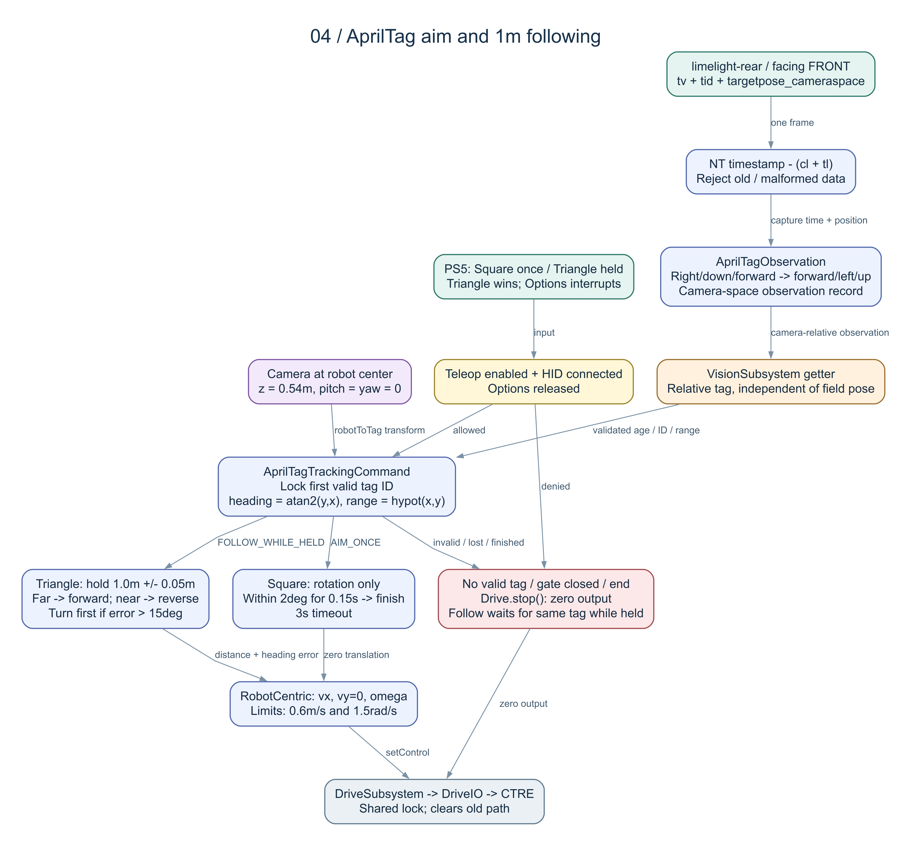

# AprilTag 對準與 1 公尺跟隨：編譯前流程確認

分支 `offseason`。已完成原始碼、測試案例與圖表；**尚未編譯、執行測試、啟動模擬或部署**。本頁涵蓋新增按鍵及尚未編譯的[單顆 Limelight 修改](SINGLE-CAMERA.md)。

## 操作與相機安裝

| 輸入 | 行為 |
|---|---|
| □ Square 按一下 | 車頭轉向第一張有效 AprilTag；不平移。連續 0.15 秒落在 ±2° 內即結束；最長 3 秒。放開 □ 不會提前取消。 |
| △ Triangle 按住 | 車頭對準標籤並前後移動，維持「底盤中心 → 標籤中心」的 **1.0 公尺水平距離**；太遠前進、太近後退。放開即停止追蹤，交還搖桿。 |
| 同時按 □、△ | △ 優先；跟隨期間按 □ 不會中斷跟隨。放開 △ 時即使 □ 還按住，也不會突然開始對準。 |
| Options | 中斷追蹤並執行原本的朝向重設；按住 Options 時不能開始追蹤。若 △ 仍按住，Options 放開後會重新開始跟隨。 |
| 模擬 Keyboard0 | `Z` 對應 □、`X` 對應 △，`R` 仍是 Options；尚未啟動驗證。 |

追蹤需 Teleop Enabled 且 PS5 連線。追蹤期間由命令持有 Drive requirement，搖桿不會混入自動輸出。退出後預設駕駛重新擷取當前朝向；搖桿若沒有回中，手動駕駛便會依輸入移動。Disabled／Auto／Test 不執行追蹤。△ 持有時若重新進入 Teleop 或恢復連線，合成 trigger 會重新觸發跟隨。

相機名稱 **`limelight-rear`**，使用者確認實際朝車頭，位置設定如下：

```java
// Constants.VisionConstants：位置用公尺、角度用度。
kCameraForwardMeters = 0.0;
kCameraRightMeters = 0.0;
kCameraHeightMeters = 0.54;
kCameraPitchDegrees = 0.0;
kCameraYawDegrees = 0.0;
```

更換鏡頭安裝位置，修改 [Constants.java](../../src/main/java/com/team11855/frc2026/Constants.java) 的這五個欄位；`kRobotToCamera` 會自動推導，供追蹤與模擬共用。啟動時會將同一組安裝值寫至 Limelight。roll 固定 0°。

## 資料如何接到底盤



[可縮放 SVG](diagrams/04-apriltag-tracking.svg) · [Mermaid](diagrams/04-apriltag-tracking.mmd) · [Graphviz DOT](diagrams/04-apriltag-tracking.dot)

1. `VisionIOHardwareLimelight` 讀 `tv`、`tid`、`targetpose_cameraspace` 及 `cl + tl`。位置陣列使用 NetworkTables 的更新時間減去延遲，不能每次讀取都換成現在時間。欄位含義依 [Limelight NetworkTables API](https://docs.limelightvision.io/docs/docs-limelight/apis/complete-networktables-api)。
2. `AprilTagObservation` 將 Limelight 相機座標「右／下／前」轉成 WPILib 的「前／左／上」：`(x, y, z) = (原 z, -原 x, -原 y)`；命令呼叫此 record 的 `robotToTag()` 方法，再套用鏡頭安裝旋轉與平移，得到相對底盤中心的標籤位置。座標依 [Limelight 座標文件](https://docs.limelightvision.io/docs/docs-limelight/pipeline-apriltag/apriltag-coordinate-systems)。
3. `VisionSubsystem.getAprilTagObservation()` 提供局部觀測。此資料不依賴場地 MegaTag 定位是否被接受；`setUseVision(false)` 只關閉原本的場地定位回送，不關閉局部追蹤。
4. `AprilTagTrackingCommand` 算 `atan2(y, x)` 作為轉向誤差，`hypot(x, y) - 1.0` 作為距離誤差。因此高度差不會被算進 1 公尺。
5. 命令輸出 `SwerveRequest.RobotCentric`：前後速度、零橫移速度、角速度，經 `DriveSubsystem.setControl()` → Drive IO → CTRE。這是車體座標控制，不受紅藍方翻轉影響。
6. `setControl()`／`stop()` 沿用既有同步鎖與清除路徑機制，避免舊 100 Hz 路徑繼續覆蓋追蹤命令。結束或被其他 Drive 命令中斷時呼叫 `stop()`。

局部追蹤不使用場地座標，不會開啟 PathPlanner 或自動找最近的 Reef。相機需已有可輸出 AprilTag 3D pose 的 pipeline，標籤實際大小／相機校正會影響量測準確度；靠近至 1 公尺時，標籤也必須仍在鏡頭視野內。原本場地定位與模擬仍使用 2025 Reefscape 設定。

## 停止、目標選擇與調校

每次啟動鎖住第一筆有效量測的 tag ID，不指定固定號碼。鎖定的是機器人端接受的 ID；沒有修改相機 `priorityid`。若 Limelight 改回傳另一張標籤，就停止輸出；△ 需同一 ID 再成為主要目標才恢復。要改追另一張，放開再按 △。

| 情況／參數 | 行為／預設值 |
|---|---|
| 看不到標籤、缺 pose、非法 ID、非法數值、資料過舊 | □ 結束；△ 保持命令但送零輸出，等待同一 ID 恢復。沒有盲目搜尋旋轉。 |
| 觀測時間 | 最長 0.25 秒；比現在超前超過 0.05 秒也拒絕。相機斷線即使 `tv` 殘留，位置時間戳也會到期。 |
| 合理水平距離 | 0.10～6.0 公尺，範圍外停止。 |
| 距離目標／容差 | `1.0 m`／`±0.05 m`，範圍內前後速度為零；精度仍需實測。 |
| 前後控制 | P = 1.0，限速 `0.6 m/s`，並受原底盤最高速度限制。 |
| 轉向控制 | P = 3.0，限速 `1.5 rad/s`（弧度／秒），並受原底盤最高角速度限制。 |
| 偏離車頭超過 15° | 先轉向，不前後移動；沒有橫向平移或繞障能力。 |
| 斷開 PS5／離開 Teleop | 不再讀目標作控制，停止並結束。△ 的 gate 關閉也會取消命令。 |

所有門檻集中在 `Constants.AprilTagTrackingConstants`。原手動搖桿曲線、速度上限、朝向維持 PID 與路徑 PID 保持原值。這裡是直接指向標籤中心，**不會把機器人姿態對成與標籤平面平行**。

## 實際變更檔案與前後流程

以下檔案相對於專案根目錄；連同[單相機文件中的修改清單](SINGLE-CAMERA.md)一起確認。

| 檔案 | 改變的流程 |
|---|---|
| `src/main/java/com/team11855/frc2026/Constants.java` | 原 Camera A 的安裝值 → 你的中心 54 cm、水平朝前設定；增加獨立追蹤常數，共用安裝 Transform。 |
| `src/main/java/com/team11855/frc2026/RobotContainer.java` | 原本僅 Options → 新增 □、△ 綁定、△ 優先及 Teleop／連線／Options gate。 |
| 新增 `commands/AprilTagTrackingCommand.java`（同一 frc2026 套件） | 無局部追蹤 → tag 鎖定、轉向、1 m 前後控制、逾時與 end 停止。 |
| 新增 `subsystems/vision/AprilTagObservation.java` | 原本只有場地 pose → 新增 tag ID、相機相對平移、capture time 及座標轉換。 |
| `subsystems/vision/VisionIO.java` | 單相機 inputs 新增 Optional 相對觀測。 |
| `subsystems/vision/VisionIOHardwareLimelight.java` | 原本只讀全場定位 → 增讀局部 tag pose，失去目標清空；保留原場地資料讀取。 |
| `subsystems/vision/VisionSubsystem.java` | 增加局部觀測 getter 與記錄，原 MegaTag／gyro 篩選與 callback 保留。 |
| `subsystems/vision/VisionIOSimPhoton.java` | 增加模擬 tid／相對 pose，保留 Photon 拍攝時間；沒有新影格時保留上次結果與原時間戳，真正的無目標影格才清除。底盤物理更新不改。 |
| `simgui-ds.json` | Keyboard0 加入 Z／X 按鍵，供模擬驗收。 |
| `src/test/java/com/team11855/frc2026/AprilTagControlsTest.java` | 新增按鍵事件、優先權、放開、gate 測試。 |
| `src/test/java/com/team11855/frc2026/subsystems/drive/AprilTagTrackingCommandTest.java` | 新增轉向正負、速度／容差、中心水平距離、ID／時間有效性及停止測試。 |
| `src/test/java/com/team11855/frc2026/subsystems/vision/AprilTagObservationTest.java` | 新增座標、安裝 Transform 與資料解析測試。 |
| `src/test/java/com/team11855/frc2026/subsystems/vision/SingleCameraVisionTest.java` | 更新 Transform 名稱，補上局部／場地資料獨立性與 NT 時間戳測試。 |
| `docs/drive-vision/` 說明、renderer、圖表 | 操作表、安裝值、接線圖、此確認文件。 |

`Robot.java` 模式切換、Drive 輸出鎖、馬達 Tuner／CANivore 設定與 vendor 版本本輪沒有修改。原本 staged／工作目錄的 `BuildConstants.java` 保持原樣；不 commit、push 或修改 `main`。

## 取得確認後才執行

已通過 `python3 docs/drive-vision/static_check.py` 與 `git diff --check`，核對原始碼／本地 WPILib、CTRE、Photon API 簽章、文件、JSON、引用與 Git diff。共有 83 個正式 Java 檔，仍只有 Drive／Vision；43 項 JUnit 案例尚未執行。原有暫存內容與 BuildConstants 工作檔的 SHA-256 一致。沒有 Java 型別解析或執行結果，新增的測試原始碼也不能視為已通過。

```sh
./gradlew spotlessCheck test build -PteamNumber=0
./gradlew simulateJavaRelease -PteamNumber=0
```

第一行執行格式、編譯、所有 JUnit 與建置；第二行啟動桌面模擬驗收 □／△／Options、距離前進／後退、失去／恢復標籤、模式切換、Vision 定位回送與既有路徑停止。`-PteamNumber=0` 只供本機驗證，不修改 11855 隊號。Gradle 會產生 build／AutoLogged 等產物，版本生成任務也可能更新 BuildConstants；執行前需保護現有該檔工作內容與暫存內容。

依使用者規則「程式下進去編譯前要跟我完整確認會改到哪些流程才可以下」，確認上述實際流程後才執行這兩個指令。本次沒有部署至機器人。
