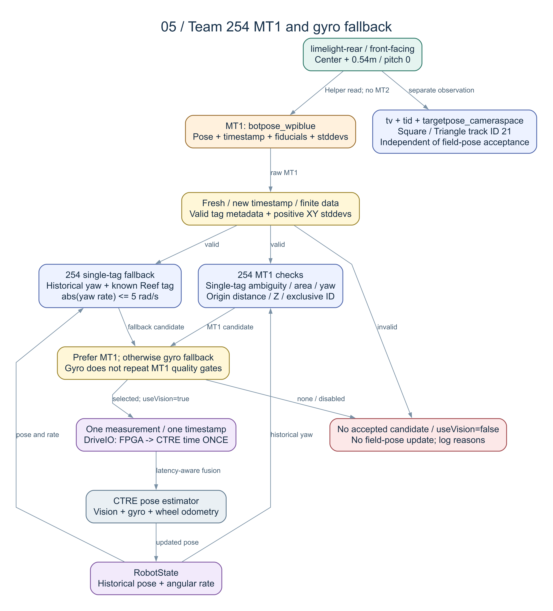

# MegaTag 定位流程

目前定位已改為 **Team 254 MT1 優先＋單 Tag 歷史航向備援**。完整流程、檔案清單、保留差異及編譯前確認見 [TEAM254-MT1.md](TEAM254-MT1.md)。

先前的「MT2 X/Y＋MT1 航向」實作已由本輪取代；MT2 讀取、朝向傳送與混合姿態不再使用。舊版本紀錄可從 Git 歷史查閱。

[SVG](diagrams/05-megatag-inputs.svg) · [Mermaid](diagrams/05-megatag-inputs.mmd)
