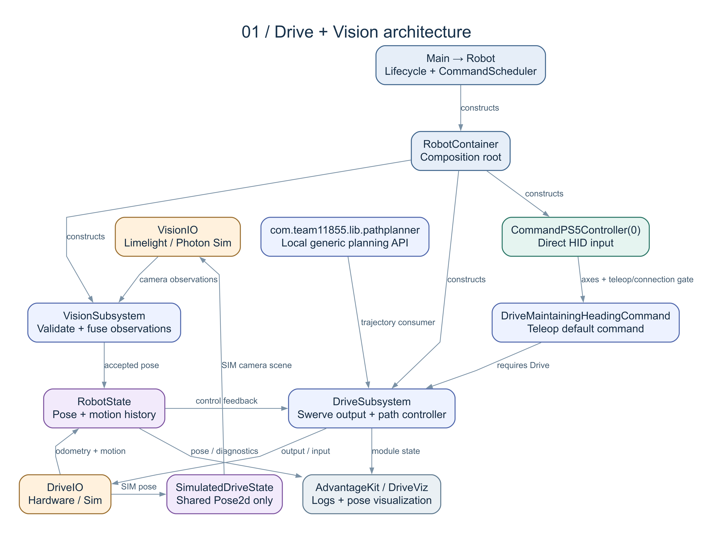
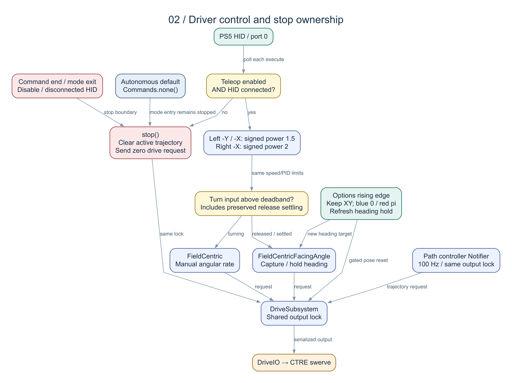
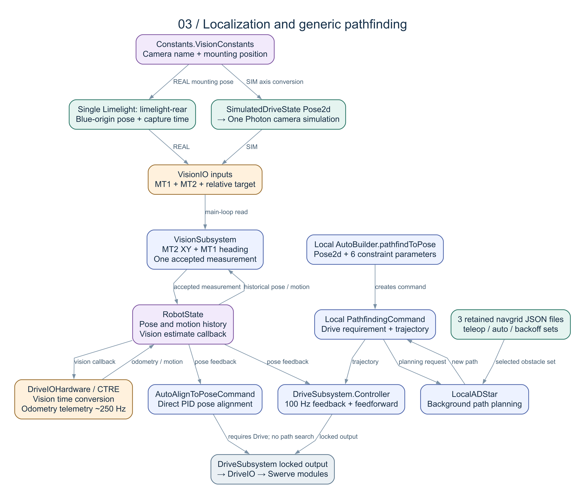

# Drive + Vision 分支使用說明

目前專案名稱為 `FRC-2026-Systemcore-Public-main`；機器人套件為 `com.team11855.frc2026`、共用套件為 `com.team11855.lib`。詳見 [更名說明](NAMESPACE-MIGRATION.md)。

本文件說明 `offseason` 的新版接線與操作方式。此分支把機器人功能縮為 **Drive 與 Vision 兩個 subsystem**，用一支 USB 0 的 PS5 控制器駕駛；保留本地 PathPlanner、三張 navgrid 與指定 Pose 的自動對位能力。預設 Autonomous 為 `Commands.none()`，沒有競賽取料、得分或機構排程。

目前底盤已接入使用者的 MK5i R2／Kraken X60／CANivore 設定，詳見 [TUNER-INTEGRATION.md](TUNER-INTEGRATION.md)。2026 library 更新見 [LIBRARY-UPGRADE.md](LIBRARY-UPGRADE.md)。

**狀態：2026-09-19 依工作樹原始碼查核；尚未執行 Java 編譯、Gradle、測試、模擬或部署。** 本文件中的程式片段已對照本地方法簽章，沒有經編譯或實機驗證。三張圖以相同節點／連線模型產生 Mermaid、Graphviz DOT、SVG 與 PNG，並已開圖檢查。

使用者要求：「程式下進去編譯前要跟我完整確認會改到哪些流程才可以下」。因此先提供可審查的分支變更、流程與待跑驗證；確認前不執行上述步驟。原 `main` 與 `docs/mentor-analysis/` 保留作為完整版參考，舊 mentor 文件不代表此精簡分支的現況。

| 範圍 | 此分支內容 |
|---|---|
| 保留 | Swerve Drive、雙相機 Vision、Drive／Vision REAL 與 SIM IO、generic `AutoAlignToPoseCommand`、本地 PathPlanner fork、三張 navgrid、定位與記錄工具。 |
| 操作替換 | 舊 controlboard 與 modal controls 改為 RobotContainer 直接建立 PS5；不需要第二支手把。 |
| 移除 | 原 `claw`、`climber`、`elevator`、`indexer`、`intake`、`led`、`superstructure`、`wrist` 八個子系統目錄與相關 factories／狀態機；Reefscape 競賽 Auto selector／factory 與自動得分流程。 |
| 後續擴充入口 | `RobotContainer.getAutonomousCommand()`、generic Pose 路徑與 AutoAlign；目前沒有新路徑按鍵綁定。 |

## 1. 先讀這張總圖



[可縮放 SVG](../../docs/drive-vision/diagrams/01-architecture.svg) · [Mermaid 原始碼](../../docs/drive-vision/diagrams/01-architecture.mmd) · [Graphviz 原始碼](../../docs/drive-vision/diagrams/01-architecture.dot)

| 層／檔案 | 從哪裡接收 | 做什麼、再交給哪裡 |
|---|---|---|
| [Main.java](../../src/main/java/com/team11855/frc2026/Main.java) | WPILib 啟動入口 | 啟動 `Robot`。 |
| [Robot.java](../../src/main/java/com/team11855/frc2026/Robot.java) | Disabled／Auto／Teleop／Test 生命週期 | 設定 AdvantageKit、建立 `RobotContainer`、執行 `CommandScheduler`、更新狀態記錄；模式切換取消 Auto 並呼叫 Drive 停止。 |
| [RobotContainer.java](../../src/main/java/com/team11855/frc2026/RobotContainer.java) | 平台 REAL／SIM、PS5 USB 0 | 建立 `RobotState`、Drive IO、Vision IO、兩個 subsystem 與預設駕駛命令；直接綁定 Options，不經舊 controlboard。 |
| [DriveMaintainingHeadingCommand.java](../../src/main/java/com/team11855/frc2026/commands/DriveMaintainingHeadingCommand.java) | 三個軸 supplier、模式／連線 supplier、`RobotState` | 取得 Drive requirement；產生手動角速度或 heading hold 的 CTRE request；交給 `DriveSubsystem.setControl()`。 |
| [DriveSubsystem.java](../../src/main/java/com/team11855/frc2026/subsystems/drive/DriveSubsystem.java) | 手動 request、本地 PathPlanner trajectory、Vision measurement | 擁有 Drive IO 與 100 Hz 路徑控制器；序列化輸出／停止／重設姿態；週期讀 IO、記錄 DriveInputs 與模組資料。 |
| [DriveIO.java](../../src/main/java/com/team11855/frc2026/subsystems/drive/DriveIO.java) | Drive subsystem 的讀寫呼叫 | 定義底盤 IO 介面；REAL 使用 `DriveIOHardware`，SIM 使用繼承它的 `DriveIOSim`。 |
| [RobotState.java](../../src/main/java/com/team11855/frc2026/RobotState.java) | Drive IO 的里程計／速度，Vision 接受的觀測 | 保存位置與動作歷史、提供控制回授與 alliance；透過 constructor 注入的 callback 把 Vision estimate 送回 Drive。沒有舊 RobotContainer 反向依賴。 |
| [VisionSubsystem.java](../../src/main/java/com/team11855/frc2026/subsystems/vision/VisionSubsystem.java) | 相機 A/B inputs、歷史位置與角速度 | 檢查觀測、處理 MegaTag／陀螺儀備援、融合可用相機；呼叫 `RobotState.updateMegatagEstimate()`。 |
| [VisionIO.java](../../src/main/java/com/team11855/frc2026/subsystems/vision/VisionIO.java) | Limelight NetworkTables 或 Photon 模擬結果 | 把相機資料交給 Vision subsystem；相機輸出不是 motor request。 |
| [SimulatedDriveState.java](../../src/main/java/com/team11855/frc2026/simulation/SimulatedDriveState.java) | SIM 底盤 truth pose | 只保存帶時間的 `Pose2d` 歷史，交給 Photon 相機模擬；不保存 coral、algae、機構或得分狀態。 |

啟動時 Drive 先建立，接著建立 Vision。`RobotState` 的 Vision callback 由 `RobotContainer.acceptVisionEstimate()` 轉交 `DriveSubsystem.addVisionMeasurement()`，最後到 Drive IO 的 CTRE pose estimator。`RobotState` 仍由 Drive IO 直接寫入里程計與動作資料；這點與完全透過 logged inputs 還原狀態的架構不同。

## 2. PS5 操作表

控制器在 Driver Station USB 頁面放在 **索引 0**。目前程式直接建立 `CommandPS5Controller(Constants.kDriverControllerPort)`，常數是 `0`。

| 控制 | 輸入與整形 | 目前作用 | 生效條件 |
|---|---|---|---|
| 左搖桿 Y | `-sign(Y) × abs(Y)^1.5` | 場地座標前後平移；推前時產生正方向輸入。 | Teleop enabled 且 HID connected。 |
| 左搖桿 X | `-sign(X) × abs(X)^1.5` | 場地座標左右平移；推左時產生正方向輸入。 | 同上。 |
| 右搖桿 X | `-sign(X) × abs(X)^2` | 手動角速度；推左為正角速度。 | 同上；轉向整形後絕對值超過 `0.05` 進入手動轉向。 |
| 放開右搖桿 | 原有釋放緩衝判斷後鎖定 yaw | 保持釋放後的機器人方向，左搖桿仍可平移。 | 同上；不是將 yaw 自動設為 0。 |
| Options | 合成 trigger 的 rising edge | 保留最新 field X/Y，藍方 yaw 設 `0`、紅方設 `π`；下一次預設駕駛初始化直接使用新 heading。 | `options().and(teleopEnabled && connected)`；命令持有 Drive requirement。 |
| 右搖桿 Y、扳機、其他按鍵、POV | 未綁功能 | 不會啟動機構、自動得分或路徑。 | — |
| HID 斷線 | execute 先檢查條件，不讀取軸值 | 呼叫 `Drive.stop()` 並清除手動 heading 狀態。 | 預設駕駛命令執行時。 |
| Autonomous | `getAutonomousCommand()` 回傳 `Commands.none()` | Auto 入口先停止；此預設命令不要求底盤移動。 | 手動預設命令即使被排程，亦因非 Teleop 而停止。 |

紅方將平移 X/Y 同時反號，保留駕駛視角的 field-centric 行為；旋轉輸入不因 alliance 反號。`RobotState.isRedAlliance()` 在 alliance 未提供時為 `false`，所以目前採藍方行為。實際軸方向與 DS 裝置辨識仍在待跑驗證表內。

Options 的 trigger 是「按鍵與模式／連線條件的 AND」之上升沿；若按住 Options 時由 Disabled 進入 Teleop，合成條件也可能從 false 變 true 而觸發。這不是單純只接受 Teleop 期間的新物理按壓。

### 保留的調校

| 參數 | 目前數值／語義 |
|---|---|
| 平移最高 request | `kDriveMaxSpeed = 5.0 m/s`。 |
| 手動最高角速度 | `kDriveMaxAngularRate = 0.4 × 2π ≈ 2.513 rad/s`。 |
| Heading PID | `P = 5.0, I = 0, D = 0`。 |
| 平移死區 | CTRE request 使用 `5.0 × 0.05 = 0.25 m/s`。沒有另外把輸入先線性重映射。 |
| 轉向死區 | 整形後輸入判斷 `0.05`；手動 request 角速度死區 `(0.4 × 2π) × 0.05 ≈ 0.1257 rad/s`。不能把它解釋成原始搖桿 5% 就開始轉。 |
| 釋放緩衝 | 最近 `0.25 s` 曾轉動且目前 `abs(omega) > 10 deg/s` 時，暫維持手動角速度模式；條件解除後擷取 heading。 |
| 實機／SIM request type | 手動實機採 `Velocity`；SIM 採 `OpenLoopVoltage`，沿用上游差異。 |

參數來源：[Constants.java](../../src/main/java/com/team11855/frc2026/Constants.java)、[RobotContainer.java](../../src/main/java/com/team11855/frc2026/RobotContainer.java)、[DriveMaintainingHeadingCommand.java](../../src/main/java/com/team11855/frc2026/commands/DriveMaintainingHeadingCommand.java)。

## 3. 輸出權、停止與模式切換



[可縮放 SVG](../../docs/drive-vision/diagrams/02-control-and-stop.svg) · [Mermaid 原始碼](../../docs/drive-vision/diagrams/02-control-and-stop.mmd)

`DriveSubsystem.controlLock` 同時保護 trajectory 的替換／清除、100 Hz 控制輸出、手動 `setControl()`、`stop()` 與 `resetOdometry()`。手動控制或停止先清掉 trajectory，讓下一個 100 Hz tick 不會再輸出被取消的舊路徑。這是依原始碼得到的同步設計；競態測試尚未執行。

| 入口 | 狀態改變與輸出 |
|---|---|
| `setControl(request)` | 鎖內清除 active trajectory、停止／重設 path timer，再交給 IO。 |
| `stop()` | 同一把鎖內清除 active trajectory，送出零速度 `ApplyRobotSpeeds`，request type 為 `OpenLoopVoltage`。這個動作不是 X-lock 輪向功能。 |
| `resetOdometry(pose)` | 鎖內先 `stop()`，再呼叫 IO 的 odometry reset。Options 另把指定 heading 放進命令的 pending setpoint，避免下一次初始化擷取延遲的舊 yaw。 |
| 預設駕駛 `end(interrupted)` | 停止 Drive，重設 heading command 狀態。由其他持有 Drive requirement 的命令接手時也會執行。 |
| `applyRequest(supplier)` | 使用 `Commands.runEnd(..., this::stop, this)`，持有 Drive requirement，結束時停止。 |
| 路徑命令中斷、Disabled、目標末速 `< 0.1 m/s` | 本地 `PathfindingCommand`／`FollowPathCommand` 傳入 stay-stopped trajectory，Drive controller 清除路徑並送出零輸出。 |
| 路徑正常結束且末速 `>= 0.1 m/s` | 傳入 `null` 清除路徑控制迴圈，不額外送零；供下一段接續。最後一段不應無意使用此語義而留下先前 motor request。 |

模式入口與出口由 [Robot.java](../../src/main/java/com/team11855/frc2026/Robot.java) 管理：

| 模式事件 | 執行內容 |
|---|---|
| `disabledInit()` | 取消記錄的 Auto、停止；切 teleop 障礙網格；開啟 cache、距離容差 `0.0 m`。 |
| `disabledPeriodic()` | 記錄 CAN bus；每 50 次 flush NetworkTables；曾 enable 後每 10 秒排程檔案 sync。 |
| `disabledExit()` | 取消不連 motor 的 pathfinding warmup；開啟 Vision 使用。 |
| `autonomousInit()` | 先取消 Auto／停止；cache 距離容差改 `0.8 m`；排程目前的 `Commands.none()`。 |
| `autonomousExit()` | 取消記錄的 Auto 並停止。 |
| `teleopInit()` | 取消 Auto 並停止；停用 path cache、選 teleop 障礙網格。 |
| `teleopExit()` | 停止。 |
| `testInit()`／`testExit()` | 入口取消所有命令並停止；出口再停止。沒有新增可驅動機構的 test sequence。 |

warmup 使用本地 `PathfindingCommand.warmupCommand()`，其 trajectory consumer 是空函式，不接 Drive。它可在 Disabled 執行，用來初始化路徑規劃；不可把 warmup 的固定示例座標誤當正式 Auto。

連線 gate 是手動預設命令的條件。未來新增會占用 Drive 的路徑命令時，不能假設 PS5 斷線一定會取消該命令；若需要此行為，應在該命令的中斷條件中明確定義並加入流程確認。

## 4. 定位、相機與 SIM



[可縮放 SVG](../../docs/drive-vision/diagrams/03-localization-and-paths.svg) · [Mermaid 原始碼](../../docs/drive-vision/diagrams/03-localization-and-paths.mmd)

1. REAL 的 `DriveIOHardware` 使用 CTRE swerve。CTRE 里程計設定為 `250 Hz`，telemetry callback 轉換時間後寫入 `RobotState`；Drive 的週期讀取再更新測量速度、角速度、pitch／roll、加速度等歷史。
2. `VisionIOHardwareLimelight` 讀取 `limelight-left` 與 `limelight-right`；藍方原點的相機 pose、觀測時間、fiducials 與 stddev 交給 Vision。相機位置、角度與場地 layout 在 `Constants`。
3. Vision 對新舊觀測、相機品質與動作條件進行篩選；單一可用相機可直接採用，兩個可用估計先利用歷史 pose 對齊時間，再做 inverse-variance 融合。這些檢查沿用既有演算法，沒有宣稱已覆蓋所有異常時間或數值。
4. 接受的 `VisionFieldPoseEstimate` 經 `RobotState → RobotContainer callback → DriveSubsystem → DriveIOHardware` 回到 CTRE。`Utils.fpgaToCurrentTime()` 把 Vision timestamp 轉到 CTRE 時基；不可把相機 capture time 改成讀取當下時間。
5. Drive controller、heading hold 與 AutoAlign 從 `RobotState` 取得 pose／motion 回授；`DriveViz`、AdvantageKit 與 PathPlanner log callbacks 顯示狀態。

SIM 仍採 `DriveIOSim` 與 `VisionIOSimPhoton`。Drive 的 Notifier 以 Tuner 指定的 `0.004 s` 週期推進模擬；`Robot.simulationPeriodic()` 不再重複推進同一個 MapleSim 世界。`SimulatedDriveState` 只共享 pose truth 的歷史，Photon 使用它產生相機結果，再進入既有 Vision 處理路徑。初始 SIM pose 在 `Robot` 設為 `(3 m, 3 m, 0 rad)`。其 history 在時間範圍外取樣會 clamp 邊界，所以 `Optional` 非空不能單獨證明時間資料新鮮。

[simgui-ds.json](../../simgui-ds.json) 準備單一 `Keyboard0`：`A/D` 是 axis 0、`W/S` 是 axis 1、`Q/E` 是 axis 2、`R` 是 button 10（Options）。其他按鍵／軸沒有配置。這只描述已寫入設定；模擬尚未啟動，按鍵與 PS5 mapping 待驗證。

MapleSim 0.4.0-beta 的預設場地為 2026；本分支明確使用 `DriveSimulationArena`，只載入 2025 障礙物，連場地重設也不加入遊戲物件。

Replay runner 保留，但不能宣稱完整 deterministic replay：`RobotContainer` 仍以 `RobotBase.isSimulation()` 選擇 SIM IO；Drive IO 直接更新 `RobotState`，Vision 仍記錄 outputs 而非透過 `Logger.processInputs()` 重建整包輸入，SIM Notifier 亦未為 replay 重設計。Replay 改造是後續獨立工作，應先定義資料來源與時間契約。

## 5. 本地 PathPlanner API：如何擴充

這份專案用的是 `com.team11855.lib.pathplanner` 原始碼 fork。匯入、建構子與 output callback 都要以本地源碼為準。`DriveSubsystem` 已完成一次 `AutoBuilder.configure()`，其中 controller 接收的是 `Consumer<PathPlannerTrajectory>`；不要在 RobotContainer 再配置第二次，也不要直接套用另一版本的 motor-output callback 範例。

### 指定座標的避障路徑

以下是**未接到按鍵或 Auto 的擴充範例**，可放在 RobotContainer 類別中。目標 pose 應由已審查的呼叫者提供；範例不選定實際場地目的地、不啟用 Auto。

```java
import com.team11855.lib.pathplanner.auto.AutoBuilder;
import com.team11855.lib.pathplanner.path.PathConstraints;
import edu.wpi.first.math.geometry.Pose2d;
import edu.wpi.first.wpilibj2.command.Command;
import java.util.Objects;

private Command pathfindAndStop(Pose2d targetInBlueFieldFrame) {
    Objects.requireNonNull(targetInBlueFieldFrame, "targetInBlueFieldFrame");

    // 本地 fork 的六參數順序；這些是現有上限，實際路線仍需驗證。
    PathConstraints constraints = new PathConstraints(
            Constants.DriveConstants.kDriveMaxSpeed,                       // m/s
            Constants.DriveConstants.kMaxAccelerationMetersPerSecondSquared, // m/s²
            Constants.DriveConstants.kDriveMaxAngularRate,                 // rad/s
            Constants.DriveConstants.kMaxAngularSpeedRadiansPerSecondSquared, // rad/s²
            Constants.DriveConstants.kMaxXAccelerationMetersPerSecondSquared, // m/s²
            Constants.DriveConstants.kMaxYAccelerationMetersPerSecondSquared);// m/s²

    return AutoBuilder.pathfindToPose(targetInBlueFieldFrame, constraints, 0.0)
            .finallyDo(interrupted -> driveSubsystem.stop());
}
```

`PathConstraints` 這個六個 `double` 的建構子預設 nominal voltage `12 V`、`unlimited = false`；本地沒有常見教學中的四個 `double` 建構子。`pathfindToPose(..., 0.0)` 指末端速度為 `0 m/s`，不是執行時間。此 builder 配置的 Drive requirement 由本地命令持有；不要再同時排程另一個會寫底盤的無 requirement 命令。

若輸入是「藍方設計的目標位置，需要依紅藍切換」，改用 `AutoBuilder.pathfindToPoseFlipped(target, constraints, 0.0)`。它在 command 執行時依已配置的 alliance supplier 決定翻轉。若 target 已經轉成當前 alliance 的實際 field pose，使用 `pathfindToPose()`；不能先自行翻轉後又呼叫 flipped 版本。

已逐項核對：[AutoBuilder.java](../../src/main/java/com/team11855/lib/pathplanner/auto/AutoBuilder.java)、[PathConstraints.java](../../src/main/java/com/team11855/lib/pathplanner/path/PathConstraints.java)、[PathfindingCommand.java](../../src/main/java/com/team11855/lib/pathplanner/commands/PathfindingCommand.java)。此為源碼閱讀核對，並非編譯結果。

### 最後一小段直接對位

generic [AutoAlignToPoseCommand.java](../../src/main/java/com/team11855/frc2026/commands/AutoAlignToPoseCommand.java) 保留以下 constructor：

```java
new AutoAlignToPoseCommand(
        driveSubsystem,
        robotState,
        targetPose,
        constraintFactor);
```

它持有 Drive requirement，利用 pose error 的 profiled PID 直接產生速度；**沒有 LocalADStar 避障**。只應用於已確認路徑空間的短距離接近。`targetPose` 必須非 null、位置與角度必須有限；呼叫前應檢查 `constraintFactor` 為有限且 `0 < factor <= 1`。目前 factor 只縮放平移最大速度與加速度，旋轉 controller 的限制沿用原常數。既有位置 tolerance 是 `0.04 m`，方向 tolerance 是 `2 deg`，停止條件仍以 controller 的 `atGoal()` 為準。

若需要先避障再對位，可將兩個 command 依序組合；最後一段用零末速並設計明確的停止／逾時條件。任何新增綁鍵、Auto 選項或非零末速接續，先更新本文件的輸出權／終止規則與使用者流程確認。

### 三張 navgrid 的選擇

| 檔案 | 本地選擇 API | 本分支目前使用狀態 |
|---|---|---|
| [navgrid.json](../../src/main/deploy/pathplanner/navgrid.json) | `Pathfinding.setTeleopObstacles()` | 啟動、Disabled、Teleop 都明確選它。 |
| [auto_navgrid.json](../../src/main/deploy/pathplanner/auto_navgrid.json) | `Pathfinding.setAutoObstacles()` | 檔案保留；目前 Autonomous 入口沒有呼叫此切換。 |
| [backoff_navgrid.json](../../src/main/deploy/pathplanner/backoff_navgrid.json) | `Pathfinding.setBackoffObstacles()` | 檔案保留；目前沒有按鍵或 Auto 綁定它。 |

`Pathfinding.ensureInitialized()` 在 Robot 啟動時執行，建立 LocalADStar。檔名不會讓系統自動隨模式切換。未來選用不同 grid，應同時審查障礙物尺寸、場地版本、cache 與整段 command 結束後要恢復哪一組網格。Dynamic obstacles 的本地入口為 `Pathfinding.setDynamicObstacles(...)`，目前沒有新增資料來源或呼叫者。

## 6. 此分支的程式規則

1. **接線集中在 RobotContainer。** 控制器只在此建立、軸整形只做一次，command 接 supplier；新增功能不可再引入多層 controlboard、競賽 superstructure 或 RobotContainer 的隱藏全域存取。
2. **所有底盤輸出經 DriveSubsystem。** Command 必須宣告 Drive requirement；手動 request 使用 `setControl()`／`applyRequest()`；停止使用 `stop()`。不要越過它直接呼叫 IO 或 CTRE，否則會跳過 trajectory 清除與控制鎖。
3. **每個 command 交付時寫清楚何時結束。** 正常完成、取消、Timeout、Disabled、模式切換、操作者斷線各是什麼結果；路徑非零末速 handoff 必須有確定的下一個擁有者。
4. **座標和單位寫在 API 名稱／註解。** 平移用公尺、速度用 m/s、角度通常用 radians；清楚區分 field-relative 與 robot-relative、藍方原點與紅方翻轉。Options 只改 yaw，保持 X/Y。
5. **配置不要在按鍵 callback 內偷偷切換。** 控制器 port、死區、最高速度、PID、相機 extrinsics、CAN bus／ID／encoder offset 由對應常數管理；更換設備前核對 Comp／Prac／Sim tuner 檔，不以隊伍原數字代表目前硬體已正確。
6. **時間與執行緒是介面的一部分。** Vision 保留 capture timestamp 與 stddev；IO→RobotState 的非主執行緒寫入、100 Hz controller、5 ms SIM thread 均須納入審查。縮短鎖範圍前先確認「stop 後不能恢復舊輸出」契約。
7. **觀測與控制分開驗證。** 查看 `DriveInputs`、`Drive/currentCommand`、`DriveMaintainHeading/Mode`、`DriveMaintainHeading/HeadingSetpoint`、`PathPlanner/*` 與 `Vision/*`；有 log 不等於能完整 replay。
8. **新增 Auto 必須保持可預期的預設值。** 預設 `Commands.none()`；選項或目標缺失時回到明確停止行為，不能以 null 或未驗證字串啟動路徑。
9. **每次修改先給完整影響表。** 在編譯前列出受影響的啟動、讀取、command、IO、生命週期、SIM／Replay、Auto 與操作流程，提供擬執行驗證，再取得使用者確認。Git review 應包含刪檔、資源／vendor 與操作介面變更；本次沒有把待跑測試列成通過。

## 7. 尚待確認後執行的驗證

下表是計畫，所有執行結果目前都是 **待跑**。編譯通過、模擬正常與實機可行是三種不同證據，應分別記錄。

| 項目 | 要確認的行為 | 預計證據 |
|---|---|---|
| 編譯與依賴 | 刪除舊機構後無殘留 import／型別；本地 PathPlanner fork 與目前 WPILib／vendor API 相容。 | 使用者確認後的建置輸出與錯誤清單。 |
| 輸入曲線 | `-1, -0.5, 0, 0.5, 1` 符號與指數正確；轉向死區適用在整形後值。 | 有意義的單元測試、DS 軸值觀察。 |
| Drive 輸出互斥 | 有 active path 時呼叫 stop／手動 takeover／reset，不允許下一個 100 Hz tick 恢復舊軌跡。 | fake IO 與可控 controller 的生命週期／競態測試。 |
| 路徑 end 行為 | interrupted 必停；零末速正常完成必停；非零末速正常完成可交接且不殘留 controller 軌跡。 | end 分支測試與輸出序列。 |
| Options | XY 不變、blue 0／red π；pending heading 在 delayed odometry 情況下仍正確；Disabled／Auto／斷線時 gate 關閉。 | command 測試、SIM pose／heading log。 |
| PS5 與鍵盤 SIM | USB 0 正確映射，WASD／QE／R 操作方向；未綁鍵不產生動作。 | 核准後的 simulator 與 Driver Station 觀察。 |
| 模式切換 | Disabled→Auto→Teleop→Disabled／Test，Auto 預設不動、每個 exit 清除輸出。 | command 與 Drive request log。 |
| SIM pose 共用 | sim truth 僅更新一次物理世界，Vision 取得非機構相依 pose；time interpolation／空歷史語義正確。 | SimulatedDriveState 測試與 SIM 時序記錄。 |
| Vision | 相機 NT 名稱／extrinsics、單相機／雙相機接受與拒絕、yaw／timestamp、失去相機時里程計仍正常。 | 受控相機資料與 log；現場標定結果另列。 |
| generic 路徑 | 三種 obstacle set 切換、紅藍 flip、路線空間與停止／取消符合預期。 | 先 SIM，再經確認的受控實機測試。 |
| 最終實機 | CAN 配置、模組方向／offset、輪速、controller 斷線、Disable、Options 與 heading hold。 | 經流程確認後的實機檢查紀錄；不是此文件建立時已完成。 |

三張圖的重建工具是 [render-diagrams.mjs](../../docs/drive-vision/render-diagrams.mjs)，只執行 Node 的 Graphviz WASM 與 PNG 轉檔，不啟動機器人程式。`FRC_DOC_NODE_MODULES` 可指定包含 `@viz-js/viz` 與 `sharp` 的本地套件目錄；預設是此工作站的 Codex dependency runtime。
