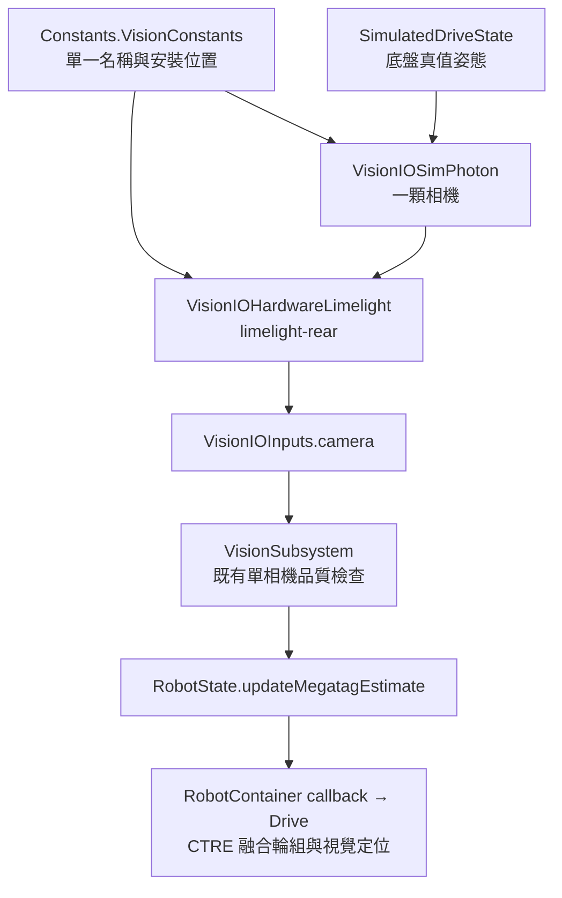

# 單顆 Limelight：安裝位置設定與編譯前確認

> 最新定位原始碼已改為 MT2 位置＋MT1 朝向，完整檔案清單、流程差異及待確認指令見 [MEGATAG-IO.md](MEGATAG-IO.md)。下方保留前階段的確認紀錄；其中「MT1／gyro 備援保留」只描述當時版本。

這次在 `offseason` 將目前架構整理為單顆 `limelight-rear`。保留 MegaTag1、gyro 輔助判斷，以及 `Vision → RobotState → Drive` 的定位回送。沒有改成 MegaTag2；`main` 原始 Team 254 完整機台分支不受影響。

## 鏡頭裝在哪裡，要改哪裡？

修改 [Constants.java](../../src/main/java/com/team11855/frc2026/Constants.java) 的 `VisionConstants`，尋找中文標題 **「鏡頭安裝位置：更換安裝位置時只修改這一區」**。

| 設定 | 意義與單位 | 目前設定值 |
|---|---|---|
| `kLimelightTableName` | 裝置 NetworkTables 名稱，必須完全一致 | `limelight-rear`（使用者確認） |
| `kCameraForwardMeters` | 前後位置，公尺；前正、後負 | `0.0` |
| `kCameraRightMeters` | 左右位置，公尺；右正、左負 | `0.0` |
| `kCameraHeightMeters` | 鏡頭中心離地高度，公尺 | `0.54` |
| `kCameraPitchDegrees` | 俯仰角，度；抬頭正、低頭負 | `0.0` |
| `kCameraYawDegrees` | 水平朝向，度；0 朝前、180 朝後 | `0.0` |

**使用者已確認鏡頭在底盤中心正上方 54 公分，水平 0°、朝前。** 名稱 `limelight-rear` 不會自動改變朝向。鏡頭若實際朝後，將 `kCameraYawDegrees` 改為 `180.0`；安裝在後方與朝向後方是獨立設定。roll 仍固定為 0 度，適用沒有左右側傾的安裝方式。

量測原點是底盤定位中心投影到地面的點，終點是鏡頭中心。這裡採 Limelight Robot Space 的前／右／上方向；可對照 [Limelight 座標文件](https://docs.limelightvision.io/docs/docs-limelight/pipeline-apriltag/apriltag-coordinate-systems)。俯仰及水平轉向請在 Limelight 的 3D 安裝預覽中核對實際姿態。

例如「底盤中心後方 30 cm、左右置中、離地 25 cm、抬頭 15 度、朝後」應填：

```java
public static final double kCameraForwardMeters = -0.30;
public static final double kCameraRightMeters = 0.0;
public static final double kCameraHeightMeters = 0.25;
public static final double kCameraPitchDegrees = 15.0;
public static final double kCameraYawDegrees = 180.0;
```

這是說明範例，沒有把它套成你的實際安裝值。距離直接填公尺，不再把已經是公尺的值放進 `Units.inchesToMeters()`。

實機啟動時 `VisionIOHardwareLimelight` 會寫入 `camerapose_robotspace_set`，所以只在 Limelight 網頁修改位置，下次機器人程式啟動仍會被這裡的值覆寫。程式重新建置並部署後才會把修改送至實機；本輪沒有執行這些動作。

## 實機、模擬與定位怎麼連接？



模擬只建立一顆 PhotonCamera。`kRobotToCamera` 從上方常數推導，請勿另填第二份安裝數值。Limelight 的 right 正方向對應 WPILib 的 left 負方向，因此模擬 Y 取負號；抬頭正角對應 WPILib 的負 pitch。這次也修正舊模擬把 Limelight 的左右數值直接當 WPILib Y 使用的問題。底盤物理仍只由原 DriveSim 迴圈推進。

指定 21 號後，`tv` 供局部追蹤使用；場地定位改由 pose 的 tagCount 判斷。完整增量見 [21 號流程確認](APRILTAG-TRACKING.md#本輪指定-21-號的增量變更)。

## 本輪實際變更與流程確認

| 流程 | 修改前 | 修改後 |
|---|---|---|
| 啟動設定 | 左／右各一份相機名稱與安裝位置 | `Constants.VisionConstants` 一份設定，啟動只設定 `limelight-rear` |
| 實機讀取 | 讀 A、B 兩張 NetworkTable | 只讀一張表至 `VisionIOInputs.camera` |
| 視覺處理 | 分別篩選；兩顆都有效時融合後回送 | 篩選單顆有效量測後直接回送；保留原品質門檻、時間檢查、gyro 備援 |
| 定位與路徑回授 | RobotState callback → Drive → CTRE | 同一條回送路徑；時間仍只在 Drive IO 轉換一次 |
| 模擬 | 兩顆 Photon 相機；側向座標直接沿用 | 一顆，相機位置由同一組實機值轉為 WPILib 座標 |
| Dashboard／記錄 | CameraA、CameraB 與 fusedAccepted | Camera 與 accepted；三份 layout 同步移除第二顆 widget |

本頁記錄單鏡頭變更；後續新增 PS5 □／△ 局部 AprilTag 控制，請一併審閱 [追蹤與編譯確認](APRILTAG-TRACKING.md)。原 Options、手動朝向維持、Drive 停止介面、模式切換、Tuner／CANivore 與 library 版本保持原設定。場地仍是 2025 Reefscape，單標籤 gyro 備援與模擬仍使用原 Reef 標籤集合；這次沒有切換 2026 場地。相機內參／解析度／FOV 與延遲模型也沿用舊值，未宣稱已完成新鏡頭校正。

本輪修改檔案：

- `src/main/java/com/team11855/frc2026/Constants.java`
- `src/main/java/com/team11855/frc2026/subsystems/vision/VisionIO.java`
- `src/main/java/com/team11855/frc2026/subsystems/vision/VisionIOHardwareLimelight.java`
- `src/main/java/com/team11855/frc2026/subsystems/vision/VisionSubsystem.java`
- `src/main/java/com/team11855/frc2026/subsystems/vision/VisionIOSimPhoton.java`
- 新增 `src/test/java/com/team11855/frc2026/subsystems/vision/SingleCameraVisionTest.java`
- `layouts/2025 AdvantageScope Layout.json`、`2025 Elastic Layout.json`、`2025 Shuffleboard Layout.json`
- `docs/drive-vision/README.md`、`REVIEW.md`、本說明、`render-diagrams.mjs`，以及重繪的架構／定位圖（`.dot`、`.mmd`、`.svg`、`.png`）

使用者原本已暫存且另有工作目錄變更的 `BuildConstants.java` 不屬於本次修改；保持原樣，不新增 commit 或 push。

## 驗證與編譯確認

本輪先檢查差異、所有舊 A／B 相機引用、三份 layout 的 JSON/topic、一顆模擬相機、名稱與位置來源、文件連結，並核對暫存內容未受影響。此為靜態檢查，不能證明 Java 已可編譯或實機定位正確。

單鏡頭階段已通過 `python3 docs/drive-vision/static_check.py` 與 `git diff --check`；額外源碼比對確認單相機篩選／gyro 備援函式未改、Drive 與生命週期程式未改、舊 A／B 執行引用為 0、只建立一顆 PhotonCamera，且原有暫存與 BuildConstants 檔案雜湊保持一致。文件圖表已重繪；Dashboard 僅做 JSON／topic 靜態檢查，尚未匯入軟體驗證。

本檔有九項 JUnit 案例（含後續追蹤與指定 ID 驗證），尚未執行：

1. 單顆相機的有效量測只回送一次，時間、tag 數與原標準差保持正確。
2. 相同或更舊影格不重複融合，新影格可繼續回送。
3. 看不到標籤時不回送舊量測，恢復目標後可重新接受。
4. `setUseVision(false)` 阻止回送，重新開啟後可接受。
5. 實機安裝陣列與模擬座標一致，包含左右與抬頭角轉換。
6. 關閉場地定位回送時，局部 tag 仍可供追蹤；無目標時 getter 清空。
7. 局部量測使用 NT 時間減掉 capture／pipeline 延遲，重讀不刷新時間，丟失時清空。
8. 看不到指定追蹤標籤時，其他標籤仍可回送有效場地定位。
9. IO 在 tv=0 時仍可讀取場地 pose，無場地資料後會清空舊值。

依使用者規則「程式下進去編譯前要跟我完整確認會改到哪些流程才可以下」，完成上述修改後取得確認，才會執行：

```sh
./gradlew spotlessCheck test build -PteamNumber=0
./gradlew simulateJavaRelease -PteamNumber=0
```

第一行會執行格式檢查、Java 編譯、全部 JUnit 與建置，可能更新自動產生的 BuildConstants／AutoLogged 與 build 快取；第二行另啟動桌面模擬，檢查一顆鏡頭的可見範圍、標籤丟失／恢復、相機位置與底盤定位回送。`-PteamNumber=0` 只用於本機驗證，不改使用者隊號 11855，不執行 deploy。

編譯確認前，沒有執行上述指令，也沒有連線變更實體 Limelight 或機器人設定。
