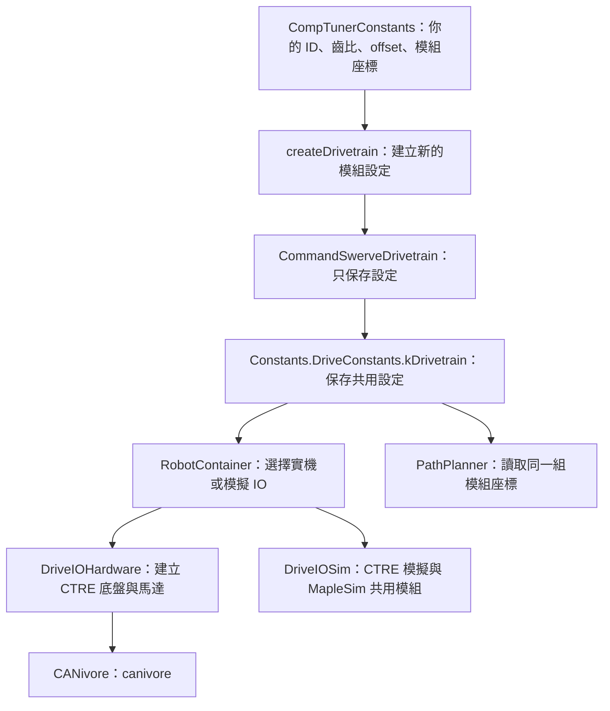

# 使用者 Tuner 設定接入：MK5i R2／Kraken X60／CANivore

日期：2026-09-19。分支：`offseason`。來源為使用者提供的 `/Users/pepsi/Downloads/DriveConstants.java`；使用者確認行走與轉向皆為 Kraken X60，底盤接 CANivore，重量、保險桿外尺寸與慣量等剩餘數值先沿用原預設。

**已完成原始碼修改與靜態查核；沒有執行 Gradle、Java 編譯、JUnit、機器人模擬或部署。** 這份說明接續 [Library 升級階段](LIBRARY-UPGRADE.md)，並更新 [完整流程確認清單](REVIEW.md)。

## 為什麼保留 createDrivetrain()

`createDrivetrain()` 是這份專案現有的資料交接方法，**不是 CTRE 強制規定的方法，也不是把硬體接到 roboRIO CAN 的開關**。

`Constants.DriveConstants.kDrivetrain` 原本就呼叫它，取得本地的 `CommandSwerveDrivetrain`。這個類別雖然名稱有 Command，實際上只是設定容器，沒有繼承 WPILib Command／Subsystem，也不建立 TalonFX 或 CANcoder。

保留這個方法，可以沿用 RobotContainer → Drive IO 的既有連接。如果移除它，就要一起改掉所有取得此設定容器的呼叫端；並不是不能移除。本次保留介面，將其內容改成你的底盤資料。

Team 254 原本也在 [Constants.java](https://github.com/Team254/FRC-2025-Public/blob/main/src/main/java/com/team254/frc2025/Constants.java) 呼叫此方法，依模擬、練習機或比賽機選擇參數。本分支依使用者確認，固定使用自己的 `CompTunerConstants`，再由 `RobotContainer` 選擇實機或模擬 IO。設定的傳遞順序是：`CompTunerConstants.createDrivetrain()` → `Constants.DriveConstants.kDrivetrain` → `RobotContainer` → `DriveIOHardware`／`DriveIOSim`。



你的硬體設定目前在 [CompTunerConstants.java](../../src/main/java/com/team254/frc2025/subsystems/drive/CompTunerConstants.java)。保留檔名與 package 是為了接上既有專案，不表示仍使用 Team 254 的模組參數。

## 已採用的硬體參數

CAN bus 名稱為 `canivore`，Pigeon 2 ID 為 `0`。底盤與 CAN bus 診斷共用此名稱；三份 dashboard 的診斷 topic 也更新為 `CANBusStatus/canivore`。這是 CANivore bus，不是 roboRIO 內建 CAN。

模組順序固定為左前、右前、左後、右後；X 正方向朝車頭，Y 正方向朝左。

| 模組 | Drive ID | Steer ID | CANcoder ID | Offset（圈） | X / Y（英吋） |
|---|---|---|---|---|---|
| 左前 FL | 1 | 2 | 3 | 0.09326171875 | +11 / +11 |
| 右前 FR | 4 | 5 | 6 | 0.004638671875 | +11 / −11 |
| 左後 BL | 7 | 8 | 9 | −0.35595703125 | −11 / +11 |
| 右後 BR | 10 | 11 | 12 | 0.167236328125 | −11 / −11 |

- 行走齒比：`6.026785714285714`；轉向齒比：`26`；耦合比：`3.857142857142857`。
- 輪半徑：`2 in = 0.0508 m`。模組中心座標：`±11 in = ±0.2794 m`。
- 左側 drive 不反轉、右側 drive 反轉；四個 steer 與 encoder 都不反轉。
- 行走與轉向閉迴路輸出皆採 `Voltage`，保留 `FusedCANcoder`。
- Steer gains：P=100、I=0、D=0.5、kS=0.1、kV=3.23、kA=0。Drive gains：P=0.1、I=0、D=0、kS=0、kV=0.124。
- Slip current：120 A；行走 supply limit：70 A；轉向 stator limit：60 A。初始 configs 採用提供的檔案，沒有另外加入原 Tuner 檔的 `NeutralMode.Brake` 設定。

Encoder offset 保留 `Rotations.of(...)` 的圈數，不能跟角速度的 rad/s 混為一談。本次單位轉換只針對控制使用的角速度；不重新換算或重新校正 offset。

## 速度與路徑控制的設定位置

[Constants.java](../../src/main/java/com/team254/frc2025/Constants.java) 已加入中文註解：

```java
// Tuner 原值 0.4 圈/秒；1 圈 = 2π 弧度，換算為 0.4 × 2π ≈ 2.513 rad/s。
// 此值供底盤 request 使用；rad/s 是弧度/秒，不是角度/秒。
public static final double kDriveMaxAngularRate = 0.4 * 2.0 * Math.PI;
```

| 設定 | 目前用途與數值 |
|---|---|
| `CompTunerConstants.kSpeedAt12Volts` | 馬達／模組速度模型，5 m/s；PathPlanner ModuleConfig 直接讀這個值 |
| `Constants.DriveConstants.kDriveMaxSpeed` | PS5 的平移速度上限，5 m/s；與 12 V 模型分開設定 |
| `Constants.DriveConstants.kDriveMaxAngularRate` | PS5 手動旋轉上限，0.4 × 2π rad/s，約 2.513 rad/s |
| `AutoConstants` 速度設定 | 平移與角速度上限引用上述控制數值；既有加速度值保留 |
| `AutoConstants.kPLTEController`／`kPCTEController` | 使用 Tuner 檔的平移 P=1.0，對應本地 fork 的沿路徑／橫向誤差 |
| `AutoConstants.kPathRotationControllerP` | 使用 Tuner 檔的路徑旋轉 P=1.0 |
| PS5 heading hold／定點對位 PID | 獨立保留原值，沒有因更新路徑旋轉 P 而一起變更；定點對位的角速度約束使用更新後的 AutoConstants |

平移與旋轉輸入曲線、5% request deadband 比例、Options、連線 gate、模式停止與同步鎖保留。因速度上限改變，平移 request deadband 現為 0.25 m/s，手動旋轉 request deadband 約為 0.1257 rad/s。

## 實機、路徑、模擬如何使用同一套設定

1. `Constants.DriveConstants.kDrivetrain` 一律使用 `CompTunerConstants.createDrivetrain()`；移除舊 practice MAC 自動選擇、`PracTunerConstants` 與 `SimTunerConstants`，避免誤用另一台機器人的設定。
2. `createDrivetrain()` 每次建立新的四個模組設定。模擬仍沿用原調整：offset 歸零、反轉關閉、steer P=70/D=4.5、friction 0.1/0.15 V、steer inertia 0.05；調整 gains 前先複製物件，因此不覆寫公開的實機校正與 PID。
3. `CommandSwerveDrivetrain.getModuleLocations()` 從這四個模組的 `LocationX/LocationY` 產生座標。PathPlanner 不再寫死舊的 ±0.31115 m。
4. `DriveIOSim` 將建構子收到的同一組 modules 交給 MapleSim；每個模組使用各自的設定。實機與模擬共用齒比、輪半徑與幾何，模擬專用調整另行保留。
5. 模擬週期依 Tuner 檔由 5 ms 改為 **4 ms／250 Hz**；仍只有 DriveIOSim 的 Notifier 推進物理。路徑控制 Notifier 保留 10 ms／100 Hz。
6. 地圖、AprilTag、Vision 融合、PS5 按鍵與自主模式預設不移動的流程保留。

## 使用者同意先沿用的預設值

這些不是新底盤的實測值，後續可另外更新，這次不推測數字：

| 參數 | 暫用原值 |
|---|---|
| PathPlanner 整車質量 | 147.92 lb，約 67.095 kg |
| MapleSim 整車質量 | 150 lb，約 68.039 kg；原專案與路徑模型的質量本來就不同 |
| PathPlanner 轉動慣量 | 18.76 kg·m² |
| 保險桿外長／外寬 | 35.625 in × 35.625 in，約 0.9049 m × 0.9049 m |
| 輪胎摩擦係數 | PathPlanner 1.0；MapleSim 1.2 |
| 馬達模型 | Kraken X60；路徑保留原本 FOC 曲線，MapleSim 保留原本一般曲線 |
| 相機位置／校正、2025 navgrid | 原專案資料保留 |

模組中心間距是 22 × 22 英吋，不能把它直接當成保險桿外尺寸。

## 實際受影響流程與驗證確認

| 流程 | 此次改動 |
|---|---|
| 啟動 | 取得使用者 Tuner 設定；取消依原 Team 254 MAC 切換硬體；IO 仍只建立一次 |
| CAN 通訊／診斷 | 底盤與 CAN 記錄、dashboard 都選 `canivore` |
| Teleop | 使用 5 m/s 平移與約 2.513 rad/s 手動旋轉上限；其他按鍵與停止流程保留 |
| 通用路徑／定點對位 | 模組座標、輪半徑、齒比、12 V 速度、路徑 P 更新；既有定點對位 PID 保留、角速度約束更新 |
| 模擬／視覺模擬 | 採新底盤幾何、Kraken X60、4 ms 物理週期，保留共享 pose → Photon → Vision 的資料流 |
| Auto／Disabled／Test | 命令取消、Drive stop、控制權同步與 Auto 預設不移動保留 |

已完成：51 個 Tuner 常數、8 組 gains／initial configs／factory／drivetrain 設定運算式，以及四個輪組的參數順序均與提供的檔案比對一致；CANivore 名稱、舊設定引用、JSON／文件連結與 `git diff --check` 檢查通過。目前 21 個 JUnit 案例尚未執行；本次新增三個情境涵蓋跨模型幾何與順序、模擬設定隔離、滿搖桿單位。上述比對屬原始碼靜態檢查，不代表 Java 編譯或執行結果已通過。

依使用者提供的 AGENTS.md：「程式下進去編譯前要跟我完整確認會改到哪些流程才可以下」，確認上述流程與 [REVIEW.md](REVIEW.md) 後，才執行：

```sh
./gradlew spotlessCheck test build -PteamNumber=0
./gradlew simulateJavaRelease -PteamNumber=0
```

隊號 0 只供本機驗證；不部署、不刷韌體、不 push。Java 原始碼與 JNI 是否實際相容、模擬轉向是否穩定仍待核准後驗證。

## 本次增量檔案

以接入 Tuner 前的工作樹為基準；全部分支差異另見 [CHANGES.md](CHANGES.md)。

<!-- TUNER_FILES -->

| Status | File |
|---|---|
| M | [README.md](<../../README.md>) |
| M | [docs/drive-vision/CHANGES.md](<../../docs/drive-vision/CHANGES.md>) |
| M | [docs/drive-vision/LIBRARY-UPGRADE.md](<../../docs/drive-vision/LIBRARY-UPGRADE.md>) |
| M | [docs/drive-vision/README.md](<../../docs/drive-vision/README.md>) |
| M | [docs/drive-vision/REVIEW.md](<../../docs/drive-vision/REVIEW.md>) |
| A | [docs/drive-vision/TUNER-INTEGRATION.md](<../../docs/drive-vision/TUNER-INTEGRATION.md>) |
| M | [docs/drive-vision/static-check.json](<../../docs/drive-vision/static-check.json>) |
| M | [docs/drive-vision/static_check.py](<../../docs/drive-vision/static_check.py>) |
| M | [layouts/2025 AdvantageScope Layout.json](<../../layouts/2025 AdvantageScope Layout.json>) |
| M | [layouts/2025 Elastic Layout.json](<../../layouts/2025 Elastic Layout.json>) |
| M | [layouts/2025 Shuffleboard Layout.json](<../../layouts/2025 Shuffleboard Layout.json>) |
| M | [src/main/java/com/team254/frc2025/Constants.java](<../../src/main/java/com/team254/frc2025/Constants.java>) |
| M | [src/main/java/com/team254/frc2025/Robot.java](<../../src/main/java/com/team254/frc2025/Robot.java>) |
| M | [src/main/java/com/team254/frc2025/RobotContainer.java](<../../src/main/java/com/team254/frc2025/RobotContainer.java>) |
| M | [src/main/java/com/team254/frc2025/subsystems/drive/CommandSwerveDrivetrain.java](<../../src/main/java/com/team254/frc2025/subsystems/drive/CommandSwerveDrivetrain.java>) |
| M | [src/main/java/com/team254/frc2025/subsystems/drive/CompTunerConstants.java](<../../src/main/java/com/team254/frc2025/subsystems/drive/CompTunerConstants.java>) |
| M | [src/main/java/com/team254/frc2025/subsystems/drive/DriveIOSim.java](<../../src/main/java/com/team254/frc2025/subsystems/drive/DriveIOSim.java>) |
| M | [src/main/java/com/team254/frc2025/subsystems/drive/DriveSubsystem.java](<../../src/main/java/com/team254/frc2025/subsystems/drive/DriveSubsystem.java>) |
| D | `src/main/java/com/team254/frc2025/subsystems/drive/PracTunerConstants.java` |
| D | `src/main/java/com/team254/frc2025/subsystems/drive/SimTunerConstants.java` |
| M | [src/main/java/com/team254/frc2025/utils/simulations/MapleSimSwerveDrivetrain.java](<../../src/main/java/com/team254/frc2025/utils/simulations/MapleSimSwerveDrivetrain.java>) |
| M | [src/test/java/com/team254/frc2025/subsystems/drive/DriveMaintainingHeadingCommandTest.java](<../../src/test/java/com/team254/frc2025/subsystems/drive/DriveMaintainingHeadingCommandTest.java>) |
| A | [src/test/java/com/team254/frc2025/subsystems/drive/TunerConfigurationTest.java](<../../src/test/java/com/team254/frc2025/subsystems/drive/TunerConfigurationTest.java>) |
