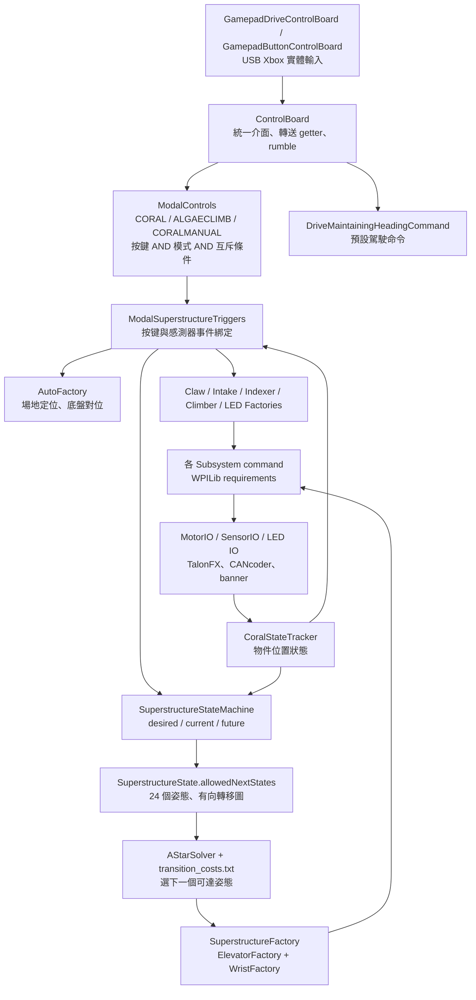
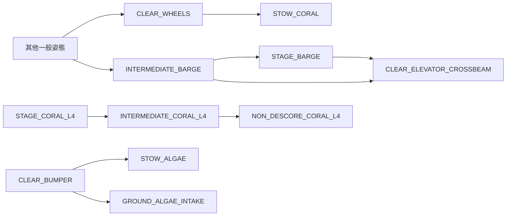
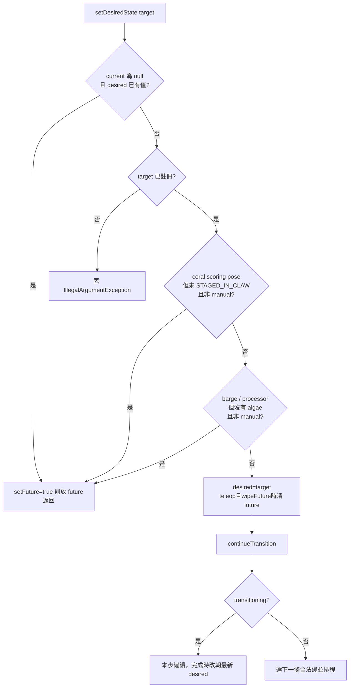
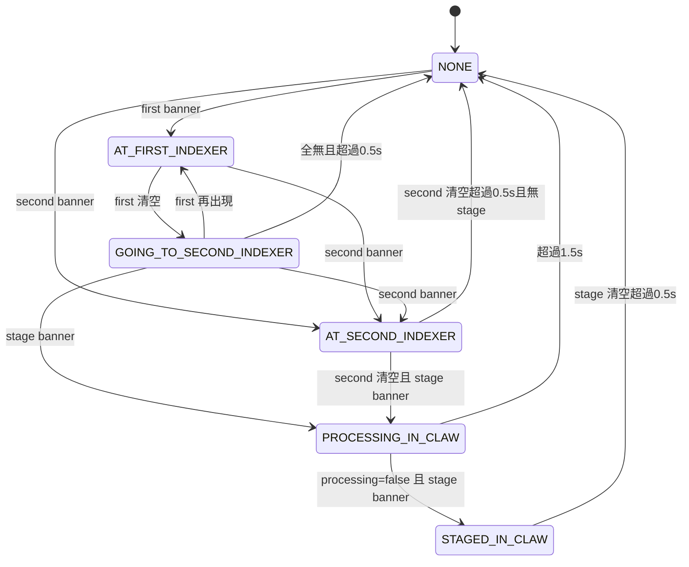

# 操作介面、命令組合與 Superstructure 詳細導讀

本章以目前工作目錄的原始碼為準，採靜態閱讀與資料解析，沒有編譯、模擬啟動、連線機器人或變更 production code。`L` 表示原始檔行號。表中的按鍵行為是「程式已接上的行為」，不是單靠方法名稱推測的功能。

## 1. 先理解五層之間的連接

這份架構有兩個不同的「狀態」：`SuperstructureState` 描述 **elevator 高度 + wrist 角度**；`CoralStateTracker.CoralPosition` 描述 **coral 在機器裡的位置**。`ModalControls.Mode` 又是第三種狀態，決定同一顆按鍵代表哪個操作。三者不能合併看待。

完整控制鏈為：**實體按鍵 → 語意化 getter → 模式條件 → Trigger 邊緣 → 建立／排程 Command → 狀態機要求或機構直接命令 → Subsystem requirement 仲裁 → IO 輸出 → 感測器回報 → 下一個 Trigger**。

## 2. RobotContainer 是組裝點，不是每個動作的執行器

來源：`RobotContainer.java` L58–216、L219–316。

| 成員／方法 | 建立與依賴 | 下游使用 |
|---|---|---|
| `controlBoard`、`modalControls` | singleton，L219–220 | driver command、trigger 綁定 |
| `visionEstimateConsumer` → `robotState` | callback 會呼叫 `driveSubsystem.addVisionMeasurement`，L223–235 | 視覺估測送到底盤姿態估測器 |
| `coralStateTracker` | 單一共享實例，L238 | Claw、Indexer、狀態機、trigger |
| `simulatedRobotState`、各 `*SensorIOSim`、模擬馬達 | 只在 simulation 建立，L239–254 | 真實與模擬使用相同上層命令 |
| `buildDriveSystem()` | simulation → `DriveIOSim`；real → `DriveIOHardware`；共用 `RobotState` | `DriveSubsystem` |
| `buildVisionSystem()` | simulation → Photon；real → Limelight | `VisionSubsystem` |
| `buildClawSubsystem()` | config + MotorIO + ClawSensorIO + `this` | Claw 可存取 tracker、wrist、mode |
| `buildClimberPivotSubsystem()` | config + Talon/Sim + CANcoder/Sim + state | 角度、raw rotor offset、deploy flag |
| `buildClimberRollerSubsystem()` | config + motor + 左右限位感測器 + state | latch／雙邊接合判斷 |
| `buildElevatorSubsystem()` | lead motor + 一個 follower + 感測器 + state | 升降與靠近 reef 的收回條件 |
| `buildWristSubsystem()` | motor + CANcoder + state | wrist Motion Magic、是否離開 indexer |
| `buildIndexerSubsystem()` | motor + 兩個 banner + state + tracker | 輸送、更新物件位置 |
| `buildIntakeRollerSubsystem()` | motor + state | 吸入、反吐 |
| `buildIntakePivotSubsystem()` | motor + CANcoder + state | intake 展開、收回、climb 收回 |
| `buildLedSubsystem()` | 永遠 `LedIOHardware`，沒有在此分支模擬 LED IO | 模式與機構狀態提示 |
| `driveCommand` | drive + state + container + throttle/strafe/rotation suppliers，L284–291 | L315 設為底盤 default command |
| constructor | 先 simulation init，再 state machine，再 auto selector，再 bindings，L297–306 | 確保 factories 取得完整容器 |
| `configureBindings()` | `ModalControls.configureBindings()` → new `ModalSuperstructureTriggers` → drive default | 所有按鍵與感測器 triggers 在建構期間註冊 |

### 2.1 所有公開介面如何被使用

`getDriveSubsystem/getVisionSubsystem/getClaw/getClimberPivot/getClimberRoller/getElevator/getWrist/getIndexer/getIntakeRoller/getIntakePivot/getLeds`（L333–375）提供 factory 與 command 取得**同一個**機構實例；不應另外 new 第二個 subsystem 操作同一個 CAN 馬達。

`getRobotState/getCoralStateTracker/getModalControls/getStateMachine/getModalSuperstructureTriggers`（L329、377–387、453）把共享狀態與操作協調器交给命令。`getReefViz/getRobotViz`（L280、421）為視覺化；`getSimulated*`（L389–419）為模擬裝置注入與觀察；這些 getter 不會自行執行機構動作。

`getModeChooser/getScoringSequence/getLevelSequence/getStartingPositionChooser/getIceCreamCountChooser/getFeederStrategyChooser/isValidAutoCommand/getAutonomousCommand`（L425–475）轉送 `AutoModeSelector`，不在本類直接拼自動流程。

`resetHeading()`（L318）保留 x/y，將 heading 設為 blue 0、red π；**本地 `src/main/java` 沒找到呼叫它的按鍵綁定**。`odometryCloseToPose()`（L457）同時檢查距離 < 0.25 m、朝向差 < 8° 並寫 SmartDashboard。`getDisabledCommand()`（L482）回傳 `Commands.none()`。

`setAutoDefaultCommands(strategy)` 與 `setTeleopDefaultCommands()`（L478、486）目前只切換 intake pivot 的 default command，不是替所有機構重新設定 default。

### 2.2 Default command 的實際來源

| 機構 | 沒有其他 command 佔用時 | 來源 |
|---|---|---|
| Drive | `DriveMaintainingHeadingCommand` 讀三個 joystick suppliers | RobotContainer L284、315 |
| Elevator | 持續對 `getPositionSetpointUnits()` 跑 Motion Magic | ElevatorSubsystem L54 |
| Wrist | 持續保持最後 setpoint | WristSubsystem L23 |
| Intake pivot，Auto | GROUND feeder strategy → 展開；其他 strategy → 收回 | IntakePivotSubsystem L38 |
| Intake pivot，Teleop | 保持最後 setpoint | IntakePivotSubsystem L52 |
| Claw | 有 algae → torque hold／regrab；coral autoScore 啟用 → position target 0；wrist 未離開 indexer → 0 V | ClawSubsystem L98、230 |
| Climber pivot | 其自訂 default 行為，見硬體／機構章 | ClimberPivotSubsystem L31 |
| 其他一般 ServoMotor | base class 的 neutral duty-cycle command | ServoMotorSubsystem L31 |

Motion Magic command 結束後通常**不清 setpoint**，接回保持 setpoint 的 default command。因此「blocking command 結束」表示到達容許誤差，不表示馬達解除閉迴路。`ignoringDisable(true)` 表示 scheduler 允許命令在 disabled 排程／執行；它不是繞過 FRC disabled 的硬體輸出限制。

## 3. 每個 controlboard 檔案的責任與按鍵

| 檔案 | 入口與責任 | 不應放入的邏輯 |
|---|---|---|
| `IDriveControlBoard.java` L5–14 | `getThrottle/getStrafe/getRotation/getRotationY/resetGyro` 契約 | CAN 或 subsystem 實例 |
| `IButtonControlBoard.java` L5–78 | 36 個 trigger getter + rumble，語意化命名 | elevator 高度／state machine 路徑 |
| `GamepadDriveControlBoard.java` L22–56 | USB 0；simulation 用 `CommandSimXboxController`；leftY/leftX 經負號與 1.5 次方，rightX/rightY 經負號與平方 | 模式切換 |
| `GamepadButtonControlBoard.java` L28–40 | `kForceDriveGamepad=true`，所以目前使用 USB 0；建 USB 1 additional controller，但未使用。備援 else 選 USB 2 | 實際動作排程 |
| `ControlBoard.java` L20–236 | drive/button facade；所有 getter 轉送；`rumble()` 為 startEnd，開始雙馬達 rumble=1、結束=0 | 模式條件與安全互鎖 |
| `ModalControls.java` L11–293 | 3 模式 + raw trigger AND mode；供 trigger binding 層使用 | 直接操作馬達 |

常數：`Constants.java` L127、129、157–159。控制軸負號及曲線是本檔處理；速度上限、deadband、field-relative、heading snap 還需追 `DriveMaintainingHeadingCommand`，不能只看這裡就認定 joystick 直接等於 m/s。

### 3.1 模式選擇與共同控制

| 實體輸入 | raw getter | 實際作用 |
|---|---|---|
| Start 且非 Back，持續 0.1 s | `getCoralMode()` | `ModalControls.configureBindings` onTrue → CORAL |
| Back 且非 Start，持續 0.1 s | `getAlgaeClimbMode()` | onTrue → ALGAECLIMB |
| Back + Start，雙向 debounce 0.5 s | `getCoralManualMode()` | onTrue → CORALMANUAL |
| D-pad 下，非上 | `setDefaultRobotWide()` | 非 CORALMANUAL 時設定 `defaultRobotWide=true` 並展開 intake |
| D-pad 上，非下 | `setDefaultRobotTight()` | 非 CORALMANUAL 時設定 false；第一 banner 沒 coral 才收 intake |
| 左摇杆 Y/X | throttle/strafe | default drive 持續讀取 |
| 右摇杆 X | rotation | default drive 持續讀取 |

`ModalControls` 的一般 `intake()` 是 **LT && !RT**，`score()` 是 **RT && !LT**（L90–96），同時壓 LT/RT 會讓兩者為 false。但 `moveToAlgaeLevel()` 直接用 raw `score()` getter，**未套用 LT 互斥**（L164–165），而實際 algae RT 綁的是這個方法（ModalSuperstructureTriggers L963）。

`setMode()` 只寫 enum；`forceSetMode()` 先呼叫變更 consumer 再寫 enum；`maybeTriggerStateChangeConsumer()` 僅在模式真的變更時呼叫。現有 `stateChangeConsumer` 沒看到賦值入口，所以主要模式效果來自 `coralMode()/algaeClimbMode()` trigger 的 onTrue（ModalControls L17–54）。

### 3.2 CORAL 模式：逐鍵到命令

| 按鍵 | ModalControls getter | 接到哪裡、結束條件與輸出 |
|---|---|---|
| X | `stageL1()` | onTrue 只把 `latestCoralStageState=L1`；不立即升降，MT L847 |
| A | `stageL2()` | 只選 L2，MT L850 |
| B | `stageL3()` | 只選 L3，MT L853 |
| Y | `stageL4()` | 只選 L4，MT L856 |
| LT | `groundCoralIntake()` | whileTrue → `SuperstructureFactory.groundIntake`；tracker 必須 NONE；intake 0 rad + roller +1 duty + indexer +1 duty 並行，第一 banner true 結束；第一 banner 已有 coral 且姿態不是 STOW_CORAL 時阻擋，MT L747 |
| LT 放開 | 同上 onFalse | 若仍無 coral 且正在 LB/RB 對位，roller/indexer 最多再跑 1 s 等 coral；之後 defaultRobotWide=false 且物件未卡第一段才收 intake，MT L758 |
| RT、選 L2–L4 | `stageOrScoreCoral()` | onTrue → current/desired 都已是所選層時 score；否則先要求所選姿態，MT L370、859 |
| RT、選 L1 | 同上 | 若已有 stage request 或沒有 staged/processing coral，等 L1 後 `scoreL1Shallow`，輸出最多 0.5 s、整段最多 2 s；否則只要求 L1，MT L861 |
| LB | `leftBranchSelect()` | whileTrue 選最近 reef face + 第一字母 → `AutoFactory.getPathfindToReefCommand`；傳入 stage callback 和到層 predicate；放開取消對位並清 future state，MT L782 |
| RB、非 L1 | `rightBranchSelect()` | 同上，使用第二字母；放開清 future state，MT L805 |
| RB、L1 | 同上 | L1 deep score；層／物件條件與 RT L1 同類，但 deep=-5 RPS，MT L825 |
| 左摇杆按下 | `stowCoral()` | 需 canStow 且 awayFromReef；若 staged coral → CLEAR_LIMELIGHT，否則 STOW_CORAL，MT L775 |
| 右摇杆按下，debounce 0.1 s | `autoHP()` | 只設定 coral snap-heading=false；放開設 true；此處沒有直接啟動 HP pathfind，MT L841 |
| D-pad 左 | `funnelIntakeCoral()` | 非地面 intake 且 canStow/away 或已 STOW_CORAL → 要求並等待 STOW_CORAL → indexer +1 duty；按住執行，MT L877 |
| D-pad 右 | `coralExhaust()` | `!uncancellableCommandRunning` 才 whileTrue：intake -0.75、indexer -1；tracker 不是 STAGED_IN_CLAW 才 claw +1，MT L888、301 |

進 CORAL 的 onTrue（MT L733）若 claw 持 algae，先 `exhaustAlgae` 最多 0.5 s，再在收回條件允許時要求 STOW_CORAL。這條 onTrue 也受 scheduler 的 disabled／requirement 規則限制。

### 3.3 ALGAECLIMB 模式：逐鍵到命令

| 按鍵 | ModalControls getter | 接到哪裡、結束條件與輸出 |
|---|---|---|
| A | `stageAlgaeL2()` | 只選 `REEF_ALGAE_INTAKE_L2`，MT L942 |
| B | `stageAlgaeL3()` | 只選 `REEF_ALGAE_INTAKE_L3_MANUAL`，不是一般 L3，MT L945 |
| Y | `bargeManualStage()` | 只選 `STAGE_BARGE`，MT L948 |
| X | `processorManualStage()` | 只選 `STAGE_PROCESSOR`，MT L950 |
| RT | `moveToAlgaeLevel()` | onTrue `createStageOrScoreAlgaeCommand`；未到所選位置 → 要求該姿態；已是所選 BARGE → -12 V 0.4 s 後 STOW_CORAL；已是所選 PROCESSOR → claw -1 duty，放開 RT 結束，MT L393、963 |
| LT、尚未持 algae | `groundIntakeAlgae()` | onTrue 要求 GROUND_ALGAE_INTAKE；claw 70 A torque，falling debounce 0.25 s；鬆開後走收回分支，MT L904、908 |
| RB、尚未持 algae | `lollipopIntake()` | 同類但姿態 LOLLIPOP_INTAKE，MT L906、911 |
| LT、已持 algae 且不是 ground/lollipop 取 algae 姿態 | `groundIntakeAlgae()` | 改做 coral ground intake，允許 claw 持 algae、coral 暫存第一 banner，MT L898、915 |
| LT/RB 放開 | 合併 trigger onFalse | 必要時等 algae debounce；若 desired 是 ground/lollipop 則 createStowAlgaeCommand；同時依 defaultRobotWide 與 coral 位置收 intake，MT L920 |
| LB | `autoAlignReefIntake()` | 取自己或對手半場最近 face → `AutoFactory.getPathfindToAlgaeIntake`；按住對位，MT L954 |
| 右摇杆按下 | `manualIntakeAlgae()` | algae snap-heading=true；放開 false；不是這個 getter 直接跑吸球馬達，MT L844 |
| 左摇杆按下 | `stowAlgae()` | canStow/離 reef 或已 processor 才執行：持 algae 且選 processor → processor；持 algae 其他 → STOW_ALGAE；無 algae → STOW_CORAL，MT L412、966 |
| D-pad 左，0.25 s | `deployClimber()` | 同一事件啟動三件事：autoClimb；intake 收到 -90°（2 s timeout）；要求 STOW_CORAL。是並行排程，未等待另兩者完成才 deploy，MT L972–974 |
| D-pad 右，按住 | `climb()` | `manualJogClimber`：pivot 12 V，沒有本命令內到位結束條件，放開取消，MT L976 |
| D-pad 上／下 | 共用 tight／wide | 仍會收／展 intake；`bargeAutoAlignStage/processorAutoAlignStage` getter 雖存在，沒有被 MT 綁定 |

進 ALGAECLIMB（MT L891）僅當 elevator canStow 且離 reef 時呼叫 createStowAlgaeCommand。爪在 reef algae 姿態、尚無 algae 且目前是 algae mode 時，另一條自動 trigger 會持續跑 `ClawFactory.intakeAlgae`，不需要再額外握住取球鍵（MT L689–697）。

### 3.4 CORALMANUAL 模式

| 按鍵 | 實际連接 |
|---|---|
| X/A/B/Y | 選 L1/L2/L3/L4，同樣只改 latest，MT L1030 |
| RT、非 L1 | current/desired 已到 selected → score；否則先把 current 強制標成 desired、transitioning=false，再要求新 selected，MT L379、1042 |
| RT、L1 | deep score=-5 RPS；正常 CORAL 的 RT 是 shallow=-3 RPS，MT L1045 |
| LT | ground intake，仍要求 tracker NONE 且非第一 banner 保留條件；不是完全無條件轉馬達，MT L1006 |
| D-pad 上 | whileTrue deploy pivot 0 rad，MT L1001 |
| D-pad 下 | whileTrue deploy pivot 0 rad + roller +1，MT L1003 |
| D-pad 左 | 等 STOW_CORAL 再跑 indexer；略過一般模式的 canStow/away gate，MT L1067 |
| D-pad 右 | intake -0.75、indexer -1、claw +1，全反吐；仍受 uncancellable flag gate，MT L1075 |
| RB | 若 current 是 L2/L3/L4，要求對應 NON_DESCORE 姿態，MT L1061 |
| 左摇杆按下 | 直接要求 STOW_CORAL，沒有一般模式的 canStow/away gate，MT L1064 |

Manual 模式會略過 `setDesiredState()` 對是否持有 coral/algae 的檢查，以及 `isTransitionBlocked()` 對持 algae 進 coral state 的限制；**仍使用同一張姿態轉移圖、同一組馬達命令**。因此 manual mode 應有明確練習流程與使用條件。

### 3.5 有宣告但沒有接成動作的 API

以 `rg` 搜尋目前 `src/main/java`：`resetGyro()`、`getWantToXWheels()`、`getWantToAutoAlign()`、`getRotationY()` 沒有控制板外部呼叫；不要把 Back 解說為「目前會歸零 gyro」，也不要把 Start 解說為「目前會 X-lock」。`RobotContainer.xWheels` 亦僅宣告。

ModalControls 的 `bargeAutoAlignStage`、`processorAutoAlignStage`、`scoreAlgae`、`coralIntakeToIndexer`、`closestFaceAlign` 沒看到 consumer；`povAutoAlignStage()` 固定 false。`IButtonControlBoard.climb()` 回 RB，但真正 modal climb 回 D-pad 右。這些差異是建立 driver cheat sheet 前必須核對的重點。

## 4. WPILib Command 語義與本專案資源規則

`onTrue` 在 false→true 時排一次；`onFalse` 在 true→false 排一次；`whileTrue` 於上升緣排程、下降緣取消，但命令自然結束後，按鍵持續為 true **不會自動重跑**。因此「吸到第一 banner 結束」後仍握 LT，不會一直重建 intake 命令；後半段交給 sensor triggers。[WPILib Trigger 文件](https://docs.wpilib.org/en/latest/docs/software/commandbased/commands-v2/binding-commands-to-triggers.html)

一般 sequence/parallel composition 的 requirements 為子命令的聯集；parallel 不允許兩個子命令同時佔相同 subsystem。`deadline` 由指定子命令的完成決定全組完成、取消其他子命令。`asProxy()` 讓內層獨立排程，影響 requirement 的持有方式。[WPILib Command Compositions](https://frcdocs.wpi.edu/en/stable/docs/software/commandbased/command-compositions.html)

本地實作還有下列重要規則：

| 寫法 | 實際 requirement／生命週期 | Mentor 要核對的地方 |
|---|---|---|
| `subsystem.run/runEnd/startEnd` | 需要該 subsystem | 不可偷呼叫另一個 subsystem 的 IO 卻沒加 requirement |
| `new InstantCommand(() -> stateMachine.setDesiredState(...))` | 沒有 elevator/wrist requirement；狀態機會另外 `.schedule()` 動作 | 外層取消不必然取消已排程的姿態移動 |
| `Commands.defer(..., Set.of(claw))` | 明確先宣告 claw | MT stage-or-score 在等待／只選姿態時也持有 claw |
| `setStateAndWaitCommand` | request + 等 current==target；本身沒有 E/W requirements | 沒有內建 timeout，也未用 physical atTarget 重新檢查 |
| `kCancelIncoming` | 有 requirement 衝突時拒絕新命令 | 不等於不能 `.cancel()`；本專案還靠 `until(manualOverride)` 主動退出 |
| `kCancelSelf` | 接受新衝突命令，中斷自己 | finallyDo/end 應恢復旗標與输出 |
| `withTimeout`／`until` | 條件達成會結束包裝並中斷未結束內層 | 不能把 timeout 直接當成功到位 |
| `ignoringDisable(true)` | scheduler 層容許 disabled 執行 | 記憶狀態可能在 disabled 改變，須在 enable 校驗 |

`ChezySequenceCommandGroup`（`lib/commands` L39–95）保留全部子命令 requirements，註冊 composed commands；某個子命令一結束，直接遞迴 `execute()` 下一個，所以多個 instant/wait 已滿足步驟可在**同一個 scheduler tick**跑完。其 interruption behavior 初始為 cancelIncoming，但只要某子命令是 cancelSelf 就降為 cancelSelf；不能單看類別名稱猜整組不可中斷。

### 4.1 馬達命令的 end() 不全相同

來源：`ServoMotorSubsystem.java` L136–319。

| 命令 | 每 tick 做什麼 | 結束做什麼 |
|---|---|---|
| `dutyCycleCommand` | 設 duty cycle | 設 0 duty |
| `dutyCycleCommandNoEnd` | 設 duty cycle | 無動作；default 或後續 command 才可能覆蓋 |
| `voltageCommand` | 設 voltage | 設 0 V |
| `velocitySetpointCommand` | velocity closed loop | 無動作 |
| `positionSetpointCommand` | position closed loop | 無動作 |
| `motionMagicSetpointCommand` | profile + position setpoint | 無動作 |
| `setTorqueCurrentFOC` | torque current | 無動作 |
| `motionMagicSetpointCommandBlocking` | 同上，直到目前 position 在 tolerance 內 | 沿用 Motion Magic 空 end |
| `setCurrentPosition` | 直接呼叫 IO 的感測器位置重設 | 它不是 position target command |

最後一列對理解 RT score 很關鍵：MT 的 `setCurrentPosition(-10)` 是把 encoder 座標改為 -10，再利用已啟用的 claw position target 0 產生位移；不是直接命令馬達轉到 -10。這也是後續 avoid-descore trigger 讀 `getPositionRotations() < -5` 的來源（MT L665）。

## 5. SuperstructureState：24 個姿態的完整索引

角度下表為方便閱讀換算的 degree，程式傳入為 rad；高度為 m。一般到位容許誤差 elevator=0.05 m、wrist=0.05 rad（約 2.86°）。來源：`SuperstructureState.java` L13–126；`Constants.java` L420–465、L565–608。

| 狀態 | E 高度 m | W 角度 ° | 意義／與誰連接 |
|---|---:|---:|---|
| CLEAR_ELEVATOR_CROSSBEAM | 0.96 | 名目 -90；實際依終點 clamp 在 -90..-80 | 唯一自訂 command supplier；清 elevator 横梁 |
| CLEAR_WHEELS | 0 | -87 | 回 STOW_CORAL 的轉接姿態 |
| CLEAR_LIMELIGHT | 0 | 42 | staged coral 後抬 wrist 讓相機可見 |
| STOW_CORAL | 0 | -103 | indexer→claw handoff 必要姿態 |
| STOW_ALGAE | 0 | 55 | algae 安全收姿 |
| GROUND_ALGAE_INTAKE | 0 | -71 | claw 地面吸 algae |
| LOLLIPOP_INTAKE | 0.3 | -71 | 高位 lollipop 取球 |
| REEF_ALGAE_SLAP | 0.506 | -71.3 | reef slap |
| REEF_ALGAE_INTAKE_L2 | 0.606 | -71.3 | reef L2 algae |
| REEF_ALGAE_INTAKE_L3 | 1.006 | -71.3 | reef L3 algae，自動對位選用 |
| REEF_ALGAE_INTAKE_L3_MANUAL | 0.5319 | -4 | B 鍵選的 algae 手動姿態 |
| STAGE_CORAL_L1 | 0.07 | -93 | L1 shallow/deep score |
| STAGE_CORAL_L2 | 0.13 | -4 | L2 coral |
| NON_DESCORE_CORAL_L2 | 0 | 55 | L2 score 後避開已得分 coral |
| STAGE_CORAL_L3 | 0.52 | -4 | L3 coral |
| NON_DESCORE_CORAL_L3 | 0.445 | 55 | L3 score 後避開 |
| STAGE_CORAL_L4 | 1.14 | -2 | L4 coral |
| INTERMEDIATE_CORAL_L4 | 1.25 | -5 | 進 NON_DESCORE_CORAL_L4 必經來源 |
| NON_DESCORE_CORAL_L4 | 1.25 | 55 | L4 score 後避開 |
| INTERMEDIATE_BARGE | 1.385 | 55 | 進 STAGE_BARGE 必經來源 |
| STAGE_PROCESSOR | 0.15 | -66 | processor score |
| CLEAR_BUMPER | 0 | -71 | 只允許接 STOW_ALGAE / GROUND_ALGAE_INTAKE |
| STOW_ELEVATOR | 0 | 55 | 優先收 elevator、再等安全條件收 wrist |
| STAGE_BARGE | 1.385 | 113 | barge score |

`getCommand(container)`（L158）建立該姿態的命令；預設是 `SuperstructureFactory.moveToSuperstructureLevel`，E/W 並行且兩者都到位才完成。`getAvoidDescoreState()`（L244）將 L2/3/4 對到 NON_DESCORE；其他回自己。`getContinueAutoAlignElevatorPosition()`（L257）給 L2=0、L3=0、L4=0.1 m，其他=0。

`isCoralState()`（L270）**只**包含 STOW_CORAL + STAGE_CORAL_L1..L4，沒有 NON_DESCORE／CLEAR_*；`isAlgaeState()`（L283）包含 ground/lollipop/stow/reef/slap/processor/intermediate-barge，但**不含 STAGE_BARGE**。它們是手寫分類，不是完整的機械碰撞判斷器。

### 5.1 每個來源姿態允許往哪裡：完整集合規則

設 `ALL` 為上表 24 states。以下完全對應 `allowedNextStates()`（L165–241），可展開成所有 424 條有向邊；不是把所有姿態兩兩相連的無限制圖。

| 來源 | 下一步集合 | 出邊數（含允許 self） |
|---|---|---:|
| STOW_CORAL、CLEAR_WHEELS | ALL 減 INTERMEDIATE_BARGE、NON_DESCORE_CORAL_L4、STAGE_BARGE | 各 21 |
| STOW_ELEVATOR | 上列再減 STOW_CORAL | 20 |
| STAGE_CORAL_L1 | ALL 減 INTERMEDIATE_BARGE、STAGE_BARGE、STOW_CORAL、NON_DESCORE_CORAL_L4 | 20 |
| INTERMEDIATE_CORAL_L4 | 只有 NON_DESCORE_CORAL_L4 | 1 |
| INTERMEDIATE_BARGE | CLEAR_ELEVATOR_CROSSBEAM、STAGE_BARGE | 2 |
| STAGE_BARGE | 只有 CLEAR_ELEVATOR_CROSSBEAM | 1 |
| CLEAR_BUMPER | STOW_ALGAE、GROUND_ALGAE_INTAKE | 2 |
| CLEAR_ELEVATOR_CROSSBEAM、CLEAR_LIMELIGHT、STOW_ALGAE、GROUND_ALGAE_INTAKE、LOLLIPOP_INTAKE、REEF_ALGAE_SLAP、REEF_ALGAE_INTAKE_L2、REEF_ALGAE_INTAKE_L3、REEF_ALGAE_INTAKE_L3_MANUAL、STAGE_CORAL_L2、NON_DESCORE_CORAL_L2、STAGE_CORAL_L3、NON_DESCORE_CORAL_L3、STAGE_CORAL_L4、NON_DESCORE_CORAL_L4、STAGE_PROCESSOR | ALL 減 STOW_CORAL、NON_DESCORE_CORAL_L4、STAGE_BARGE | 各 21 |

GROUND_ALGAE_INTAKE 的 case 在 L182–186 沒有 return/break，會落到 LOLLIPOP_INTAKE，因此結果也排除 STOW_CORAL。這是目前 Java 原始碼行為，是否刻意應在註解說明。

圖中關鍵瓶頸如下；為了可讀性僅畫限制最明確的邊，完整集合以上表為準。

### 5.2 横梁姿態的特殊 deadline

`CLEAR_ELEVATOR_CROSSBEAM` 不固定使用表內 wrist=-90°：它讀**最終 desired state** 的 wrist angle。

1. desired wrist < -90°：command wrist=-90°；elevator 0.96 m，elevator tolerance 放寬為 0.4 m；deadline 要等 elevator 容差內且 wrist ≥ -90°，再取消 wrist 子命令。
2. desired wrist > -80°：command wrist=-80°；由 wrist 到位作 deadline，elevator 可以還未精確到 0.96 m 就結束本步。
3. -90°..-80°：wrist 直接用 desired；走第 1 類 elevator + wrist 下限 deadline。

這是以動態中間姿態減少等待的設計；成本檔用 `(from,to)` 一個數值，卻不包含「最終 desired wrist」，因此實際同一條中間邊的耗時可能不固定。來源 SS L13–56、SuperstructureFactory L160–184。

## 6. SuperstructureStateMachine：要求、排隊與路徑

### 6.1 建構與實際成本資料

建構（SM L76–84）：`current=null, desired=null, future=null` → 載入 deploy 的 `transition_costs.txt` → 按每個 state 的 allowedNextStates 產生 `StateTransition` → 預先計算 24×24=576 組路徑。

靜態解析目前檔案的結果：

| 項目 | 數量／值 |
|---|---:|
| states | 24 |
| allowed edges | 424 |
| self edges | 19 |
| 不同姿態間的邊 | 405 |
| 成本檔有效三欄資料／唯一 key | 312 / 312 |
| 對得上目前圖的成本 | 310 |
| 圖上未提供成本、採預設 1.0 秒 | 114 |
| 檔中已非合法邊的成本 | 2 |
| 有效成本最小／最大 | 0.061551 / 1.021601 秒 |
| 有效成本小於 1 秒 | 308 |

失效 key 是 `GROUND_ALGAE_INTAKE → STOW_CORAL`、`STOW_ELEVATOR → STOW_CORAL`。檔內有資料不代表有邊：`autoGenerateTransitions` 以 enum allowed edges 為準；缺成本才由 `getTransitionCost` 補 1.0。

`loadTransitionCosts()`（SM L55）逐行 `split(",")`、三欄才讀；未 trim、沒有檢查 state 名稱、沒有驗證負值/NaN/Infinity，只有 IOException 被 catch，格式錯的數值可丟 NumberFormatException。相同 key 若重複，最後一列覆蓋前一列；本檔目前沒有重複。`Using Transition Costs=true` 代表讀到至少一列，**不代表成本覆蓋全部狀態圖**。

### 6.2 公開方法與讀寫契約

| 方法 | 行號 | 完整作用 |
|---|---:|---|
| `addState/addTransition` | 90/94 | 加入集合；transition 也把 from/to 加進 states。建構完成後再加，不會自動更新已算好的 path table |
| `get/setCurrentState` | 100/104 | 表示最後被命令宣布完成的姿態；setter 只確認註冊，沒有感測器到位驗證 |
| `get/setDesiredState` | 111/115/119 | 接受目標、檢查持有物、寫 desired、啟動或繼續 transition |
| `getFutureDesiredState` | 147 | 若超過 3 s，讀取時清除 future；getter 有副作用 |
| `wipeFutureDesiredState` | 162 | 清空預約 |
| `applyFutureDesiredState` | 166 | 如果沒過期就呼叫 setDesiredState，再清 future |
| `setTransitioning/isStable` | 86/174 | 直接設 flag；stable 只表示 !transitioning，未等同 physical atTarget |
| `autoGenerateTransitions` | 178 | `to.getCommand(container)` 為 command supplier；全部 collision=false |
| `computeTransitionPath` | 222 | 排除 collision 邊，A* 找路；用於建構期預先計算 |
| `computeDynamicTransitionPath` | 268 | 再排除目前 `isTransitionBlocked` 的邊 |
| `continueTransition` | 314 | 若沒在移動，取下一條邊、排程移動並在完成時繼續 |
| `buildCharacterizationCommand` | 392 | 嘗試逐邊量測耗時並 append 回 deploy 成本檔；目前沒看到外部呼叫 |
| `getClosestFace/getClosestOpponentFace` | 461/519 | 依預測位置選最近 reef face；對手版翻 alliance |
| `getReefFaceAngleRadians` | 523 | AB=0°、CD=60°、EF=120°、GH=180°、IJ=240°、KL=300° |
| `isCloserToLeftFeeder` | 542 | 比目前 translation 到左右 feeder pose 的距離，red 先 flip |

`StateTransition`（L13–56）純粹儲存 from、to、command supplier、transition seconds、collision flag；`getCommand()` 每次向 supplier 取新的 command。`AStarSolver`（L30–70）维护 gScore/cameFrom/priority queue，出隊 goal 就重建路徑；沒路回 null。

### 6.3 setDesiredState 的決策順序

Coral scoring pose 在這裡只指 STAGE_CORAL_L1..L4；algae scoring pose 只指 STAGE_BARGE/STAGE_PROCESSOR。預約有效 3 s，通常在 `ClawFactory.stageCoralInClaw` 成功時 apply。使用者按 Y 只是改 selected，還沒有進到此判斷；RT/AutoFactory callback 才要求姿態。

### 6.4 每條 transition 的執行

`continueTransition()` 先看 `transitioning`。current=null 時直接排 desired 的 command，結束把 current 設為 desired；此分支沒有先設 transitioning=true。一般情況 current==desired 就返回；否則取預算路徑第一條。若第一條受目前條件阻擋，才重算 dynamic path；全部沒路就記錄 blocked 並返回，沒有定時重試。

目前動態阻擋只做一件事：**持 algae 且下一個是 isCoralState() → 阻擋**；manual mode 一律不阻擋（SM L381）。不是連續碰撞偵測；圖上的 allowed edges 才是主要機構路徑限制。

一般邊設定 transitioning=true → `ChezySequence(transitionCommand, Instant(setCurrent=to; transitioning=false; if current!=desired continue))` → `.ignoringDisable(true).schedule()`。因此新目標會改變 desired，但通常先完成正在跑的這一條邊。

### 6.5 A* 成本的限制與一個可重現反例

heuristic 對 goal 回 0、其他一律回 1（SM L238、284）。然而有效成本大多 <1 秒，此 heuristic 會高估剩餘成本，因此不能保证最短時間路徑。從本檔數值直接可算：

| 路徑 | 成本秒 |
|---|---:|
| CLEAR_ELEVATOR_CROSSBEAM → GROUND_ALGAE_INTAKE | 0.918677 |
| CLEAR_ELEVATOR_CROSSBEAM → CLEAR_BUMPER → GROUND_ALGAE_INTAKE | 0.705861 |

直接到 goal 的 f=0.918677，比走 CLEAR_BUMPER 的 `g + 1` 小，演算法會先回傳較慢的直達。這是靜態圖與檔案數值的推導，沒有執行 robot。建議後續獨立變更採 h=0（Dijkstra）作 baseline，或證明一個不高估的 heuristic；只有 24 nodes，先確保可驗證性。

### 6.6 closest face 的連接與限制

`getClosestFace` 用 robot 到 reef center 的距離推 lookahead time `(distance-radius)/3`，0→1 秒 interpolation；對六個 face 比較 predicted pose 的平移距離，新 face 必須比舊 face 至少近 5% 才更換（hysteresis=0.95）。index 順序 AB、KL、IJ、GH、EF、CD。選 face 的狀態 `lastClosestFace` 被自己／對手查詢共用；lookahead 距離取 `RobotState.isRedAlliance()` 的自家 reef center，對手函式只反轉傳入參數。若要完善對手半場邏輯，應一起驗證這兩點，而不能只檢查翻轉後的目標位置。

## 7. CoralStateTracker：物件在哪裡、誰更新它

Indexer periodic 更新第一、第二 banner；Claw periodic 更新 stage banner；ClawFactory handoff 更新 processing flag；Auto init、初始化回滾、L1 score、avoid-descore 另有 forceSet。Tracker 自己不是 subsystem，沒有獨立 periodic；計時超時靠外部持續呼叫 update 方法時重算。

詳細優先順序（`CoralStateTracker.java` L46–119）：

| 目前位置 | 輸入與下一個位置 | 計時行為 |
|---|---|---|
| NONE | 先 first→AT_FIRST，再 second→AT_SECOND；兩者同時 true 時 second 勝出 | 每次成功變更刷新時間；單獨 stage=true 不會從 NONE 自動跳 staged |
| AT_FIRST | first=true 留住；first=false→GOING；再看 second，若 true→AT_SECOND | 第一 banner 持續 true 時持續刷新 |
| GOING | 優先 second、再 first、再 stage；皆無且 >0.5 s→NONE | 表示感測器間的空檔，不立刻判遺失 |
| AT_SECOND | second=true 留住；清空後有 stage→PROCESSING；否則 >0.5 s→NONE | second=true 持續刷新 |
| PROCESSING | `!processingInClaw && stage`→STAGED；否則 >1.5 s→NONE | 超時以進入時間為準，不因 stage 持續 true 無限延長 |
| STAGED | stage=false 且 >0.5 s→NONE；stage=true 刷新時間 | 短暫感測器抖動不立刻清空 |

`forceSet()`（L127）直接改位置及 timestamp，不修改四個輸入布林值。`updateFirstIndexer/updateSecondIndexer/updateStageBanner/updateProcessingInClaw` 每次都立即 recalc，因此同一個 loop 內可能執行多次狀態轉換，不是把四個 inputs 原子地一次提交。

目前 Indexer L55–58 與 Claw L138–140 都在 sensor IO 新資料讀入前呼叫 tracker，會用上一輪 sensor snapshot；Robot L138–140 又在 scheduler 之後更新 claw 的 wristRPS/mode。分析 log 時要考慮這種一輪延遲，不能只憑 timestamp 同刻認定資料同一拍。

## 8. 不用按鍵也會發生的自動 trigger

下表是 `ModalSuperstructureTriggers.configureTriggers()` 的完整事件分組；這些規則讓「按住 intake」之後能自動轉交，亦是診斷意外動作的第一查詢點。

| Trigger／入口行號 | 條件 | 排程動作與停止 |
|---|---|---|
| init stage，MT L431 | checkIfCoralAtStageBanner && stage banner && desired=STOW_CORAL | 等 current=STOW_CORAL；claw -0.25 duty 0.5 s；force STAGED，清 check flag；cancelSelf |
| L2/L3 voltage mode，L453 | current 是 STAGE/NON_DESCORE L2/L3 | true→L3_L2；false→DEFAULT；disabled 可改 config |
| push back indexer，L462 | tracker 說 AT_FIRST/AT_SECOND，但相應 banner 已無，且非 manual override | indexer +1 duty；whileTrue，最多2 s、cancelSelf |
| push back claw，L476 | tracker=STAGED、stage banner 無、current=STOW_CORAL | claw -0.25 duty；whileTrue，最多2 s、cancelSelf |
| second→claw，L487 | tracker=AT_SECOND、current=STOW_CORAL、非 override | Indexer +1 與 stageCoralInClaw deadline；cancelIncoming、disabled可排；tracker NONE 或 override 結束 |
| 第一段保留，L498 | tracker=AT_FIRST、current!=STOW_CORAL、非 override | indexer 0 duty 的持續 command；此處沒有真的送第二段 |
| first→claw，L506 | AT_FIRST、STOW_CORAL、非 algae mode、非 override | Indexer +1 與 stageCoralInClaw deadline；另排 intake roller；cancelIncoming；改 algae／NONE／override 結束 |
| handoff intake roller，L517 | 同上一事件 | roller +1，直到 AT_SECOND/PROCESSING/STAGED/NONE 或 mode algae/override；cancelSelf |
| 第二 banner 收 intake，L522 | AT_SECOND 或 PROCESSING、第一 banner 清空、非 override、非 auto | 設 uncancellable；roller反吐1 s，pivot按 wide展／tight收最多1 s；override可終止；finally清 flag；cancelIncoming |
| 排第二顆 coral，L539 | 已 STAGED/PROCESSING，第一 banner 又有 coral、非 override、非 auto | intake/indexer反吐直到兩 banner清空，再等2 s；override退出；finally清 flag；cancelIncoming |
| 自動時 feeder 附近跑 indexer，L558 | tracker不是 first/going/second/staged，且離任一 coral station<4 m；auto；沒 ground intake | indexer +1，whileTrue。PROCESSING 並未被條件排除 |
| coral auto-stow，L579 | stage/score兩 banner都空、enableAutoStow、auto或coral模式 | 等 canStowElevator && away>0.4 m，或 L1；清 flag；L1直接STOW_CORAL，其他先STOW_ELEVATOR再等canStow/away後STOW_CORAL；總timeout3 s；algae分支會改reef intake |
| algae auto-stow，L644 | 有algae、current=desired=reef L2/L3、algae mode、非auto、face允許或選processor | 等canStow/away，再次確認初始條件後stow/processor；timeout3 s |
| avoid descore，L665 | claw encoder<-5、current=desired=L2/L3/L4、autoScore enabled | 要求 NON_DESCORE；force tracker NONE |
| 啟用 coral auto-stow，L673 | current或desired是NON_DESCORE／INTERMEDIATE_L4 | enableAutoStow=true |
| L1 auto-stow flag，L681 | CORAL mode、current=L1、stage banner空 | enableAutoStow=true |
| 自動 reef algae intake，L689 | desired為reef L2/L3/L3_MANUAL/slap、無algae、algae mode | falling debounce0.25後whileTrue claw 70 A |
| disable autoScore，L699 | desired不是stage L2/L3/L4而autoScore開 | setAutoScore(false)，記timestamp |
| enable autoScore，L700 | current=desired=stage L2/L3/L4而autoScore關 | encoder設0→setAutoScore(true)，設position target0 |

`getManualOverrideButtons()`（MT L424）包含 coral exhaust、manual exhaust、manual deploy、manual deploy+spin；不包含所有「手動按鍵」。`uncancellableCommandRunning` 是單一 AtomicBoolean，可能被多個並行流程 set true/false；其名字並不代表 scheduler 裡全部不可中斷命令的真實集合。

`stageCoralInClaw`（ClawFactory L28）明確順序：processing=true → claw -10 V直到stage banner → processing=false + force STAGED → 若future不存在且current=desired，選L1則要求L1，否則在canStow/away時CLEAR_LIMELIGHT；若有future或current!=desired，呼叫applyFuture。無論如何 end 都把processing=false。外層 handoff 用它作 deadline，因此 claw staging 結束會停止 indexer。

## 9. Factories 逐檔逐入口

### 9.1 ElevatorFactory / WristFactory

| 方法 | requirements | 行為、結束 |
|---|---|---|
| `ElevatorFactory.moveToScoringHeightBlocking(container, supplier)` L17 | E | Motion Magic，誤差0.05 m結束 |
| 上式含 `toleranceM` overload L25 | E | 使用呼叫者指定容差 |
| `WristFactory.moveToScoringAngleBlocking` L12 | W | defer到執行時建立；有algae選`kHasAlgaeWristConfig`，否則default；current在-100..-80°且向更低角度移動時加-1 feedforward，其餘0；target<-80°選slot1，否則slot0；0.05 rad到位 |

名稱裡的 Blocking 是「Command 等到完成」；並沒有阻塞 Java 執行緒或寫 while-loop busy wait。

### 9.2 IntakeFactory / IndexerFactory

| 方法 | requirement | setpoint／輸出 | 自然結束 |
|---|---|---|---|
| `deployIntakeBlocking` L16 | IntakePivot | 0 rad | 0.05 rad內 |
| `deployLollipopIntakeBlocking` L24 | IntakePivot | 30° | 同上 |
| `stowIntakeBlocking` L32 | IntakePivot | -80° | 同上 |
| `stowIntakeForClimbBlocking` L40 | IntakePivot | -90° | 同上 |
| `spinRollers` L48 | IntakeRoller | +1 duty | 無；end輸出0 |
| `spinRollersNoEnd` L54 | IntakeRoller | +1 duty | 無；end不清輸出 |
| `exhaustRollers` L60 | IntakeRoller | -0.75 duty | 無；end輸出0 |
| `runIndexer` L16 | Indexer | +1 duty | 無；end輸出0 |
| `exhaustIndexer` L22 | Indexer | -1 duty | 無；end輸出0 |

### 9.3 ClawFactory

| 方法／行號 | 實際輸出與條件 | 結束／資源 |
|---|---|---|
| `stageCoralInClaw` L28 | 上節 handoff 完整流程 | 需要Claw；stage banner後後處理完成；finally清processing |
| `scoreCoral` L95 | defer claw +0.75 duty | 需要Claw；無自然結束；參數`superstructureState`目前未使用 |
| `scoreL1Deep` L108 | 先position target=目前rotations-0.4，容差0.04 rot；再slot1 velocity=-5 RPS；同時force tracker NONE | 需要Claw；velocity段無自然結束，呼叫者包timeout |
| `scoreL1Shallow` L132 | 前段同上；velocity=-3 RPS | 同上 |
| `exhaustCoral` L156 | +1 duty | 需要Claw；end0 |
| `intakeAlgae` L163 | 70 A torque current | 需要Claw；無自然結束；end不清，由後續default接手 |
| `holdAlgae` L170 | 30 A torque current | 同上 |
| `scoreAlgaeBarge` L176 | -12 V 0.4 s，再更新lastAlgaeScoreTimestamp | 需要Claw；中斷在voltage段時，andThen timestamp未必執行 |
| `scoreAlgaeProcessor` L191 | -1 duty；finally更新score timestamp | 需要Claw；無自然結束；RT釋放條件在呼叫者 |
| `exhaustAlgae` L204 | -50 A 0.5 s，再更新score timestamp | 需要Claw；torque end本身無歸零 |
| `algaeIntakingEnd` L219 | 無algae才70 A，timeout=debounce+0.1 s | 需要Claw |

### 9.4 SuperstructureFactory

| 方法／行號 | 組合與requirements | 完成条件／注意事項 |
|---|---|---|
| `delayedScore` L36 | 只等待，沒有機構requirement | current barge/processor等hasAlgae；其他等STAGED_IN_CLAW。**方法本身不score** |
| `stationaryScore` L53 | Claw；barge/processor走scoreAlgaeBarge，其他scoreCoral | algae最多0.5 s（內層0.4）；coral最多1.5 s；processor也選barge輸出，需確認是否預期 |
| `groundIntakeAlgae` L70 | Claw；未持algae才intake | hasAlgae即結束 |
| `exhaustClawSide` L80 | Claw scoreCoral | 無自然結束 |
| `exhaustIntakeSide` L87 | IntakePivot+IntakeRoller+Indexer | 先收pivot，再rollers/indexer反吐；反吐無自然結束 |
| `groundIntake` L97 | IntakePivot+IntakeRoller+Indexer | 僅tracker NONE；三者並行直到第一banner |
| `groundIntakeNoEnd` L110 | 同上；roller用NoEnd | 同上；名字不代表整組不結束，是roller end不清輸出 |
| `groundIntakeNoIndexerNoEnd` L123 | IntakePivot+IntakeRoller | 同上但無Indexer command，仍靠first banner結束 |
| `lollipopIntake` L138 | IntakePivot+IntakeRoller | pivot30°；tracker NONE才開始；first banner結束；此處是coral intake版本，不同於algae姿態LOLLIPOP |
| `moveToSuperstructureLevel` L150 | Elevator+Wrist並行 | 兩者都到位 |
| `moveToSuperstructureLevelTolerance` L160 | E/W；deadline是E到容差內與wrist≥crossbeam min的parallel group | deadline完成會取消wrist子command |
| `moveToSuperstructureLevelToleranceNoWristCancel` L178 | E/W；wrist是deadline | wrist先到便取消elevator子command |

### 9.5 ClimberFactory

| 方法／行號 | 連接與輸出 | 結束 |
|---|---|---|
| `autoClimb` L22 | parallel deployPivot + latchRoller | 左右限位都true後取消前段，進stow；資源聯集ClimberPivot+Roller |
| `manualClimb` L48 | parallel deploy+latch | latch無自然結束，因此需外層取消 |
| `deployClimber` L53 | 僅deployDone=false時pivot +12 V | raw rotor >= deploy rotations + offset；然後setDeployDone(true) |
| `stowClimber` L75 | pivot +12 V | current角度≤2° |
| `manualJogClimber` L86 | pivot +12 V | 無位置／timeout停止，靠按鍵釋放取消 |
| `latchClimber` L93 | roller +1 duty | 無自然結束；由雙限位deadline決定停止 |

deploy 與stow電壓常數同為+12 V，程式確實如此；不能擅自改符號，需依機構繞線／幾何及實機驗證。自動climb沒有整段timeout或單邊卡住處理；應納入允許機構運動前的確認與測試。

### 9.6 LedFactory 與回饋

`coralModeLEDs(container,state,isGroundIntaking)` L26在地面吸取選紅燈，否則用manual=true的coralStaging；同名無額外參數L52是純coral色。`updateLEDs` L36依當前mode回staging命令。`coralManualModeLEDs/groundIntakeLEDs/algaeModeLEDs/climbLEDs/latchedLEDs` L56–73分別manual色／紅／綠／紫／藍。`batteryLEDs` L76依voltage supplier切低電壓色／良好色。

`coralStagingLEDs` L89：L1閃爍0.25 s、L2/L3條帶pattern、其他L4顯示全色，manual/nonmanual選不同色。`algaeStagingLeds` L131：processor閃、L2/L3 pattern、其他barge全algae色。`getLedStateByMode` L145只分CORAL與其他，所以ALGAECLIMB會回coral manual色。`lowOnTimeLEDs` L152將呼叫當時mode對應色與紫色交替。

MT L1079–1220把它們接到：雙爬升limit→latched藍（cancelIncoming）；各模式及selected level→staging；ground coral intake→紅；climberDeployDone→紫；disabled→關；enabled→更新；FMS teleop剩15..25秒且每秒末0.3秒→low-time提示。註解寫25–35秒，但實際條件是15–25秒。

注意 `LedSubsystem.commandSolidColor/commandSolidPattern` 使用subsystem `run`，有LED requirement；`commandBlinkingState` L70用 `Commands.runOnce` 組sequence，未传LED requirement，且repeatedly。這使閃燈可能和其他LED命令同時寫硬體；低時間 `.onTrue` 可能在多次trigger上升緣後留下一個持續閃爍的命令。應統一LED仲裁模式並驗證，不能只靠withName或註解判定優先權。

## 10. 六條可沿著原始碼走完的操作案例

### 案例 A：空爪，CORAL 地面吸一顆，再升 L4

1. LT → GamepadButton `intake` → Modal `groundCoralIntake` → MT L747 → SuperstructureFactory L97。
2. tracker=NONE才讓pivot展0rad、roller+1、indexer+1；first banner出現令groundIntake完成。
3. Indexer periodic把tracker推AT_FIRST。若current=STOW_CORAL且不是algae模式，first→claw trigger升緣。
4. handoff命令佔Indexer+Claw；indexer+1與claw-10 V同跑；另一條roller命令繼續推，直到第二段／claw處理。
5. stage banner觸發 → claw staging結束、tracker強制STAGED；外層deadline停止indexer。
6. 若先前RT已要求L4且future未超過3 s，applyFuture讓狀態機從current沿合法路徑去L4；否則先CLEAR_LIMELIGHT（前提canStow/away）。
7. Y只選L4；RT要求L4；路徑每邊把ElevatorFactory與WristFactory組合，E到1.14 m、W到-2°後current=L4。
8. current=desired=L4觸發enableAutoScore，encoder清0、target0；後續coral score的硬體／claw行為還依claw配置與banner設計。

### 案例 B：CORAL 自動對位到最近 reef 左分支

Y/A/B先選level → LB → selectedBranch=最近face，useFirstLetter=true → AutoFactory pathfind；callback要求latest state；等待current等於selected後允許後續對位阶段。放LB取消drive pathfind、清future；**不保證撤銷已由state machine單獨排程的E/W移動**。得分後claw位置<-5觸發NON_DESCORE，傳感器與距離允許時auto-stow。

### 案例 C：L4 得分後安全回收

STAGE_CORAL_L4且autoScore→claw位置<-5→setAvoidDescoreCommand→desired=NON_DESCORE_CORAL_L4。由圖限制先到INTERMEDIATE_CORAL_L4（1.25 m,-5°），再到NON_DESCORE_CORAL_L4（1.25 m,55°）。這會enableAutoStow。兩coral banners清空後，等canStowElevator與離reef>0.4 m→desired=STOW_ELEVATOR；同時再等更完整canStow/away，才要求STOW_CORAL。後段還可能經CLEAR_WHEELS，不能直接把wrist從55°快速折回indexer。

### 案例 D：已有 algae，想順手再吸 coral

ALGAECLIMB且hasAlgae，desired不在GROUND_ALGAE_INTAKE/LOLLIPOP → LT走`SuperstructureFactory.groundIntake`而不是claw70 A。coral第一banner出現後，若current非STOW_CORAL便排Indexer0 duty保留；first→claw trigger要求非algae mode，因此不會把coral塞進已持algae的爪。hasAlgae也會阻擋非manual模式前往coral姿態。

### 案例 E：algae reef intake → barge

Back進algae → LB最近face選取；AB/EF/IJ用REEF_ALGAE_INTAKE_L3，其餘L2；MT reef-trigger看到desired姿態而無algae，自動claw70 A。hasAlgae後在允許face且離reef時可auto-stow。Y選barge，RT要求STAGE_BARGE；圖保證經INTERMEDIATE_BARGE，最後到1.385 m/113°。再按RT才scoreAlgaeBarge，-12 V 0.4 s並更新score timestamp，後續要求STOW_CORAL。

### 案例 F：自動爬升

Back進algae → D-pad左0.25 s → 三條命令同時排：autoClimb、intake -90°（2s）、desired STOW_CORAL。autoClimb內pivot+12 V與roller+1並行；兩limit都觸發才進stow pivot+12 V，直到≤2°。這裡沒有以「intake已收回且E/W已stow」作autoClimb先決條件；如果機構需要，後續修正應先請user確認會改到的流程。

## 11. 已確認的程式行為、疑點與建議順序

以下是静態閱讀證據，不是實機故障宣告；本次沒有修改它們。

| 優先 | 證據與影響 | 建議驗證／改善 |
|---|---|---|
| 高 | SM L366–378只有成功走完尾端Instant才清transitioning；中斷或schedule被拒絕可能保留true；以後setDesiredState會被L315擋住 | 為transition command設明確finally/recovery與command handle；故障中斷測試要驗證能重新要求姿態 |
| 高 | SM初始current=null分支沒有設transitioning=true；isStable可能在初始移動中回true | 定義initializing狀態並用物理atTarget完成；不要只相信flag |
| 高 | MT manual stage與auto-stow有直接setCurrentState/setTransitioning，可把未到位姿態宣稱完成 | 為override制定顯式理由／狀態與log，不混同正常到位 |
| 高 | 自動climb和其他收回動作是同時onTrue排程，沒有先等安全姿態；autoClimb無整段timeout | 先確認機構干涉條件，再設ready interlock、單邊limit故障／超時處置 |
| 中 | 固定h=1有上述0.918677 vs0.705861反例 | 以Dijkstra驗證全部state pairs；成本缺值、invalid數值都要可見 |
| 中 | SM建構後預算paths不隨addTransition或成本檔變更重算 | 限制建構後拓撲可變性或提供明確rebuild API |
| 中 | dynamic path無路時返回、未設重試；hasAlgae轉false本身不一定再次呼叫continueTransition | 為blocked→unblocked建立明確事件，或集中periodic推進狀態機 |
| 中 | `future`只有3秒且getter清資料，long intake可能讓先選stage無效 | 設定具體過期理由並log；driver feedback顯示pending target |
| 中 | `uncancellableCommandRunning`單boolean由handoff/stow/eject等多條並行流程改寫 | 改由command ownership／集合／計數等單一一致來源，避免一條結束解除另一條保護 |
| 中 | 闪LED缺requirement、low-time command無timeout、mode在binding建構時被值捕捉 | 單一LED renderer計算priority；或每條LED command完整requirement及終止規則 |
| 中 | A按鈕L2 LED一致；B選REEF_ALGAE_INTAKE_L3_MANUAL，但LED比較L3 | 統一selected enum分類／mapping，避免按B不更新對應圖樣 |
| 中 | GamepadButton `additionalController`為blank final，只在if分支賦值；目前kForceDriveGamepad=true使使用路徑固定 | 記錄為備援分支需檢查的definite-assignment／切換配置風險；本次不以未執行編譯宣稱build失敗 |
| 中 | RobotContainer L131 `assert followers.length != 1 : "Expected length 1"` 和訊息相反 | 意圖若是一個follower，條件需另案修正；assert通常未啟用也不能取代config validation |
| 中 | `buildCharacterizationCommand`直接把current/desired設from，沒有先物理移動到from；且內外timeout都5s | 不可直接拿來量真實安全轉移；先build preparation move、明確成功/timeout狀態，再寫新檔 |
| 中 | characterization外層5s可能在內層5s剛結束時先中斷，略過記錄步驟；append不清舊資料且未即時重算paths | 量測與寫檔分離，帶config/robot/date版本、失敗原因與coverage |
| 低 | `overrideCurrentDesiredStateAndWaitUntilDesiredCommand`的currentState參數未用；ClawFactory scoreCoral的state supplier未用 | 清除或實現參數語意，避免呼叫者誤認已套用clearance/level |
| 低 | `stationaryScore`把processor也送scoreAlgaeBarge；helper `delayedScore`只wait；多個raw API未使用 | 命名與行為一致，列出actual callers後再重構 |
| 低 | `getClosestOpponentFace`和自家face共用hysteresis與自家center lookahead | 對手半場測例檢查幾何是否符合意圖 |

### 11.1 適合寫進隊伍規範的具體條款

1. 新功能的PR須附「按鍵／auto入口 → 模式 → trigger條件 → requirements →機構輸出→正常結束→中斷／timeout→default接手」九項。只寫「新增L3」不足以review。
2. Controlboard只做裝置對映；ModalControls只做模式／輸入互斥；Factory只建立新command；Subsystem持有IO；跨E/W路徑只由superstructure協調。要例外須寫清理由與測例。
3. 物理單位写進名稱；height使用m、wrist用rad、roller position用rotations、velocity用RPS。資料表可顯示degree，但不可把degree直接傳rad介面。
4. 所有硬體寫入命令要有對應requirement；尤其LED和InstantCommand不能因為動作短就省略。必要的state-request命令可無E/W requirement，但須說明它會獨立schedule子命令。
5. 每個有flag的流程都必須有取消cleanup；timeout是結果之一，不能自動標成atTarget。不要在一般流程任意forceSet physical state。
6. 改allowed edges須同步更新圖、成本coverage、所有pair可達性與critical forbidden-edge測例。狀態名稱更動也要遷移transition_costs。
7. Driver按鍵表必須從已綁定consumer追出；unused getter另列，禁止按方法名稱猜功能。模式切換、雙trigger同時壓、按住不放跨模式都要試。
8. closed-loop／torque command的end行為要寫明，驗證default能正確接手；NoEnd只在有明確接手契約時使用。
9. sensor update應採同一輪snapshot再跑tracker，並記錄raw、debounced、tracker、current/desired/future與active command，能從一份log還原鏈路。
10. 本使用者已要求：「程式下進去編譯前要跟我完整確認會改到哪些流程才可以下」。實作或準備編譯／部署前，先提出完整受影響流程、diff與驗證計畫，取得確認；本章僅建立可review的分析與建議。

## 12. 閱讀來源索引

- [RobotContainer.java](../../src/main/java/com/team254/frc2025/RobotContainer.java)：L58 builders，L219 ownership，L297 construction，L311 binding，L478 default切換。
- [ControlBoard.java](../../src/main/java/com/team254/frc2025/controlboard/ControlBoard.java)、[GamepadDriveControlBoard.java](../../src/main/java/com/team254/frc2025/controlboard/GamepadDriveControlBoard.java)、[GamepadButtonControlBoard.java](../../src/main/java/com/team254/frc2025/controlboard/GamepadButtonControlBoard.java)、[ModalControls.java](../../src/main/java/com/team254/frc2025/controlboard/ModalControls.java)。
- [IDriveControlBoard.java](../../src/main/java/com/team254/frc2025/controlboard/IDriveControlBoard.java)、[IButtonControlBoard.java](../../src/main/java/com/team254/frc2025/controlboard/IButtonControlBoard.java)。
- [SuperstructureState.java](../../src/main/java/com/team254/frc2025/subsystems/superstructure/SuperstructureState.java)（SS）、[SuperstructureStateMachine.java](../../src/main/java/com/team254/frc2025/subsystems/superstructure/SuperstructureStateMachine.java)（SM）、[ModalSuperstructureTriggers.java](../../src/main/java/com/team254/frc2025/subsystems/superstructure/ModalSuperstructureTriggers.java)（MT）。
- [CoralStateTracker.java](../../src/main/java/com/team254/frc2025/subsystems/superstructure/CoralStateTracker.java)、[AStarSolver.java](../../src/main/java/com/team254/frc2025/subsystems/superstructure/AStarSolver.java)、[StateTransition.java](../../src/main/java/com/team254/frc2025/subsystems/superstructure/StateTransition.java)、[transition_costs.txt](../../src/main/deploy/transition_costs.txt)。
- [SuperstructureFactory.java](../../src/main/java/com/team254/frc2025/factories/SuperstructureFactory.java)、[ClawFactory.java](../../src/main/java/com/team254/frc2025/factories/ClawFactory.java)、[ElevatorFactory.java](../../src/main/java/com/team254/frc2025/factories/ElevatorFactory.java)、[WristFactory.java](../../src/main/java/com/team254/frc2025/factories/WristFactory.java)。
- [IntakeFactory.java](../../src/main/java/com/team254/frc2025/factories/IntakeFactory.java)、[IndexerFactory.java](../../src/main/java/com/team254/frc2025/factories/IndexerFactory.java)、[ClimberFactory.java](../../src/main/java/com/team254/frc2025/factories/ClimberFactory.java)、[LedFactory.java](../../src/main/java/com/team254/frc2025/factories/LedFactory.java)。
- [ServoMotorSubsystem.java](../../src/main/java/com/team254/lib/subsystems/ServoMotorSubsystem.java)、[ChezySequenceCommandGroup.java](../../src/main/java/com/team254/lib/commands/ChezySequenceCommandGroup.java)、[ClawSubsystem.java](../../src/main/java/com/team254/frc2025/subsystems/claw/ClawSubsystem.java)、[IndexerSubsystem.java](../../src/main/java/com/team254/frc2025/subsystems/indexer/IndexerSubsystem.java)、[LedSubsystem.java](../../src/main/java/com/team254/frc2025/subsystems/led/LedSubsystem.java)、[Constants.java](../../src/main/java/com/team254/frc2025/Constants.java)、[Robot.java](../../src/main/java/com/team254/frc2025/Robot.java)。
