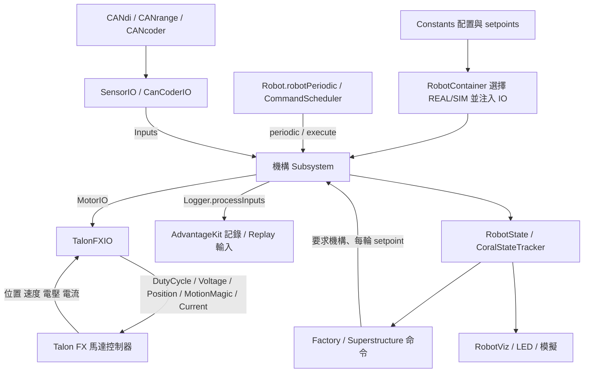
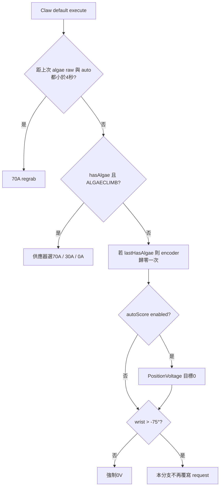

# 03｜機構、接線與硬體 IO 詳解

本章依目前工作區原始碼靜態閱讀整理，沒有編譯、執行機器人或更動控制程式。本文的「已確認」表示可由程式直接推導；實際馬達安裝方向、感測器接線、機械止擋、韌體與授權狀態仍須由實機紀錄確認。下列來源連結旁的 `L` 是原始碼行號；未列出的 CTRE 預設值，不假設等於團隊明確設定。

## 1. 先理解這份程式的硬體分層

上層 Factory 與 Superstructure 產生 `Command`，機構 Subsystem 擁有該機構的 command requirement、已讀取的 Inputs 與狀態更新，`MotorIO`／各種 SensorIO 將行為轉成硬體 API。`RobotState` 是量測的共享快照；`CoralStateTracker` 是珊瑚位置推論，兩者都不是馬達控制器。`Constants` 提供裝置 ID、單位換算、PID、限位與動作目標。

核心入口：[RobotContainer 建構機構 L85](../../src/main/java/com/team254/frc2025/RobotContainer.java#L85)、[Robot 的週期 L132](../../src/main/java/com/team254/frc2025/Robot.java#L132)、[基底 periodic L38](../../src/main/java/com/team254/lib/subsystems/ServoMotorSubsystem.java#L38)。各機構的 `periodic()` 由 command scheduler 呼叫；CAN 訊號設定為 100/250/500 Hz **不代表 Java `periodic()` 同樣頻率**。Talon 基本 telemetry 是 50 Hz，獨立物理模擬 Notifier 是 0.005 秒。

## 2. 接線表：在哪條 CAN bus、接到哪個通道

兩條具名 CANivore bus 為 `superstructure` 與 `drivebase-climber`，見 [Constants L63](../../src/main/java/com/team254/frc2025/Constants.java#L63)。軟體中的 CANDeviceId 同時包含數字與 bus；相同數字不能脫離 bus 解讀。本專案機構 Java 程式未建立 roboRIO `DigitalInput`、`DigitalOutput`、PWM motor 或 Servo；下面的數位感測器通道是 **CANdi 的 S1/S2，不是 roboRIO DIO 編號**。

| 裝置 / 用途 | CAN bus | ID / channel | 讀入哪裡 → 上層用途 | 原始碼 |
|---|---|---|---|---|
| Elevator 左側 leader Talon FX | superstructure | 21 | MotorInputs → Elevator 高度 | [Constants L514](../../src/main/java/com/team254/frc2025/Constants.java#L514) |
| Elevator 右側 follower Talon FX | superstructure | 22，反向跟隨 leader | follower Inputs → 平均位置、速度 | [Constants L472](../../src/main/java/com/team254/frc2025/Constants.java#L472) |
| Intake pivot Talon FX | superstructure | 23 | MotorInputs rad → IntakePivot | [Constants L750](../../src/main/java/com/team254/frc2025/Constants.java#L750) |
| Intake roller Talon FX | superstructure | 24 | rotations / RPS → RobotState | [Constants L736](../../src/main/java/com/team254/frc2025/Constants.java#L736) |
| Indexer Talon FX | superstructure | 25 | rotations / RPS → RobotState | [Constants L695](../../src/main/java/com/team254/frc2025/Constants.java#L695) |
| Wrist Talon FX | superstructure | 26 | FusedCANcoder feedback → rad | [Constants L632](../../src/main/java/com/team254/frc2025/Constants.java#L632) |
| Claw 共用 roller Talon FX | superstructure | 27 | rotations / RPS / stator current → 珊瑚與藻球處理 | [Constants L317](../../src/main/java/com/team254/frc2025/Constants.java#L317) |
| Wrist CANcoder | superstructure | 29 | absolute position → FusedCANcoder；另行記錄 | [Constants L664](../../src/main/java/com/team254/frc2025/Constants.java#L664) |
| Intake pivot CANcoder | superstructure | 30 | 啟動後初始化 integrated position | [Constants L761](../../src/main/java/com/team254/frc2025/Constants.java#L761) |
| Indexer CANdi | superstructure | 31 / S1、S2 | first / second banner；S2 同時可作 Talon forward hardware limit | [Sensor hardware L21](../../src/main/java/com/team254/frc2025/subsystems/indexer/IndexerSensorIOHardware.java#L21) |
| Elevator CANdi | superstructure | 32 / S1 | 底端 Hall；leader/follower 的 reverse remote source | [Sensor hardware L29](../../src/main/java/com/team254/frc2025/subsystems/elevator/ElevatorSensorIOHardware.java#L29) |
| Claw CANdi | superstructure | 33 / S1 | **score** banner；Talon reverse remote source / autoset | [Sensor hardware L28](../../src/main/java/com/team254/frc2025/subsystems/claw/ClawSensorIOHardware.java#L28) |
| Claw CANdi | superstructure | 33 / S2 | **stage** banner；Talon forward remote source | 同上 |
| Climber pivot Talon FX | drivebase-climber | 14 | RemoteCANcoder rad 與 raw rotor rotations | [Constants L379](../../src/main/java/com/team254/frc2025/Constants.java#L379) |
| Climber roller Talon FX | drivebase-climber | 15 | rotations → RobotState | [Constants L409](../../src/main/java/com/team254/frc2025/Constants.java#L409) |
| Climber CANdi | drivebase-climber | 17 / S1、S2 | 左 / 右 latch limit switch | [Sensor hardware L24](../../src/main/java/com/team254/frc2025/subsystems/climber/ClimberSensorIOHardware.java#L24) |
| CANdle | drivebase-climber | 18 | 8 顆內建 + 10 顆外接 LED，RGB | [Constants L273](../../src/main/java/com/team254/frc2025/Constants.java#L273) |
| Climber pivot CANcoder | drivebase-climber | 19 | pivot absolute angle → RemoteCANcoder | [Constants L387](../../src/main/java/com/team254/frc2025/Constants.java#L387) |
| 左 / 右 CANrange | drivebase-climber | 41 / 42 | 距離 m 與強度 → Elevator 的 reef clearance 判斷 | [Sensor hardware L36](../../src/main/java/com/team254/frc2025/subsystems/elevator/ElevatorSensorIOHardware.java#L36) |

CANdi 的珊瑚與 Elevator 設定是 `CloseWhenNotHigh + PullLow`，也就是不是 High 就視為 closed；Climber 特別改為 `CloseWhenNotHigh + PullHigh`。模擬用 Low 表示 triggered、High 表示 untriggered。[CTREUtil L69](../../src/main/java/com/team254/lib/util/CTREUtil.java#L69) 因此「線斷掉」的邏輯不能一概而論：浮接時的 pull 與外部電路影響真假值，應在接線表另列正常／觸發／斷線三態。

## 3. 單位、正負方向、控制限制

`unitToRotorRatio` 名稱容易讀反。實作是 `回傳位置 = Phoenix position × ratio`，`送入位置 = subsystem units ÷ ratio`。Phoenix position 在 Wrist/Climber 已改用 remote/fused feedback，因此這時不是原始 rotor position；只有 `rawRotorPosition` 一律來自 Talon rotor。[TalonFXIO L75](../../src/main/java/com/team254/lib/subsystems/TalonFXIO.java#L75)

| 機構 | subsystem 位置/速度單位 | ratio / feedback | 明確反轉與煞車設定 | 位置 / 電流限制 |
|---|---|---|---|---|
| Intake roller | 機構轉數 / 機構 RPS | 12/24 = 0.5 | 未明寫 Inverted；Brake | 無位置界限；supply 60 A |
| Indexer | 機構轉數 / 機構 RPS | 12/48 = 0.25 | 未明寫 Inverted；Brake | 無位置界限；supply 80 A；forward limit 預設關 |
| Claw | 機構轉數 / 機構 RPS | (12/48)(15/36) = 0.1041667 | 未明寫 Inverted；Brake | 無位置界限；supply 20 A；voltage DEFAULT +16/-16 V、L2/L3 +6/-16 V（第一次進入 +5.5） |
| Elevator | m / m/s | (11/50) × 2π × 0.02866242038 ≈ 0.03962 m/rotor rev | leader Clockwise_Positive；follower oppose=true；兩者 Brake | [0,1.39] m；leader 雙軟限位；各 supply 70 A |
| Wrist | rad / rad/s | Phoenix mechanism rotations × 2π；FusedCANcoder 29，RotorToSensorRatio=1/[(10/48)(14/32)(10/50)] | 未明寫 Inverted；Brake | [-104°,140°]；雙軟限位；supply 40 A |
| Intake pivot | rad / rad/s | 2π(10/36)(14/42)(14/56) ≈ 0.14544 rad/rotor rev；CANcoder 30 僅初始化 | Clockwise_Positive；Brake | [-115.6°,0°]；雙軟限位；supply 60 A |
| Climber pivot | rad / rad/s；另有 raw rotor rev | Phoenix RemoteCANcoder rotations × 2π；sensor 19，SensorToMechanismRatio=1 | 未明寫 Inverted；Brake | 未配置有限位置範圍；stator/supply current limit 明確關閉 |
| Climber roller | 機構轉數 / RPS | (10/30)(15/30)=1/6 | Clockwise_Positive；Brake | 無位置界限；supply 20 A |

控制正負意義要依動作常數解讀，不能只看電機順逆時針：Intake `+1` 收、`-0.75` 吐；Indexer `+1` 送、`-1` 退；Claw Coral handoff `-10 V`、一般 score `+0.75 duty`、L1 `-3/-5 RPS`；Algae intake `+70 A`、hold `+30 A`、score/exhaust `-50 A`、barge `-12 V`；Climber deploy/stow 都是 `+12 V`，模擬用放繩後反轉物理電壓表示同向馬達後續帶回 pivot，不能自行把 stow 改成負號。[Claw constants L282](../../src/main/java/com/team254/frc2025/Constants.java#L282)、[ClimberFactory L53](../../src/main/java/com/team254/frc2025/factories/ClimberFactory.java#L53)、[climber sim L809](../../src/main/java/com/team254/frc2025/simulation/SimulatedRobotState.java#L809)

Motion Magic 的 **位置**使用機構 units，但 velocity / acceleration / jerk 沒經 ratio 換算，直接傳 Phoenix native closed-loop feedback units。Elevator profile 是 90 / 1000 / 3600 或 7200（rotations/s、/s²、/s³）；Wrist 先乘 wrist gear ratio；Intake pivot 是 80 / 300。這是 API 使用者必須知道的例外。[TalonFXIO L123](../../src/main/java/com/team254/lib/subsystems/TalonFXIO.java#L123)、[Constants L497](../../src/main/java/com/team254/frc2025/Constants.java#L497)、[L621](../../src/main/java/com/team254/frc2025/Constants.java#L621)、[L753](../../src/main/java/com/team254/frc2025/Constants.java#L753)

PID feedforward 配置摘要：Claw slot0 P=10 用 position，slot1 P=.25/S=.3/V=.09 用 L1 velocity；Elevator slot0 G=.325/S=.075/V=.1333/P=5/A=.005；Wrist slot0 P=100/S=.3/G=.37/V=.075÷gear ratio，gravity=Arm_Cosine，slot1 P=300，其餘沿用；Intake pivot P=2/D=.3/V=.15；Climber pivot P=D=0。因此 Climber 預設 Motion Magic 命令的名稱不能解讀成已有有效位置保持 PID。

位置保護有兩層：位置 API 的 `MathUtil.clamp`，以及啟用的 controller soft limit。open-loop duty、voltage、torque current、velocity API 沒有 Java 層位置 clamp；它們依賴 controller 上已啟用的限位。`positionSetpointUnits` 保存的是原始要求，可能不同於 IO clamp 後目標；blocking command 卻比較原始目標，參見問題清單。

## 4. 共用底層：每個檔案接到哪裡

### 4.1 資料與契約

| 檔案 | 所有 public 契約 / 資料 | input → output、誰使用 |
|---|---|---|
| [MotorInputs L5](../../src/main/java/com/team254/lib/subsystems/MotorInputs.java#L5) | `velocityUnitsPerSecond`, `unitPosition`, `appliedVolts`, `currentStatorAmps`, `currentSupplyAmps`, `rawRotorPosition` | TalonFXIO 填入 → Logger / Subsystem。`@AutoLog` 生成 `MotorInputsAutoLogged`，生成類別不需手寫。沒有 connected / status / timestamp 欄位。 |
| [ServoMotorSubsystemConfig L6](../../src/main/java/com/team254/lib/subsystems/ServoMotorSubsystemConfig.java#L6) | name、talonCANID、fxConfig、unitToRotorRatio、min/max、momentOfInertia | Constants → Talon IO / Subsystem / Sim；預設位置界限 ±∞，慣量 .5 kg·m²。皆可變 public fields。 |
| [CanCoderConfig L6](../../src/main/java/com/team254/lib/subsystems/CanCoderConfig.java#L6) | CANID、CANcoderConfiguration | Constants → CanCoderIOHardware。 |
| [CanCoderInputs L5](../../src/main/java/com/team254/lib/subsystems/CanCoderInputs.java#L5) | absolutePositionRotations 初始 NaN；velocityRotations 初始 0 | sensor 的轉數 / RPS → CANcoder 基底；NaN 作尚未初始化旗標。 |
| [CanCoderIO L3](../../src/main/java/com/team254/lib/subsystems/CanCoderIO.java#L3) | `readInputs(inputs)`, `updateFrequency(hz)` | Subsystem 請 IO 填資料；Wrist 要求 500 Hz。 |
| [ServoMotorSubsystemWithCanCoderConfig L3](../../src/main/java/com/team254/lib/subsystems/ServoMotorSubsystemWithCanCoderConfig.java#L3) | config、cancoderToUnitsRatio、isFusedCancoder、ratioForSim、cancoderUnitsForSim；`getCanCodertoRotorRatio()` | `unitToRotorRatio / cancoderToUnitsRatio` → Sim 生成 CANcoder 值。 |
| [ServoMotorSubsystemWithFollowersConfig L3](../../src/main/java/com/team254/lib/subsystems/ServoMotorSubsystemWithFollowersConfig.java#L3) | `FollowerConfig(config,inverted)`；followers[] | Constants 的 follower 配置 → Elevator / follower 基底。 |

[MotorIO L8](../../src/main/java/com/team254/lib/subsystems/MotorIO.java#L8) 的完整 API：

| API | input → 行為 / output |
|---|---|
| `readInputs(MotorInputs)` | 更新可記錄的量測快照 |
| `setOpenLoopDutyCycle(duty)`、`setVoltageOutput(voltage)`、`setTorqueCurrentFOC(current)` | 無因次占空比、V、A → 馬達命令 |
| `setPositionSetpoint(units)` | 機構位置 → PID position request |
| `setMotionMagicSetpoint(units)` / `(units,slot)` | 機構位置 → configured Motion Magic；省略 slot 時為 0 |
| `setMotionMagicSetpoint(units,velocity,acceleration,jerk)` / 加 slot / 再加 feedforward | 位置 + native profile + V feedforward → Dynamic Motion Magic；缺省 slot=0、feedforward=0 |
| `setVelocitySetpoint(unitsPerSecond)` / 加 slot | 機構速度 → velocity voltage；缺省 slot=0 |
| `setCurrentPositionAsZero()` / `setCurrentPosition(positionUnits)` | 改回授座標，**不是要求移動到該位置** |
| `setNeutralMode(mode)` | Brake / Coast 配置 |
| `setEnableSoftLimits(fwd,rev)` / `setEnableHardLimits(fwd,rev)` | 開關兩方向限制 |
| `setEnableAutosetPositionValue(fwd,rev)` | 開關硬限位 autoset；實作還同步改 hard-limit enable，見後文 |
| `follow(masterId,oppose)` | follower 追蹤主馬達；masterId 的 number 被送 Phoenix request |
| `setMotionMagicConfig(config)` / `setVoltageConfig(config)` | 更新 profile / peak voltage 配置 |

### 4.2 ServoMotorSubsystem：Command 包裝與輸出生命週期

[ServoMotorSubsystem.java L25](../../src/main/java/com/team254/lib/subsystems/ServoMotorSubsystem.java#L25) 建構子注入 config、Inputs、IO，設 `dutyCycleCommand(0)` default，允許 disabled 時執行。Java command 在 disabled 執行不等於 FRC 硬體 enabled；但仍可能改 setpoint、config、encoder origin。`periodic()` 依序 read → processInputs → latency/current-command log。

| public 方法（行號） | input → 處理 → output / 主要連接 |
|---|---|
| `getCurrentPosition` L119 / `getCurrentVelocity` L123 | 回傳最後一輪 Inputs；沒有即時 CAN read |
| `getPositionSetpointUnits` L127 | 回傳最後一次 position/MM 要求；position default 用它持續保持 |
| `setMotionMagicConfigCommand` L131 | config → InstantCommand 配置；刻意沒有 requirement，可能與機構動作同時執行 |
| `dutyCycleCommand` L136 | supplier 每輪 → duty request；end（含 interruption）輸出 0 |
| `dutyCycleCommandNoEnd` L147 | 同上，但 end 空白；由 `IntakeFactory.spinRollersNoEnd` 使用 |
| `voltageCommand` L156 | supplier 每輪 → V；end 輸出 0 |
| `velocitySetpointCommand` L167/L171 | supplier 每輪 → velocity、slot（缺省0）；end 空白 |
| `setCoast` L180 | start 設 Coast、end 恢復 Brake；允許 disabled |
| `positionSetpointCommand` L188 | supplier → 記住位置 + PositionVoltage；end 空白 |
| `positionSetpointUntilOnTargetCommand` L197 | `ParallelDeadlineGroup(WaitUntil(error≤epsilon), position command)`；完成只檢查位置，無速度條件 / timeout |
| `motionMagicSetpointCommand` L209/L218/L229 | 固定 profile / 動態 profile / 動態 profile+feedforward；可指定 slot；每輪保存目標；end 空白 |
| `motionMagicSetpointCommandBlocking` L246/L255/L267 | 上述 command + `.until(position error≤tolerance)`；沒有阻塞 Java thread，意思是 command 到位才完成；無 timeout、無 settled time |
| 省略 slot 的 MM overload L280/L284/L289/L293 | 轉呼叫 slot0 版本 |
| `setTorqueCurrentFOCImpl` L300 | 直接 log + IO 電流，沒有 command requirement 保護 |
| `setTorqueCurrentFOC` L305 | supplier → current command；end 空白 |
| `setCurrentPosition` L318 | 直接改 encoder 座標；沒有 requirement，也不改已保存 setpoint |

protected helpers `setOpenLoopDutyCycleImpl`、`setVoltageImpl`、position/MM/velocity helper 皆先記錄 API 再委派 IO。`withoutLimitsTemporarily()` L322 回傳 start/end 命令，開始保存 soft-limit flags 並關閉，結束恢復；沒有 requirement；目前搜尋無外部呼叫。共用 API 的 end 空白表示「最後 request 可能持續」，接續 default 是否立刻送安全命令必須逐機構看，不能假設所有 command 結束都停馬達。

### 4.3 TalonFXIO：真正打到控制器的地方

[TalonFXIO.java L42](../../src/main/java/com/team254/lib/subsystems/TalonFXIO.java#L42) 建構子依 CAN ID + bus 建 Talon、apply 配置、取得 6 個 status signals，註冊 CANStatusLogger，設 50 Hz，optimize bus。SIM 會直接把共用 config 的 CurrentLimits、ClosedLoopRamps、OpenLoopRamps 換成空預設配置，所以模擬沒有保留同一套電流／ramp 保護。

| public 方法 | 實作與限制 |
|---|---|
| `unitsToRotor` L84 | units ÷ ratio；名稱在 fused / remote feedback 情境下宜改為 unitsToFeedbackRotations |
| `readInputs` L89 | refreshAll → position/velocity 乘 ratio；V/A/raw rotor 不換算；未檢查 refresh status 或 stale timestamp |
| `setOpenLoopDutyCycle` L101 | DutyCycleOut.withOutput；沒有 Java clamp |
| `setPositionSetpoint` L106 | 機構目標 clamp 到 min/max → 除 ratio → PositionVoltage |
| `setMotionMagicConfig` L111 | 改保存的 fxConfig.MotionMagic + 同步 apply |
| `setMotionMagicSetpoint` L117/L123 | MotionMagicVoltage / DynamicMotionMagicVoltage；位置 clamp，profile 原值傳入，feedforward V |
| `setNeutralMode` L141、`setEnableSoftLimits` L147 | 修改欄位後 apply **整份** fxConfig；呼叫頻率要控制 |
| `setEnableHardLimits` L154 | 修改兩個 enable → apply HardwareLimitSwitch 部分 |
| `setEnableAutosetPositionValue` L161 | 同時改 autoset enable **及 hard-limit enable** → apply；容易讓前一個 setEnableHardLimits 設定失效 |
| `setVelocitySetpoint` L170 | units/s ÷ ratio → VelocityVoltage + slot |
| `setCurrentPositionAsZero` L176、`setCurrentPosition` L181 | 將位置回授重設到 units/ratio；未 clamp，未檢查返回 StatusCode |
| `setVoltageOutput` L186 | VoltageOut |
| `follow` L191 | Follower.withMasterID(number).withOpposeMasterDirection；使用 CTREUtil retry |
| `setTorqueCurrentFOC` L202 | TorqueCurrentFOC.withOutput(A) |
| `setVoltageConfig` L207 | 呼叫名為 NonBlocking 的 helper，但 helper 實際 apply(config,0.01)，最多等候 10 ms；結果未在此檢查 |

### 4.4 CANcoder 與多馬達擴充

[CanCoderIOHardware L22](../../src/main/java/com/team254/lib/subsystems/CanCoderIOHardware.java#L22)：constructor 建 device、配置、註冊 telemetry，absolute position/velocity 預設 100 Hz；`updateFrequency(hz)` L44 直接改兩 signal rate。`readInputs` L49 每輪 refresh；只要 Inputs absolute 還 NaN 就 `waitForAll(10.0, ...)` 並 `goodValues++`，累積 50 次才填資料。這個 counter **不檢查是否 good**；失聯時可能每輪長時間等待。

[ServoMotorSubsystemWithCanCoder L16](../../src/main/java/com/team254/lib/subsystems/ServoMotorSubsystemWithCanCoder.java#L16)：constructor 加入 cancoder Inputs/IO；`periodic()` L29 先呼叫馬達 periodic，再讀/log CANcoder。非 fused 且未設過 offset 且 absolute 非 NaN 時，`setCurrentPosition(absolute×ratio)` 一次。Wrist 為 fused，跳過這段；Intake pivot、Climber pivot 不是 fused，會走這段。`resetOffset()` L44 強制套 absolute，**沒有 NaN/status 檢查，也不修改 hasSetOffset**；Robot disabled 啟用前週期性呼叫 Intake 的此方法。

[ServoMotorSubsystemWithFollowers L12](../../src/main/java/com/team254/lib/subsystems/ServoMotorSubsystemWithFollowers.java#L12)：constructor 對每 follower `follow(leader, inverted)`；只 assert Inputs/IO 長度一致，未檢查 config 長度。`periodic()` L32 額外讀/log 每 follower；`setCurrentPosition()` L49 同時改 leader/follower；protected 歸零亦同；`getCurrentPosition()` L57、`getCurrentVelocity()` L66 平均 leader+followers，沒有不一致或掉線排除。只有 Elevator 使用。量測符號是否同向是接機前必要驗證；無法只靠平均公式證明裝配正確。

## 5. 每個機構的 public API 與實際資料流

### 5.1 Intake（兩個 Subsystem）

[IntakeRollerSubsystem L17](../../src/main/java/com/team254/frc2025/subsystems/intake/IntakeRollerSubsystem.java#L17) constructor 注入 motorIO / state；另外暴露 public motorIO。`getPositionRotations()` L24 回傳 units；`periodic()` L29 先讀/log 馬達再填 RobotState 的 roller rotations/RPS。動作入口全部繼承基底，由 IntakeFactory 的 spin / no-end spin / exhaust 使用。

[IntakePivotSubsystem L21](../../src/main/java/com/team254/frc2025/subsystems/intake/IntakePivotSubsystem.java#L21) constructor 先將 encoder 當作 -80°，保存同一目標，之後 CANcoder 初次有效讀取再校正。

| public API | input → output / caller |
|---|---|
| `setAutoDefaultCommand(strategy)` L38 | 取消原 default → GROUND 自動保持0°，其他保持-80°；RobotContainer.setAutoDefaultCommands 呼叫 |
| `setTeleopDefaultCommand()` L52 | 改成保持最後 setpoint；RobotContainer teleop 設定呼叫 |
| `hasCoralAtIntake()` L60 | 已完全展開 + 目標恰為0° + 量測角度<-0.5° → true；用 pivot 被珊瑚推回作代理訊號 |
| `periodic()` L69 | CANcoder/馬達資料 → RobotState；到0°或0.005 rad內設 fullyDeployed，目標離開0°就清除；log 判斷 |

Factory targets：deploy 0°、stow -80°、climb stow -90°、lollipop +30°；tolerance .05 rad。[IntakeFactory L16](../../src/main/java/com/team254/frc2025/factories/IntakeFactory.java#L16) 其中 +30° 超過目前 max=0°，見待修清單。

### 5.2 Indexer（motor + 兩個 Banner）

[IndexerSubsystem L27](../../src/main/java/com/team254/frc2025/subsystems/indexer/IndexerSubsystem.java#L27) 注入 motor、sensor、RobotState、CoralStateTracker；兩個 banner 都用 0.03 s、雙邊 debounce。`periodic()` L51 先馬達 read/log、更新 RobotState、用 **上一輪 sensor snapshot** 更新 tracker，再 sensor read/log。`hasCoralAtFirstIndexerBanner()` L61、`hasCoralAtSecondIndexerBanner()` L65 回傳 debounce trigger。`setForwardLimit(enable)` L69 開/關 CANdi31 S2 的 forward stop，reverse 一律 false；ModalSuperstructureTriggers handoff 在 [L340](../../src/main/java/com/team254/frc2025/subsystems/superstructure/ModalSuperstructureTriggers.java#L340) 開啟，finally 關閉。

| 檔案 | public 方法與資料 |
|---|---|
| [IndexerSensorIO L9](../../src/main/java/com/team254/frc2025/subsystems/indexer/IndexerSensorIO.java#L9) | @AutoLog Inputs 兩 boolean；default `readInputs` 不做事 |
| [IndexerSensorIOHardware L21](../../src/main/java/com/team254/frc2025/subsystems/indexer/IndexerSensorIOHardware.java#L21) | constructor 建 CANdi31 superstructure、S1=first、S2=second、100 Hz；`readInputs` L38 refresh→boolean |
| [IndexerSensorIOSim L16](../../src/main/java/com/team254/frc2025/subsystems/indexer/IndexerSensorIOSim.java#L16) | constructor 從 Hardware 延伸，建立 CANdiSimState，初始兩 sensor untriggered；四個 public setter `setFirstIndexerBannerUntriggered/Triggered`、`setSecondIndexerBannerUntriggered/Triggered` 將 S1/S2 設 High/Low；SimulatedRobotState 呼叫 |

### 5.3 Elevator（雙馬達 + Hall + 雙 CANrange）

[ElevatorSubsystem L27](../../src/main/java/com/team254/frc2025/subsystems/elevator/ElevatorSubsystem.java#L27) constructor 注入 leader/follower/sensor；**直接將兩 encoder 歸零，沒有等待 Hall**。設定 position default 與 gyro trigger：|pitch|、|roll| 都小於10°，連續0.5秒才 true。

| public API / override | input → 處理 → output / caller |
|---|---|
| `periodic()` L61 | leader/follower平均 → RobotState.height；sensor read/log → canStow log；disabled 且平均位置<0 再歸零 |
| `elevatorAtHallEffect()` L91 | sensor boolean → 回傳；目前主程式搜尋沒有 caller |
| `isStowed()` L95 | 高度<.05 m → true，不是絕對誤差；目前未見 caller |
| `isAtLevel(state)` L99 | 高度與 state height 誤差≤.05m → true |
| `canStowElevator()` L108 | 每側距離 - max(0,robot-relative vx)×.2s > .38m；兩側都須符合；Modal triggers 決定退下 Elevator |
| `canStow()` L116 | 同公式但門檻 .43m；用於 wrist/elevator 可收起、ClawFactory、Superstructure triggers |
| `gyroCheck()` L124 | 回傳已 debounce gyro 判斷；ReefscapeUtil 使用 |
| protected `setMotionMagicSetpointImpl` L80 | 目標>1m 且目前<1m 使用 default jerk3600，否則 low profile jerk7200；再送 Dynamic MM |

`ElevatorFactory.moveToScoringHeightBlocking` 的兩 overload 只是指定目標與 .05m/自訂 tolerance，再轉基底 MM blocking；底層 Elevator 本身沒有根據 Reef/wrist 做完整防撞，各動作順序要靠 Superstructure。

| sensor 檔案 | public 方法與輸入輸出 |
|---|---|
| [ElevatorSensorIO L9](../../src/main/java/com/team254/frc2025/subsystems/elevator/ElevatorSensorIO.java#L9) | Inputs=Hall boolean、左右 distance/strength；default readInputs no-op |
| [ElevatorSensorIOHardware L29](../../src/main/java/com/team254/frc2025/subsystems/elevator/ElevatorSensorIOHardware.java#L29) | constructor：CANdi32/S1，CANrange41/42（另一條 drivebase-climber bus）；ShortRange100Hz、FOV X/Y=6.75；五 signals 100Hz。`readInputs` L70：refresh，若 signal strength>1500 才保留 m，否則距離=+∞ |
| [ElevatorSensorIOSim L18](../../src/main/java/com/team254/frc2025/subsystems/elevator/ElevatorSensorIOSim.java#L18) | constructor 建 CANdi/CANrangeSimState，Hall 初始觸發；`readInputs` 僅委派 parent；`setElevatorHallEffectUntriggered/Triggered` → S1 High/Low；`setElevatorDistance(leftM,rightM)` L40 → range 模擬距離，未在此設定 signal strength |

低強度→∞，接著 canStow 會判定夠遠，這是目前明確的「未知視為可收」行為；是否符合機械安全需求應獨立決策。不要把 range 的「無可信回波」當成已證實沒有障礙物。

### 5.4 Wrist（FusedCANcoder）

[WristSubsystem L15](../../src/main/java/com/team254/frc2025/subsystems/wrist/WristSubsystem.java#L15) constructor 注入馬達/CANcoder/state，設定 default 目標 -103° 並持續保持，CANcoder rate 500Hz。`periodic()` L34 讀/log→RobotState wrist radians。`isStowed()` L39 實際是 `currentPosition < .05 rad`，不是「接近-103°」；`isAtLevel(state)` L45 是目標±.05rad；`clearOfIndexer()` L52 是 `position > -75°`，供 Claw default 決定是否強制0V。

磁鐵 offset：競賽 `.409668-.25=.159668` rotations，練習 `-.249512-.25=-.499512`；absolute discontinuity .5 rotations。Fused controller 持續使用 sensor，基底跳過軟體首次 offset。位置與 profile 由 WristFactory / Superstructure 的 stage state 決定，詳見流程章。

### 5.5 Claw（Coral / Algae 共用一顆馬達）

[ClawSubsystem L55](../../src/main/java/com/team254/frc2025/subsystems/claw/ClawSubsystem.java#L55) constructor 由 RobotContainer 取 tracker/state，encoder 歸零，autoScore=false，stage banner 雙邊 debounce：REAL .03s，SIM .0s。Algae torque supplier：有 algae、wrist speed絕對值>6且距上次score>1s→70A；有 algae且距score>1s→30A；其他0A。default command 允許 disabled。

| public API | input → 處理 → output / caller |
|---|---|
| `getPositionRotations()` L102 | motor units → 機構轉數 |
| `setWantedVoltageMode(mode)` L111 | 記住 DEFAULT / L3_L2；真正配置在 periodic 更新；Modal triggers 呼叫 |
| `hasAlgae()` L115 | 原始判斷自行做雙向時間 debounce，Auto .1s、其他 .25s → boolean；每次呼叫有狀態更新，不是純 getter |
| `periodic()` L134 | motor read/log、RobotState、先stage tracker再sensor read/log、更新 algae/auto timestamp；mode改變時 apply peak voltage（第一次L3_L2=5.5V，其後6V） |
| `setAutoScore(autoScore)` L173 | 保存旗標；true 立即送 position=0；false 沒有立刻停輸出 |
| `autoScoreEnabled()` L180 | 回傳旗標 → Modal triggers |
| `setAutoStage(autoStage)` L184 | 先 setHardLimits(autoStage,false)，再 autoset(false,false)；後者也把 hard limits 關閉；目前無 caller |
| `hasCoralAtScoreBanner()` L192 | 原始 score(S1) boolean，沒有 debounce |
| `hasCoralAtStageBanner()` L199 | stage(S2) debounce boolean → tracker / Factory / triggers |
| `hasAlgaeUndebounced()` L208 | stator current>20A + 模式ALGAECLIMB + coral位置NONE或AT_FIRST_INDEXER；**沒有檢查低速度**，儘管上方註解如此寫 |
| `updateWristRPS(value)` L218 | 保存數值；Robot L139 實際傳 Wrist `getCurrentVelocity()`（rad/s） |
| `updateMode(mode)` L222 | 保存 ModalControls mode；Robot 在 scheduler.run 後更新，供下輪使用 |
| `updateLastAlgaeScoreTimestamp(time)` L226 | 保存 RobotTime 秒；ClawFactory score/exhaust 時呼叫 |

內部 public `DefaultCommand`：constructor L235 加 Claw requirement；`initialize()` L243 設 lastHasAlgae=true；`execute()` L248 依下圖；沒有自訂 end 或 isFinished。

`ClawSensorIO` 的 [Inputs L9](../../src/main/java/com/team254/frc2025/subsystems/claw/ClawSensorIO.java#L9) 只有 stage/score boolean，default read no-op。`ClawSensorIOHardware` [constructor L21](../../src/main/java/com/team254/frc2025/subsystems/claw/ClawSensorIOHardware.java#L21) 建33/S2 stage、S1 score、250Hz；`readInputs` L38 refresh→boolean。`ClawSensorIOSim` [L16](../../src/main/java/com/team254/frc2025/subsystems/claw/ClawSensorIOSim.java#L16) 初始無piece；四個 `setStageCoralBannerUntriggered/Triggered` 與 `setScoreCoralBannerUntriggered/Triggered` public setter 控制 S2/S1 High/Low。

Claw 的 remote S1 reverse autoset 預設啟用，觸發時位置被設為 **-100 Phoenix rotations**，換成 Claw mechanism units 約 -10.4167 rev。它與 encoder=0 的 position demand 形成「位置差驅動輸出」機制，不能把該設定當成平常 roller 歸零。Talon config 的 ReverseLimitEnable=false 與 AutosetPositionEnable=true 是兩個不同旗標。[Constants L330](../../src/main/java/com/team254/frc2025/Constants.java#L330)

### 5.6 Climber（pivot + latch roller）

[ClimberPivotSubsystem L19](../../src/main/java/com/team254/frc2025/subsystems/climber/ClimberPivotSubsystem.java#L19) constructor 注入 IO/state，default 維持 positionSetpoint，參數初始0；`periodic` L38 更新 RobotState radians。public 方法：`setNeutralMode` L43 直接配置；`setForwardLimit` L47 開forward、關reverse（本配置未指定 remote limit source，且目前無 caller）；`setClimberDeployDone` L51 / `getClimberDeployDone` L55 寫入／直接暴露 AtomicBoolean；`getRawRotorPosition` L59 回傳原生rotor轉數；`setRawPositionOffset` L63 / `getRawPositionOffset` L67 管理 deploy起點。Robot 在 [L407](../../src/main/java/com/team254/frc2025/Robot.java#L407) 設 offset；ClimberFactory deploy 用 raw offset+46.2 rev 判斷完成；stow 用角度≤2°；Robot disabled 若deployDone則5秒後設Coast。

[ClimberRollerSubsystem L25](../../src/main/java/com/team254/frc2025/subsystems/climber/ClimberRollerSubsystem.java#L25) constructor 建左右 latch trigger、上升 debounce .1s；`periodic` L43 讀/log馬達與sensor→RobotState rotations；`climberLeftLimitSwitchTriggered` L54 / `climberRightLimitSwitchTriggered` L58 回傳debounce值，用於 auto climb 的「兩側都扣上」；`climberHallEffectTriggered` L50 呼叫從未初始化的欄位，若使用會 NullPointerException，目前未查到 caller。

`ClimberSensorIO` [L9](../../src/main/java/com/team254/frc2025/subsystems/climber/ClimberSensorIO.java#L9) Inputs只有left/right兩boolean（沒有Hall）；default read no-op。`ClimberSensorIOHardware` [L24](../../src/main/java/com/team254/frc2025/subsystems/climber/ClimberSensorIOHardware.java#L24) constructor 建17/S1 left/S2 right、PullHigh、250Hz；`readInputs` L48 refresh→boolean。`ClimberSensorIOSim` [L16](../../src/main/java/com/team254/frc2025/subsystems/climber/ClimberSensorIOSim.java#L16) constructor 初始左右未觸發；四個 `setLeftClimberLimitSwitchUntriggered/Triggered` / `setRightClimberLimitSwitchUntriggered/Triggered` setter 控制 High/Low；未使用的 `climberHallEffectCandiSim` 欄位不代表實際存在Hall硬體。

ClimberFactory deploy / autoClimb 等待 latch / stow 都沒有 timeout；manualJog 則持續送12V直到取消。感測器卡住與 raw encoder不更新時應有明確 fault、超時與人工退出，不能僅依「測過可以」保證。[ClimberFactory L22](../../src/main/java/com/team254/frc2025/factories/ClimberFactory.java#L22)

### 5.7 LED

LED 由 LedFactory 與 Modal triggers 決定顏色；CANdle 是 Phoenix5 類別，motor/sensor 是 Phoenix6。`LedIO` [L3](../../src/main/java/com/team254/frc2025/subsystems/led/LedIO.java#L3) 的 `readInputs` / `update` default no-op，`LedInputs` 空白，必須實作 `getCurrentState` 與兩個 `writePixels` overload。

`LedIOHardware` [L15](../../src/main/java/com/team254/frc2025/subsystems/led/LedIOHardware.java#L15)：REAL 建CANdle18、亮度1、RGB；桌面candle=null。`getCurrentState()` L28 回傳單色快取；`getCurrentPixels()` L32 直接回傳陣列；`writePixels(LedState)` L37 將null視為off、更新currentState、送全色；`writePixels(LedState[])` L44 將相鄰同色合成run後發CANdle setLEDs，空陣列不寫。此版本 pattern 路徑沒有更新currentState，也沒有完整更新currentPixels，詳見問題清單。

`LedSubsystem` [L22](../../src/main/java/com/team254/frc2025/subsystems/led/LedSubsystem.java#L22) constructor 保存 IO/state；`periodic` L28 把currentState寫RobotState並log current command；`getCurrentState` L37委派IO。

| public command API | input → output / 行為 |
|---|---|
| `commandSolidColor(state)` L42 / `(Supplier)` L46 | 每輪 setSolidColor→IO；有LED requirement；disabled可執行 |
| `commandSolidPattern(states)` L52 | 每輪 pattern→IO；有LED requirement |
| `commandPercentageFull(DoubleSupplier,state)` L58 / `(Supplier<PercentageSetpoint>)` L63 | 呼叫private setPercentageFull；但目前只建立半長陣列，沒有IO寫入，所以無燈光效果 |
| `commandBlinkingState(a,b,durationA,durationB)` L70 | 無requirement的runOnce/Wait sequence重複切色；可能和有LED requirement的command同時寫 |
| `commandBlinkingStateWithoutScheduler(...)` L82 | 一次初始化Timer，之後由commandSolidColor supplier依時間切色；其實仍是scheduler執行的Command，名稱指不使用每次Wait切換 |
| `commandBlinkingState(a,b,duration)` L119 | 委派兩個相等duration版本 |
| `PercentageSetpoint(pct,color)` L20 | record：供應百分比與顏色 |

`LedState` [L3](../../src/main/java/com/team254/frc2025/subsystems/led/LedState.java#L3) 定義可變 RGB 與常用共享顏色/18格pattern；constructor L154 全0、L160指定RGB；`copyFrom` L166複製；`equals` L173比同class與RGB但未實作hashCode；`toString` L187是未補零的十六進位字串（例如0不會顯示00），不應直接當標準 `#RRGGBB` 網頁顏色。public RGB允許修改共享static顏色，應改immutable值物件。

## 6. 真機、模擬與 Replay 的差異

| 功能 | REAL | SIM | Replay 實際路徑 |
|---|---|---|---|
| 馬達 | TalonFXIO | SimTalonFXIO / SimTalonFXWithCancoder / SimElevator，但仍建立Phoenix simulated device | RobotContainer 判斷 `RobotBase.isSimulation()`，所以桌面Replay仍建SIM IO |
| Sensor | CANdi/CANrange/CANcoder Hardware IO | SensorIOSim 繼承Hardware IO並寫SimState | 同SIM；`Logger.processInputs` 會以log資料重建記錄輸入，但IO read副作用與Notifier依然存在 |
| LED | CANdle輸出 | candle=null、保留部分快取 | 同桌面，不建立CANdle |
| current/ramp limits | Constants設定 | Talon constructor 清除CurrentLimits與ramp配置 | 同SIM建構方式 |
| 時間 | RobotTime / FPGA time 混用 | 5ms Notifier +主週期 | Robot啟用log replay不等於所有計時器和物理執行路徑都可重現 |

`Constants.currentMode` 根據Real或`simMode`，目前`simMode=SIM`；另外`kIsReplay=false`是Robot Logger分支旗標。將kIsReplay設true不會自動令currentMode=REPLAY，亦沒有為機構注入no-op IO。這是現有設計的兩套模式選擇，不應在教學時描述成已完整隔離的REAL/SIM/REPLAY三工廠。[Constants L43](../../src/main/java/com/team254/frc2025/Constants.java#L43)、[Robot L100](../../src/main/java/com/team254/frc2025/Robot.java#L100)

### 6.1 所有共用 Sim 檔案

| 檔案 / public 方法 | input → 處理 → output |
|---|---|
| [SimTalonFXIO constructors L33/L46](../../src/main/java/com/team254/lib/subsystems/SimTalonFXIO.java#L33) | config 或外部 DCMotorSim → KrakenX60Foc模型、慣量、倒數ratio作gearing，0.005s Notifier；根據Inverted設sim Orientation |
| `setPositionRad(rad)` L63 | 機構rad → 依Inverted乘符號後改sim角度 |
| `getSupplierForCancoder(c)` L83 | lastRotor rotations/RPS × getCanCodertoRotorRatio → SimCanCoderState |
| `setInvertVoltage(bool)` L93 | 後續update物理輸入反號；Climber放繩後使用 |
| protected `updateSimState` L97 | Talon simulated motor V扣0.25V摩擦→DCMotorSim→rad轉rotations再÷ratio→rawRotor/velocity；另log仿真值 |
| `overrideRPS(Optional)` L129 | 覆寫送入TalonSimState的rotor速度；不改lastRPS與物理模擬速度 |
| `overridePos(Optional)` L134 | 覆寫物理機構角度rad |
| `getIntendedRPS()` L138 | 回傳覆寫前last rotor RPS，不是機構RPS |
| [SimTalonFXWithCancoder constructor L11](../../src/main/java/com/team254/lib/subsystems/SimTalonFXWithCancoder.java#L11) | 額外使用config.ratioForSim建立模型；給Wrist/Climber使用 |
| `getSupplierForCancoder(c)` L26 / protected `getSimRatio` L39 | lastRotor × ratioForSim/cancoderUnitsForSim → encoder rotations；sim rotor換算也用ratioForSim |
| [SimCanCoderIO constructor L16](../../src/main/java/com/team254/lib/subsystems/SimCanCoderIO.java#L16) | config + Supplier<SimCanCoderState> → 建Hardware父類，取得SimState、CANcoder位置設0 |
| `SimCanCoderState` L8 / `readInputs` L24 | public pos/vel rotations初始NaN；每次用supplier×sensorDirection寫raw encoder→再走Hardware讀取（含50次初始化等待） |
| [SimElevator constructor L54](../../src/main/java/com/team254/lib/subsystems/SimElevator.java#L54) | 兩顆Kraken、gearing倒數、carriage1.97312681kg、drum radius、0–1.39m、gravity=true、initial0 → ElevatorSim與5ms Notifier |
| `getLeadIO` L46 / `getFollowerIO` L50 | 返回可注入ElevatorSubsystem的Talon IO |
| `SimElevatorConfig` L14 | gearing、mass kg、drum radius、meterToRotorRatio四public欄位 |
| protected nested `SimElevatorTalonFX` constructor L27 | Hardware父類+simOrientation |
| protected `updateSimState` L95 | leader電壓扣摩擦→ElevatorSim→高度/速度÷ratio→leader與followers rotor；follower符號根據config.inverted轉換 |

SIM精度限制：一般DCMotorSim沒有臂重力、真實傳動鬆弛或碰撞；Intake pivot 的通用ratio包含2π但又作gearing，需要單位測試驗證其物理換算；`lastUpdateTimestamp` 初始0，首次dt沒有獨立初始化保護；Notifier與主執行緒共同存取sim state，只有部分lastRotations/RPS用AtomicReference。這些是可測試的風險，不能由桌面動畫看起來順就認定真機安全。

### 6.2 SimulatedRobotState 如何假造機構感測器

本節只列與機構IO相接部分；遊戲物件軌跡與場地模型另見總體架構章。[SimulatedRobotState L552](../../src/main/java/com/team254/frc2025/simulation/SimulatedRobotState.java#L552)

| public 方法 / 內部連接 | 行為 |
|---|---|
| `updateCoralState()` L532 | funnel優先；coralLocation前段→IN_INTAKE、後段→IN_INDEXER；沒有location則依gamePieceInClaw判斷 |
| `updateSensors()` L552 | 每輪重設stage/first/second，再依coralState設banner；elevator<.05m設Hall；algaeInRobot則Claw overrideRPS=0；x∈(7,11)、pivot>90°、roller>.1則左右climb latch true；Elevator<.05且Wrist<-95°設score banner |
| protected `updateToFSensors()` L630 | 只算最近reef face，以機器人前方兩角為ToF發射點；算不到交點給20m；傳setElevatorDistance，沒有在此寫signal strength |
| `initializeWithCoral()` L803 | 初始CORAL_IN_CLAW、gamePieceInClaw=true、stage banner true |
| `updateClimberPivot(dt)` L809 | DEPLOYING限制最高99°→IN_SLACK固定角度並積分鬆繩→超過.5轉為STOWING並反轉sim電壓→最低0° |
| `updateSim()` L848 | Robot在scheduler後呼叫；更新遊戲物件、climber、得分、Coral/Algae state→最後updateSensors，供後續週期讀取 |

注意 `updateSensors` 符合climb latch條件後只設true，沒有每輪對稱清除。SIM不代表左右接觸完全獨立的真機情境。Algae `overrideRPS(0)`本身不是設定current；真正hasAlgae看stator current>20，需驗證Phoenix模擬對停轉電流的回應。

## 7. 已確認問題與待驗證風險（沒有在本次改碼）

| 分類 / 建議優先 | 證據與影響 | 建議修正及驗證 |
|---|---|---|
| **已確認：高** 不可達lollipop目標 | +30°被IO clamp到0°，blocking仍等+30°±.05rad；IntakeFactory有此命令，SuperstructureFactory L141引用。外層可能提早中止，不能一律宣稱整台卡死 | 先確認機械允許範圍，再一致設定目標/限位；invalid setpoint要拒絕/報錯；測試完整命令群組終止條件 |
| **已確認：高** CANcoder讀取可長時間阻塞 | `waitForAll(10.0)`在periodic路徑，50次counter未驗status；[L49](../../src/main/java/com/team254/lib/subsystems/CanCoderIOHardware.java#L49) | 改非阻塞connected/valid狀態；上電未初始化禁止依該位置移動；測斷線、CAN延遲、NaN |
| **已確認：高** range不可信仍允許收回 | strength≤1500→∞；兩個canStow對∞回true | 明確定義unknown政策，分離valid與distance；用已確認姿態/操作模式提供可審核的退化策略 |
| **已確認：中** AutoStage旗標被覆寫 | setAutoStage後autoset(false,false)同步關閉hard limits；目前無caller | 分離autoset和limit API的責任；若保留功能，用fake IO驗證最終flags |
| **已確認：中** Elevator assert反向 | [RobotContainer L131](../../src/main/java/com/team254/frc2025/RobotContainer.java#L131) 使用 `followers.length != 1` 卻訊息Expected length1；現在配置就是1 | 若JVM開assert就啟動失敗；修等號並改明確runtime驗證；不要把Java assert當部署必要檢查 |
| **已確認：中** 兩個tracker輸入晚一輪 | Indexer periodic L55與Claw L138在sensor read/processInputs前更新tracker | 固定read→processInputs→derive state；用時間標籤驗證sensor至command延遲 |
| **已確認：中** Wrist速度命名/單位不一致 | `getCurrentVelocity()`=rad/s，`updateWristRPS`、ThresholdVelocityRPS名稱卻RPS | 確認6是rad/s或rot/s的實機意圖，再改名或換算；不能未確認就乘2π |
| **已確認：中** LED百分比沒輸出 | setPercentageFull L131只填陣列，沒有io.writePixels | 加完整陣列組裝與輸出；fake IO 驗證比例0/.5/1 |
| **已確認：中** LED pattern快取與null處理 | run在pixels[0]清null前賦值，首格null會NPE；currentPixels只在換色位置更新；currentState pattern時不更新 | 先normalize/copy，完整保存pixel array；區分solid state與pattern state |
| **已確認：中** LED blink缺requirement | L70 sequence中runOnce未傳LedSubsystem，常用LedFactory呼叫此版本 | 切色command持有LED requirement；測試取消與default切換 |
| **已確認：低／潛伏** ClimberHallEffect API空指標 | 欄位沒有初始化，方法直接getAsBoolean；目前未見caller | 刪無效API或實作真正Hall IO，勿留假介面 |
| **已確認：低／潛伏** Wrist.isStowed太寬 | 所有位置<.05rad都true，含接近水平與大負角；目前未見caller | 以目標±tolerance定義；命名若其實表示某側區域則改名 |
| **風險：高** 缺climber保護/timeout | 12V運轉、current limits關、沒有有限位置限制、deploy/stow沒有timeout | 由機械允許電流/時間與感測可信度設fault；實機低能量逐階段驗證 |
| **風險：高** 歸零不驗有效性 | Elevator constructor直接0；Intake resetOffset無NaN檢查且disabled會呼叫 | 引入UNHOMED/HOMING/READY/FAULT；Hall/absolute valid才歸零；記錄每次原因 |
| **風險：中** Claw command結束可能保留輸出 | 多個base command end空白；default在wrist清空、autoScore=false、無algae時可能不送新request | 對每個動作明定end/interrupt輸出；演練從algae torque切模式、關autoScore、取消score |
| **風險：中** Replay仍跑物理與IO | mode選擇不統一，Notifier仍創建 | 使用明確Mode選擇REAL/SIM/REPLAY IO；Replay no-op output、只讀log |
| **風險：中** 沒量測健康度欄位 | Motor/sensor inputs無connected/status/age，refresh status沒檢查 | 增加fault/timeout與dashboard提示；資料失效時禁止依該訊號完成命令 |

## 8. 機構程式撰寫規則（建議採納）

1. **每個數值明寫單位與座標。** API名稱用`Radians`、`Meters`、`RotationsPerSecond`、`Amps`；分開motor rotor、mechanism feedback、absolute encoder；角度0位置與正方向要配機械照片標註。MotionMagic profile別用含糊`velocity`。
2. **一個Subsystem擁有一份硬體。** Factory只回傳Command，不能new Talon或直接透過public motorIO下輸出；所有控制命令持有該Subsystem requirement。直接reset/config操作必須有明確允許模式與caller。
3. **固定週期順序。** 每輪readInputs→processInputs→validity→state derivation→記錄；不要把讀取、debounce、模式更新散成不同時間快照。getter應盡量純讀取，避免每次hasAlgae呼叫改內部計時。
4. **每個Command列生命週期契約。** start做什麼、execute每輪送什麼、何時finished、end/interrupted後是0V/保持/交接給誰；所有等待sensor和blocking move都給timeout與fault原因。
5. **設定目標先驗有效再下送。** 所有目標應在min/max內；對被clamp的要求讓上層知道實際目標，避免永遠等不到。位置到位最好同時看低速度與持續時間，避免高速穿過目標即判完成。
6. **初始化是狀態機。** 沒有可信絕對角或Hall不能假裝homed；resetOffset須檢查finite與fresh；每次reset記錄before/after/source/reason；禁用狀態也不任意重設負載機構座標。
7. **感測器使用三態。** PRESENT / ABSENT / UNKNOWN比boolean更能表達斷線；CANrange distance與validity分開；通訊異常、弱反射不能默默偽裝成安全距離。
8. **配置變更限頻、可追蹤。** 不在periodic反覆apply整份config；只有模式邊沿更新所需部分，檢查StatusCode；將5.5V「firstVoltageHack」寫成有測試和原因的具名策略。
9. **真機、SIM、Replay同一份邏輯。** IO實作依Mode選擇；模擬不任意改共用Constants物件；Replay不啟動物理Notifier。每個Sim的輸入輸出單位可用代數與簡單數值測試驗證。
10. **改機構前完成影響確認。** 先列受影響模式、按鍵、default command、limits、homing、auto與failure行為，經使用者確認後才進行本專案要求的編譯／下機步驟。本次分析僅產生文件。

新成員練習順序：先追一個Intake roller duty command到Talon，再追Indexer banner回CoralStateTracker，再追Wrist radians經FusedCANcoder，再畫Elevator+wrist防撞時序，最後才修改Claw autoscore與Climber。每步都能回答「數據哪裡來、誰保存、誰決策、誰輸出、被取消後會怎樣」，才算真正懂這個framework。
