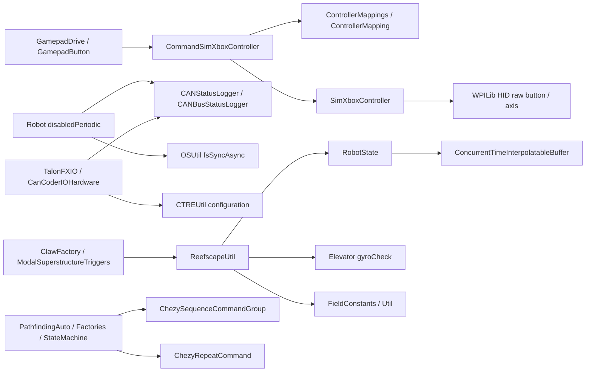

# 共用工具、自訂 Command 與非 Java 資源接線表

本節依本地原始碼逐檔閱讀，補足 `com.team254.lib.util` 的 **19 個檔案**、`lib.commands` 的 **2 個檔案**，以及部署資料、相機和建置資源。查核日期：2026-09-19。以下為靜態分析，沒有編譯、模擬或部署。

「未找到使用處」指在本地 `src/main/java` 的類名、建構與直接呼叫搜尋中，扣除宣告／import 後未見實際使用；不據此擅自刪除程式，也不推論外部程式永遠不會引用它。

## 1. 先看這些工具接到哪條主流程

這張圖中箭頭表示「呼叫／依賴」，不是每項都在 20 ms 主迴圈執行。例如 `OSUtil` 另起 thread，CTRE telemetry 也有自己的 thread；部署檔案只在特定初始化／規劃流程讀取。

## 2. 硬體設定、健康狀態與儲存工具

| 檔案 | 實際做什麼 | 誰呼叫它／結果去哪裡 | 維護重點 |
|---|---|---|---|
| [CTREUtil.java](/Users/pepsi/Desktop/FRC-2025-Public-main/src/main/java/com/team254/lib/util/CTREUtil.java) | `tryUntilOK` 最多重試 10 次 CTRE operation；失敗回報 DriverStation。提供 TalonFX／CANcoder config 套用、refresh，以及 CANdi S1/S2 close/float 組態 | `TalonFXIO`、`CanCoderIOHardware`；claw/indexer/elevator/climber sensor hardware 用 CANdi builder | 重試可能增加初始化或當次呼叫耗時。`applyConfigurationNonBlocking` 實作是 `apply(config, 0.01)`，不能僅憑名稱保證完全不阻塞。部分 sensor 直接 configurator.apply，沒有經 `tryUntilOK` |
| [CANStatusLogger.java](/Users/pepsi/Desktop/FRC-2025-Public-main/src/main/java/com/team254/lib/util/CANStatusLogger.java) | Singleton 保存 TalonFX supply-voltage signals，refresh 後以 `StatusCode.OK` 判讀 connected | `TalonFXIO` 建構註冊；`Robot.disabledPeriodic` 每 50 圈分支呼叫 update；輸出 `CANstatus/...` 與 Dashboard `CAN/<bus>/...` | **registerCANcoder 是空方法**，雖有呼叫也不代表監控 encoder。此處不是全部 fault／電流／溫度檢查。refresh 例外目前被吞掉。signal array 在首次 update 建立，晚註冊設備的更新策略要另檢查 |
| [CANBusStatusLogger.java](/Users/pepsi/Desktop/FRC-2025-Public-main/src/main/java/com/team254/lib/util/CANBusStatusLogger.java) | 建立指定 bus 的 `CANBus`，讀取 status 並送 Logger 與 SmartDashboard | `Robot` 建 driver／superstructure 兩個 logger，在每次 disabledPeriodic 結尾呼叫 | 此檔只輸出 `status.Status`，沒有在這裡完整輸出 bus utilization、error counters 等所有欄位；不可把綠色 bus 狀態當作每顆裝置健康 |
| [OSUtil.java](/Users/pepsi/Desktop/FRC-2025-Public-main/src/main/java/com/team254/lib/util/OSUtil.java) | 以 ProcessBuilder 執行作業系統 `sync`；`fsSyncAsync` 每次新開 thread；IOException 回報 DriverStation | `Robot.disabledPeriodic` 在曾 Enable 後且距上次 sync 至少 10 秒時呼叫 | 這是寫入儲存的副作用，不是純工具函式；需要確認目標作業系統、併發 thread 數和錯誤可觀察性。本次沒有執行它 |

設備健康的目前連線是：`TalonFXIO 建構 → registerTalonFX → Robot disabled 50 圈分支 → refreshAll → supplyVoltage status → Dashboard`。因此只憑這個工具不能說「Enable 時持續監測所有 CAN 故障」。

## 3. 操作器適配：SIM 輸入不是另外一套操作意圖

| 檔案 | 職責與接線 | 要注意的契約 |
|---|---|---|
| [ControllerMapping.java](/Users/pepsi/Desktop/FRC-2025-Public-main/src/main/java/com/team254/lib/util/ControllerMapping.java) | 保存 `Map<String,Integer>`：按鈕名／軸名 → raw index；給兩個 SIM controller adapter 查表 | `Map.get()` 回傳 null 再拆箱會失敗，新增按鈕時必須同步補 mapping；傳入 map 沒有 defensive copy |
| [ControllerMappings.java](/Users/pepsi/Desktop/FRC-2025-Public-main/src/main/java/com/team254/lib/util/ControllerMappings.java) | 定義 XBOX_MAPPING 和 DUALSENSE_MAPPING；由 CommandSimXboxController 選擇 | 這是這份桌面環境的 raw mapping，不能假定與實機 Driver Station 或其他 OS 完全一致 |
| [SimXboxController.java](/Users/pepsi/Desktop/FRC-2025-Public-main/src/main/java/com/team254/lib/util/SimXboxController.java) | 繼承 XboxController，把各 axis、button、pressed/released、BooleanEvent 轉到 mapping 指定的 raw index | 由 `CommandSimXboxController` 建立；保留 Xbox 語意 API，但底層仍是 HID，不會自行生成假的按鍵 |
| [CommandSimXboxController.java](/Users/pepsi/Desktop/FRC-2025-Public-main/src/main/java/com/team254/lib/util/CommandSimXboxController.java) | 繼承 CommandXboxController；按 `Constants.kSimControllerType` 建 mapping/HID，覆寫 Trigger、軸和 getHID | `GamepadDriveControlBoard`、`GamepadButtonControlBoard` 在 simulation 分支使用；REAL 用 WPILib CommandXboxController |

實際表格如下；數字是程式目前的 raw index，不是建議所有隊伍使用同一表。

| 語意輸入 | XBOX | DUAL_SENSE |
|---|---:|---:|
| A / B / X / Y | 1 / 2 / 4 / 5 | 1 / 2 / 3 / 4 |
| LeftBumper / RightBumper | 7 / 8 | 5 / 6 |
| Back / Start | 11 / 12 | 7 / 8 |
| LeftStick / RightStick | 14 / 15 | 10 / 11 |
| LeftX / LeftY | 0 / 1 | 0 / 1 |
| RightX / RightY | 2 / 3 | 4 / 5 |
| LeftTrigger / RightTrigger | 5 / 4 | 2 / 3 |

端到端測試應從「實際按鍵 → raw 值 → semantic Trigger → ModalControls mode → 最終 command」逐層看 log。只在 SIM 看見按鈕變色，不能證明它已觸發期望的機構流程。

## 4. 時間歷史、幾何與場地工具

### 4.1 RobotState 的歷史資料容器

[ConcurrentTimeInterpolatableBuffer.java](/Users/pepsi/Desktop/FRC-2025-Public-main/src/main/java/com/team254/lib/util/ConcurrentTimeInterpolatableBuffer.java) 使用 `ConcurrentSkipListMap<Double,T>` 保存帶時間戳的樣本。`addSample()` 寫入後清除比 `time-historySize` 更早的點。`getSample()` 若找到同 timestamp，回傳該點；兩側都有點則內插；只有一側則回傳邊界點；空 buffer 回傳 empty。`getLatest()` 回傳最後 entry，空時可能為 null。`getInternalBuffer()` 直接暴露 map。

`RobotState` 用它保存 field-to-robot、角速度、俯仰／側傾等歷史，供 Vision 查相機拍攝時的姿態，以及預測、範圍查詢等處使用。需要特別知道：

- **取到非空值，不等於查詢時間確實在歷史區間。**超出上下界仍會拿邊界值。需要限制 timestamp freshness 的 caller 應自行判斷。
- Concurrent map 保護單次 map operation；多次讀取（isEmpty、floorEntry、ceilingEntry）不是一份不可分割快照。`T` 自身若可變，也不會因此自動 thread-safe。
- cleanup 以新加入樣本時間為準；若允許 out-of-order samples，應明確定義保留窗口的語意。

### 4.2 幾何與數學工具

| 檔案 | 功能細節 | 本地呼叫方向 |
|---|---|---|
| [MathHelpers.java](/Users/pepsi/Desktop/FRC-2025-Public-main/src/main/java/com/team254/lib/util/MathHelpers.java) | 零 Pose/Rotation/Translation/Transform 常數；由旋轉或平移建立 Pose/Transform；投影參數 reverseInterpolate；點到線段／無限直線距離 | AutoAlignToPose、PathfindingAutoAlign、自訂 PathfindingCommand；DriveIO/DriveViz、RobotState、MegatagPoseEstimate、RobotContainer 用零常數 |
| [Util.java](/Users/pepsi/Desktop/FRC-2025-Public-main/src/main/java/com/team254/lib/util/Util.java) | clamp/limit、開區間 inRange、夾限插值、epsilonEquals、字串連接、deadband、red/blue 轉換、依 iteration memoize | ServoMotorSubsystem 與 wrist/elevator/intake 到位比較；LED 百分比；heading 命令；場地與 SIM 幾何 |
| [FieldConstants.java](/Users/pepsi/Desktop/FRC-2025-Public-main/src/main/java/com/team254/lib/util/FieldConstants.java) | 藍方原點的米制場地尺寸；Processor、Barge cages、Coral Station、Reef center/faces、branch 3D pose、staging coral、HP intake 和 ReefHeight | ReefscapeUtil、ScoringLocation、RobotState、SimulatedRobotState、ReefViz、SuperstructureStateMachine、ModalSuperstructureTriggers、DriveMaintainingHeading |
| [ReefscapeUtil.java](/Users/pepsi/Desktop/FRC-2025-Public-main/src/main/java/com/team254/lib/util/ReefscapeUtil.java) | `awayFromReef` 取得當前 pose、0.2 秒 capped prediction，再沿預測機器前方向加 offset；檢查距兩個 Reef center 均大於半徑，並要求 elevator.gyroCheck | ClawFactory、ModalSuperstructureTriggers 的收回／離開條件，SimulatedRobotState 的場地互動 |

重要語意：

1. `reverseInterpolate` 回傳投影比例，**不限制在 0–1**；start=end 則回 0。`distanceToLineSegment` 自己處理端點，`perpendicularDistanceToLine` 則不限制。
2. `Util.inRange` 不包含兩個端點；`interpolate` 把比例限在 0–1；與未限幅的 `reverseInterpolate` 不能互相替換。
3. `Util.flipRedBlue(Pose2d)` 只做 `x→fieldLength-x`，**保留 rotation**；Rotation2d overload 卻是加 π。自訂 PathPlanner `FlippingUtil` 又有自己的座標對稱契約。改 alliance 邏輯前要核對 call site，不能把名稱相近的 helper 當成同一變換。
4. `Util.memoizeByIteration` 在 iteration 變化時讓快取失效，用 AtomicReference 保存結果；本地未找到使用處。不能因原子欄位就認定跨多執行緒只會計算一次，delegate 也需符合其可能重試的語意。
5. `FieldConstants.Reef.branchPositions` 先建立藍方 12 branches，再補紅方 12；`branchTipPositions` 在此檔只建立藍方 12。`BranchCode` enum 不完整涵蓋 A–L，且本次未找到它的使用處；不能拿它直接替代 `ReefBranch` 的正式定位。
6. `ReefscapeUtil` 的 `predictedCheck`（比較是否遠離 Reef）只被計算與記 log；最後回傳是 `positionCheck && gyroCheck`，**不包含 predictedCheck**。所以本地 `awayFromReef=true` 的精確意思是「預測 offset 點在半徑外且 gyro 條件成立」，不是「機器必定正在遠離 Reef」。是否加入該條件會改動多個收回流程，需先做影響確認。

### 4.3 濾波與 profile 工具：目前沒有接上主流程

| 檔案 | 已讀實作 | 本地使用狀態與限制 |
|---|---|---|
| [ExponentialMovingAverage.java](/Users/pepsi/Desktop/FRC-2025-Public-main/src/main/java/com/team254/lib/util/ExponentialMovingAverage.java) | 首筆原值；之後 `old + alpha*(new-old)`；reset 清空歷史 | 只被 ExponentialMovingAveragePose 使用；alpha 沒有範圍驗證，也不依實際 dt 調整 |
| [ExponentialMovingAveragePose.java](/Users/pepsi/Desktop/FRC-2025-Public-main/src/main/java/com/team254/lib/util/ExponentialMovingAveragePose.java) | x、y、theta 各自用上述平均，組回 Pose2d | 未找到主程式使用處。theta 直接平均 radians，跨 ±π 邊界可能走錯方向；這不是 pose estimator |
| [CustomProfiledPIDController.java](/Users/pepsi/Desktop/FRC-2025-Public-main/src/main/java/com/team254/lib/util/CustomProfiledPIDController.java) | 梯形 profile 產生 setpoint；PID 根據 position error，再加 kV×profile velocity；goal 可指定終速 | 未找到使用處。`calculate` 的 measuredVelocity 參數未參與計算；`atGoal` 只比 goal.position 與 profile setpoint.position，沒有比量測位置。不能把它當成真實機構 atGoal |

## 5. Bool／Trigger 工具

| 檔案 | 精確語意 | 目前狀態 |
|---|---|---|
| [LatchedBoolean.java](/Users/pepsi/Desktop/FRC-2025-Public-main/src/main/java/com/team254/lib/util/LatchedBoolean.java) | `update` 只在 false→true 那次回 true，並保存上一值 | 未找到使用處；是 rising-edge detector，不是永久鎖住 true 的 latch |
| [CurrentSpikeDetector.java](/Users/pepsi/Desktop/FRC-2025-Public-main/src/main/java/com/team254/lib/util/CurrentSpikeDetector.java) | 電流持續大於 threshold 達 time threshold 才 true；低於或等於門檻即 stop/reset；getAsBoolean 回最近 update 結果 | 未找到使用處。以帶符號 current 直接比較、未取絕對值；`asTrigger` 不會自己更新電流，caller 仍要定期 update |
| [CheesyTrigger.java](/Users/pepsi/Desktop/FRC-2025-Public-main/src/main/java/com/team254/lib/util/CheesyTrigger.java) | `whileTrueAlwaysRunning` 在 rising edge 排程、falling edge 取消；保持 true 且 command 不再 scheduled 時再嘗試排程 | 未找到使用處；可能重啟已正常完成或被別的 command 中斷的動作，若未釐清 ownership 可能持續爭用 subsystem |

與 WPILib 2025.3.2 相比，普通 `Trigger.whileTrue` 在 false→true 時啟動，保持 true 時即使命令結束也不會自行再啟動。[WPILib Trigger.java](https://github.com/wpilibsuite/allwpilib/blob/v2025.3.2/wpilibNewCommands/src/main/java/edu/wpi/first/wpilibj2/command/button/Trigger.java)

CheesyTrigger 還有一個細節：binding 保存初始 condition；若綁定當下就已 true，第一次 poll 未必形成 rising edge，`shouldBeRunning` 又起始 false，因此不能概括為「只要 true 就絕對會啟動」。

## 6. 自訂 Command composition 為什麼比較快

以下與本地 GradleRIO 對應的 **WPILib v2025.3.2** 原始碼比較，不以新版文件推測舊版本行為。

### 6.1 ChezySequenceCommandGroup

[本地檔案](/Users/pepsi/Desktop/FRC-2025-Public-main/src/main/java/com/team254/lib/commands/ChezySequenceCommandGroup.java) 和官方 SequentialCommandGroup 都保存 children、註冊 composed commands、合併 requirements；`initialize` 啟動第一個；已完成的 child 會 `end(false)`；群組中斷則對正在跑的 child `end(true)`。兩者也都從 children 彙整 runsWhenDisabled 與 interruption behavior。

關鍵差別在 `execute()`：官方在 child 完成後只 initialize 下一個，下一次群組 execute 才 execute 新 child；本地在 initialize 下一個後**遞迴呼叫自己的 execute**，在同一次 scheduler tick 中繼續走，直到遇到尚未完成的 child 或整組結束。[官方 SequentialCommandGroup.java](https://github.com/wpilibsuite/allwpilib/blob/v2025.3.2/wpilibNewCommands/src/main/java/edu/wpi/first/wpilibj2/command/SequentialCommandGroup.java)

以 A、B 都是當次 execute 後完成，C 是長命令的例子：

| 時間點 | 官方 Sequential | 本地 ChezySequence |
|---|---|---|
| group initialize | A.initialize | A.initialize |
| tick 1 | A.execute/end → B.initialize | A.execute/end → B.initialize/execute/end → C.initialize/execute |
| tick 2 | B.execute/end → C.initialize | C.execute |
| tick 3 | C.execute | C.execute |

這能減少流程中短命令的額外 scheduler 間隔；不能保證實際機械動作因此更快。當同一 tick 連續要求多個 setpoint，硬體可能只來得及回饋最後一個，感測器也不會在遞迴中自動重新採樣。大量立即完成的命令還可能增加該 tick 工作量與 recursion 深度；這是需要測試的邊界，不是已觀察到 stack overflow。

實際 caller：`AutoFactory`、`ClawFactory`、`SuperstructureStateMachine`、`ModalSuperstructureTriggers`；`PathfindingAuto` 與 `PathfindingWarmupCommand` 直接繼承它，另外也用它組 step/warmup。因此換回標準 Sequential 不只是改 class 名稱，會改 auto、handoff 和姿態切換的時間安排。

### 6.2 ChezyRepeatCommand

[本地檔案](/Users/pepsi/Desktop/FRC-2025-Public-main/src/main/java/com/team254/lib/commands/ChezyRepeatCommand.java) 保留 official Repeat 的要求與生命週期，但一次 execute 裡最多跑 `kMaxLoops=3` 輪。每輪若 child 已結束就重新 initialize；execute 後完成則 end(false)，可立即再開始下一輪；遇到尚未完成的 child 就 return。自身 isFinished 永遠 false，需外部取消／decorator／模式切換結束。

官方 RepeatCommand 一次 wrapper execute 最多執行 child 一次，若完成，下一次 execute 才重新 initialize。[官方 RepeatCommand.java](https://github.com/wpilibsuite/allwpilib/blob/v2025.3.2/wpilibNewCommands/src/main/java/edu/wpi/first/wpilibj2/command/RepeatCommand.java)

| 項目 | 官方 Repeat | ChezyRepeat |
|---|---|---|
| child 每次 wrapper execute 最多執行 | 1 次 | 3 次（若前面輪次都完成） |
| child 不結束 | 每 tick 執行一次 | 一遇到未結束即 return，因此也是每 tick 一次 |
| wrapper 自然結束 | 不會 | 不會 |
| 取消時已 end 的 child | 避免重複 end | 同樣避免重複 end |
| 目前本地入口 | 一般 WPILib composition | `PathfindingAuto` 建構中的 `new ChezyRepeatCommand(getNextAction())` |

實際結果是 auto 的 `getNextAction()` 可以在一個 tick 快速越過幾個即時完成步驟；不代表重複三個完整 20 ms 控制循環。加入採樣依賴或 timer 步驟時要明確檢查「同一時間戳內多次 execute」是否合理。

### 6.3 這兩個類別的使用規範

- 明確需要同 tick 穿透短步驟才使用，並留下原因；普通人類可等待的程序不必全部改用 Chezy。
- child 的完成條件必須可靠；`isFinished=true` 不能只是「已送出馬達設定」。
- 同一個 command instance 不可重複放入不同 composition；供重複執行的 command 要在 initialize 重設狀態。
- 測試要包含立即完成鏈、第一個長 command、cancel、Disable、空 sequence、同 tick 讀寫狀態；不要只驗證正常末端完成。
- 更換它們之前，影響確認表至少列 AutoFactory、PathfindingAuto、Warmup、Claw handoff 與 superstructure transitions。

## 7. deploy 資料是執行邏輯的一部分

`build.gradle` 將 `src/main/deploy` 部署到 `/home/lvuser/deploy`，並設 `deleteOldFiles=false`。因此把本機 deploy 檔案刪除，不代表下次部署就會把 roboRIO 上同名舊檔清掉；還原策略也必須處理資料檔版本。

| 資源 | 讀寫入口 | 實際含義與影響 |
|---|---|---|
| [transition_costs.txt](/Users/pepsi/Desktop/FRC-2025-Public-main/src/main/deploy/transition_costs.txt) | `SuperstructureStateMachine.loadTransitionCosts` 在建構時讀；`buildCharacterizationCommand` 執行時 append | 每行 from,to,duration；查不到成本預設 1.0。改數字會改圖搜尋路徑。characterization 會動機構並寫檔，**不能當作單純唯讀量測指令**。檔案格式錯誤的 NumberFormatException 不在目前 IOException catch 範圍內 |
| [auto_navgrid.json](/Users/pepsi/Desktop/FRC-2025-Public-main/src/main/deploy/pathplanner/auto_navgrid.json) | `LocalADStar` constructor 載入 autoObstacles | 靜態障礙格；哪時使用仍取決於 `setAutoObstacles` 的 caller，不可只因檔名就認定所有 auto 都用它 |
| [backoff_navgrid.json](/Users/pepsi/Desktop/FRC-2025-Public-main/src/main/deploy/pathplanner/backoff_navgrid.json) | `LocalADStar` constructor 載入 backoffObstacles | 退離場景的障礙集合，改它影響相關退離路線 |
| [navgrid.json](/Users/pepsi/Desktop/FRC-2025-Public-main/src/main/deploy/pathplanner/navgrid.json) | `LocalADStar` 最後載入 teleopObstacles，起始 requestObstacles 指向它 | 最後一次載入也覆蓋共享 nodeSize／fieldSize 等設定；三份格圖應維持相同基準 |
| [example.txt](/Users/pepsi/Desktop/FRC-2025-Public-main/src/main/deploy/example.txt) | 本次未找到 Java caller | WPILib deploy 目錄說明，不是 auto 設定 |

三份 navgrid 本次解析都是 **39 rows × 85 columns**，node size `0.20646153846153845 m`。`grid[row][col]` 對到 `GridPosition(col,row)`，true 被加入 obstacle set。這裡只核對結構，沒有以實機場地確認每一格障礙是否正確。

`LocalADStar.loadObstacles` 的 parse exception 目前 catch 後直接略過；因此「檔案存在」不保證成功讀入。建議把讀入成功、格尺寸、檔案版本／checksum 記錄在 log，並定義失敗時的 auto 禁用或 fallback 規則。`Robot.disabledInit` 明確呼叫 `Pathfinding.setTeleopObstacles()`，註解說 auto 也要用該組；這再次說明不能按檔名猜 runtime。

## 8. 相機、Dashboard、設定與建置資源

| 資源 | 接到哪裡 | 本次可確認的邊界 |
|---|---|---|
| `limelight/pipelines/*.vpr` | Limelight 外部 pipeline 組態資產；與 camera 的 AprilTag／algae detection 設定有關 | 檔案本身不在 `src/main/deploy`；本次未找到 Java 自動上傳 caller，不能假設 Gradle deploy 會寫到相機 |
| `limelight/calibrations/LL4-A..F.cal` | 相機 calibration 資產 | 不由檔名推測實機 camera A/B 正使用哪份；須對相機序號／鏡頭核對 |
| `layouts/2025 AdvantageScope Layout.json` | AdvantageScope 的 log/NT 可視化布局 | README 提供匯入方式；layout 是觀察配置，不是 robot 控制邏輯 |
| `layouts/2025 Elastic Layout.json` | Elastic Dashboard 顯示／操作配置 | 需核對 topic/key 是否與程式一致；不能當作唯一按鈕或 auto 輸入規格 |
| `layouts/2025 Shuffleboard Layout.json` | Shuffleboard 布局 | 同上；切換 Dashboard 不會自動修正 robot 的輸入驗證 |
| `simgui-ds.json` | 桌面 simulation Driver Station 的 HID/UI 設定 | 配合 ControllerMappings；本次沒有啟動 SIM |
| `tuner-project.json` | CTRE Tuner 專案資料 | 本地 Java 真正引用的是相應 TunerConstants；兩者要核對，不能假定檔案自動同步 |
| [pull_latest_logs_from_rio.sh](/Users/pepsi/Desktop/FRC-2025-Public-main/pull_latest_logs_from_rio.sh) | SSH 到硬編碼 `10.2.54.2`，取 `/U/logs` 最新四個 wpilog，用 tar 建檔後 scp 和解開 | 這是實際網路／寫檔操作，本次未執行。檔名 `.tar.gz` 但 `tar -cf` 沒加 gzip；搬給其他隊前須改 IP、路徑、輸出目錄並確認覆蓋行為 |
| [settings.gradle](/Users/pepsi/Desktop/FRC-2025-Public-main/settings.gradle) | Gradle plugin repositories／本機 WPILib 2025 Maven 目錄 | 說明為何新環境需對應 2025 toolchain；本次不執行依賴下載 |
| [build.gradle](/Users/pepsi/Desktop/FRC-2025-Public-main/build.gradle) | Java17、GradleRIO、vendordeps、jar／deploy、JUnit、Spotless、GVersion | compileJava 依賴 createVersionFile，會生成 BuildConstants；build 不是唯讀資料檢查 |
| LICENSE／WPILib-License／PathPlanner-License | 本地、WPILib、PathPlanner 授權與歸屬 | 移植或再公開程式時保留對應授權，不把自訂與第三方程式混成無來源檔案 |

本次盤點沒有在根目錄找到 `.wpilib/wpilib_preferences.json`，但 build.gradle 呼叫 `project.frc.getTeamNumber()`；後續建置前應確認 team number 是由本機設定或明確參數提供，不能僅因目錄來自 254 就自動部署到 254。

### vendordeps 的精確本地版本

| JSON | name／version | 使用方向 |
|---|---|---|
| AdvantageKit.json | AdvantageKit 4.1.2 | LoggedRobot、Logger、AutoLog、WPILOG、LoggedDashboard |
| Phoenix6-frc2025-latest.json | CTRE-Phoenix v6 25.4.0 | TalonFX、CANcoder、CANdi、Pigeon、SwerveDrivetrain |
| Phoenix5-frc2025-latest.json | CTRE-Phoenix v5 5.35.1 | CANdle LED hardware 等 v5 API |
| PathplannerLib-2025.2.7.json | PathplannerLib 2025.2.7 | 外部 PathPlanner；本地另有 `com.team254.lib.pathplanner` 自訂版，import namespace 要逐檔核對 |
| ChoreoLib-2025.0.3.json | ChoreoLib 2025.0.3 | Choreo 相關相依；有相依不代表本次所有 auto 都跑 Choreo 路徑 |
| photonlib.json | photonlib v2025.3.1 | `VisionIOSimPhoton` 的模擬影像／定位 |
| maple-sim.json | maplesim 0.3.9 | MapleSim drivetrain／場地模擬 |
| WPILibNewCommands.json | WPILib-New-Commands 1.0.0 | WPILib command-based 模組描述；1.0.0 不是本專案整體 WPILib 年版 |

## 9. 從這節可直接提出的改進

1. 將 `awayFromReef` 的名稱、實際 return 和所需收回條件對齊，先列每個 caller 的影響；不要直接把未使用 predictedCheck 加入 return。
2. 補 CANcoder 及其他 sensor 的健康資訊，清楚區分「bus OK」「Talon signal OK」「機構可操作」三件事。
3. 為 deploy 資料增加 schema／範圍／正數檢查與啟動可觀察性；自動路徑不能在障礙圖讀取失敗時悄悄當一切正常。
4. 為 Chezy composition 加入少量有意義的 scheduler 行為測試，固定同 tick 語意，並測量最壞 tick 耗時。
5. 暫未使用的 helper 先標記用途與限制；下一次真的要接進機器之前，再補 angle wrap、atGoal、current sign、timestamp 邊界測試。
6. 將 calibration、offset、navgrid、transition costs 與 robot build 一起記錄版本；機器行為不只由 Java commit 決定。

上述均為文件化提案。依使用者指示，實際實作後的編譯／模擬／部署仍須先完成流程影響確認。
