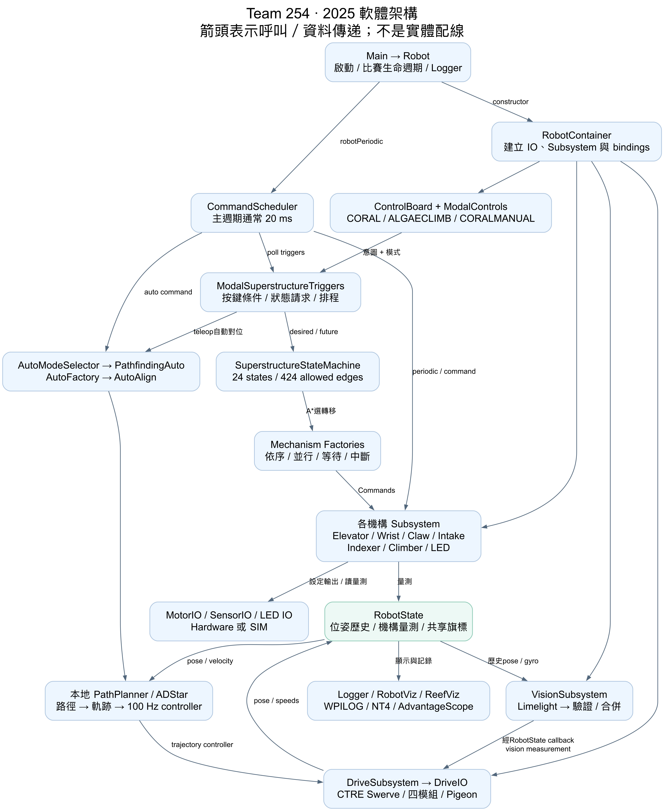
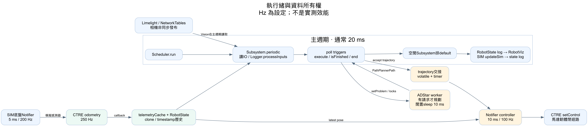
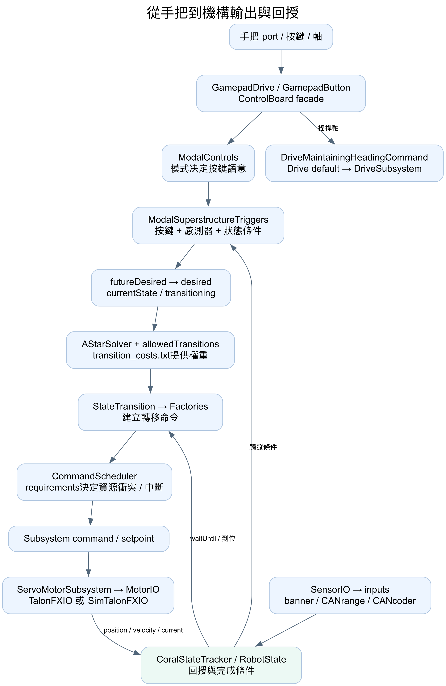
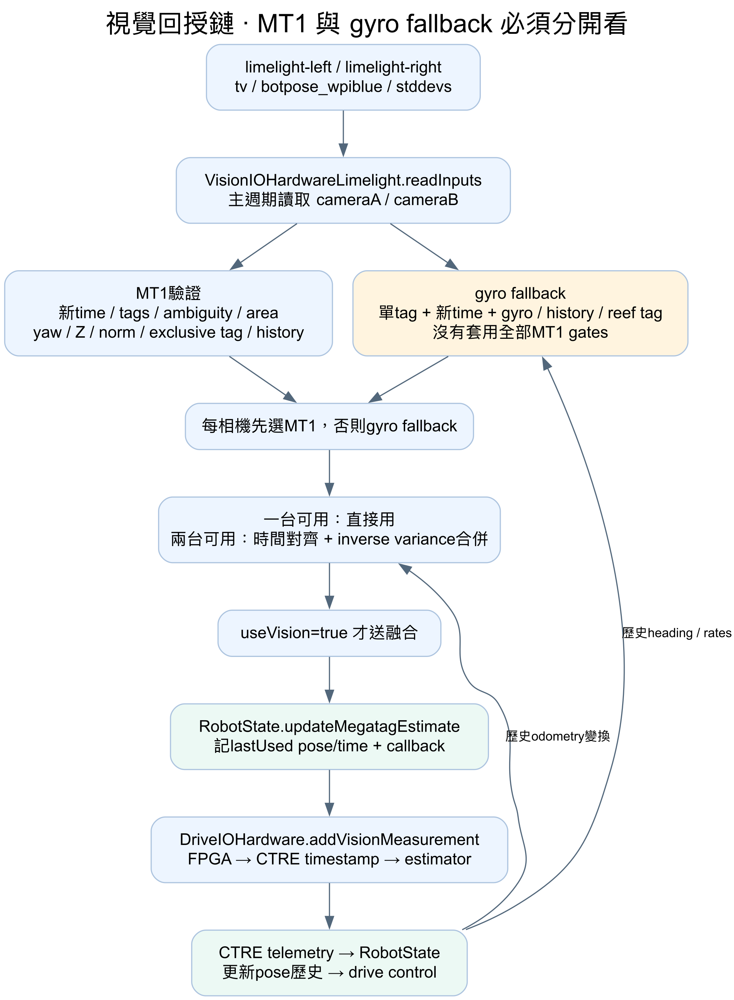
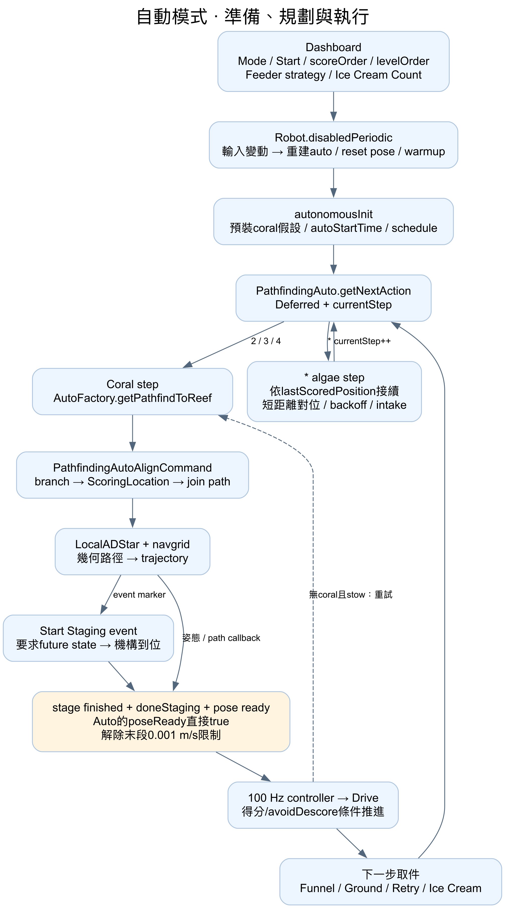
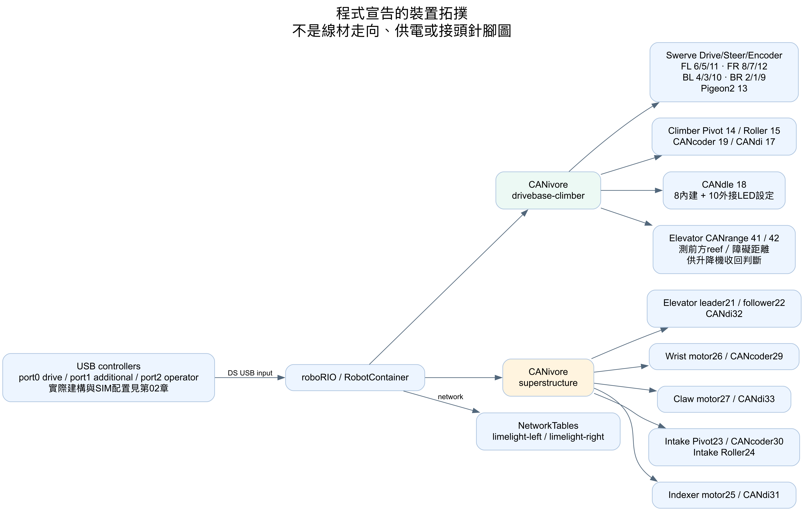
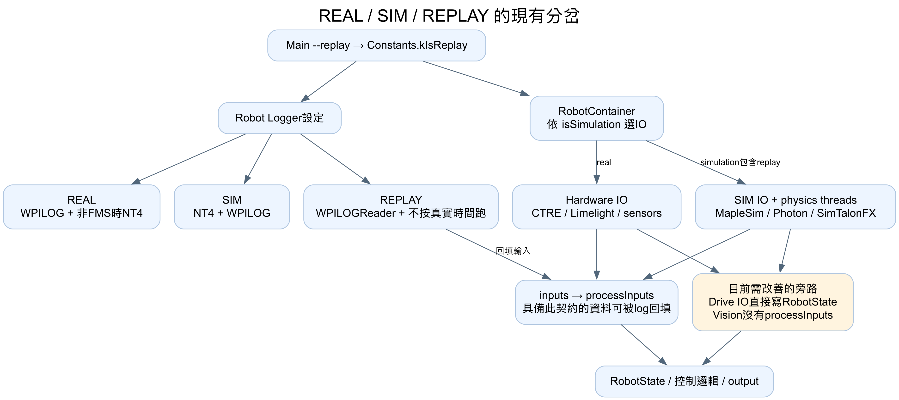

# 08｜圖表總覽

七張圖各自回答不同問題。箭頭代表呼叫或資料流；硬體圖是軟體宣告的裝置拓撲，不是實體接線施工圖。完整狀態圖有424条邊，以閱讀版中的24×24矩陣表示，比擠成一張箭頭圖更容易核對。

## 1. 整體架構

[SVG](diagrams/01-architecture.svg) · [可編輯DOT來源](diagrams/01-architecture.dot)

## 2. 執行緒與時間

[SVG](diagrams/02-runtime.svg) · [DOT](diagrams/02-runtime.dot)

## 3. 按鍵、狀態與機構

[SVG](diagrams/03-command-chain.svg) · [DOT](diagrams/03-command-chain.dot)

## 4. 視覺到位姿回授

[SVG](diagrams/04-vision.svg) · [DOT](diagrams/04-vision.dot)

## 5. 自動模式

[SVG](diagrams/05-autonomous.svg) · [DOT](diagrams/05-autonomous.dot)

## 6. CAN與裝置

[SVG](diagrams/06-hardware.svg) · [DOT](diagrams/06-hardware.dot)

## 7. 模擬與Replay現況

[SVG](diagrams/07-simulation-replay.svg) · [DOT](diagrams/07-simulation-replay.dot)
